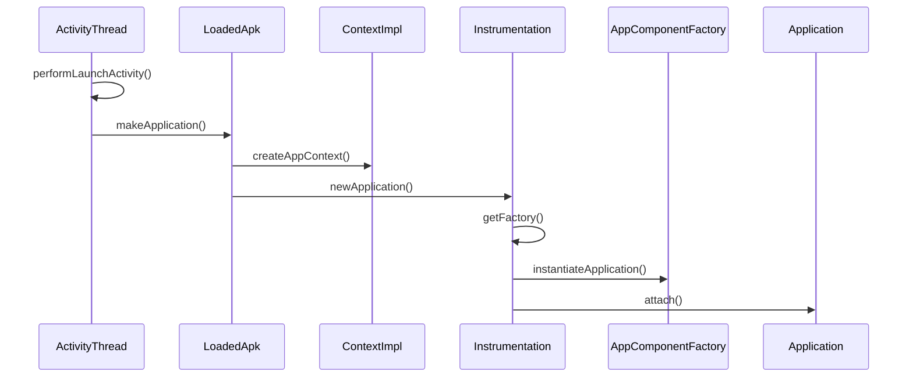

# 

## 创建

```mermaid
sequenceDiagram
	ActivityThread->>ActivityThread:performLaunchActivity()
	ActivityThread->>LoadedApk:makeApplication()
	LoadedApk->>ContextImpl:createAppContext()
	LoadedApk->>Instrumentation:newApplication()
	Instrumentation->>Instrumentation:getFactory()
	Instrumentation->>AppComponentFactory:instantiateApplication()
	Instrumentation->>Application:attach()

```

