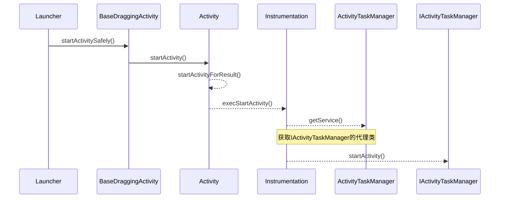

`Activity`的启动过程分为两种，一种是根`Activity`的启动过程，另一种是普通`Activity`的启动过程。根`Activity`指的是应用程序启动的第一个`Activity`，因此根`Activity`的启动过程一般情况下也可以理解为应用程序的启动过程。普通`Activity`指的是除应用程序启动的第一个`Activity`之外的其他`Activity`。

Activity的启动过程比较复杂，因此这里分为3个部分来讲，分别是：

## **Launcher请求AMS过程**

Launcher请求AMS的时序图如图所示

