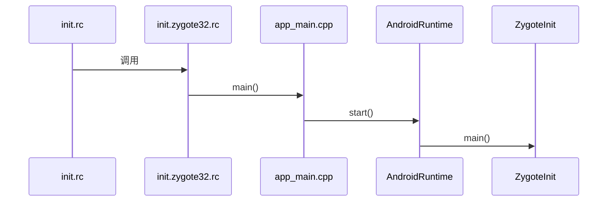

## Zygote启动流程

在Android系统中，应用程序进程以及运行系统的关键服务的`SystemServer`进程都是由`Zygote`进程来创建的，我们也将它称为孵化器。它通过`fork`（复制进程）的形式来创建应用程序进程和`SystemServer`进程。

Zygote进程是在init进程启动时创建的，起初Zygote进程的名称并不是叫“zygote”，而是叫“app_process”，这个名称是在Android.mk中定义的，Zygote进程启动后，Linux系统下的pctrl系统会调用app_process，将其名称换成了“zygote”。



在`init.rc`文件中采用了`import`引入`Zygote`启动脚本。

```java
//system/core/rootdir/init.rc
import /init.${ro.hardware}.rc
import /init.usb.configfs.rc
import /init.${ro.zygote}.rc//导入zygote.rc
```

可以看出`init.rc`不会直接引入一个固定的文件，而是根据属性ro.zygote的内容来引入不同的文件。

从`Android 5.0`开始，Android开始支持64位程序，Zygote也就有了32位和64位的区别，所以在这里用`ro.zygote`属性来控制使用不同的`Zygote`启动脚本，从而也就启动了不同版本的`Zygote`进程，`ro.zygote`属性的取值有以下4种：

* init.zygote32.rc

* init.zygote32_64.rc

* init.zygote64.rc

* init.zygote64_32.rc


```java
//system/core/rootdir/init.zygote64.rc
//启动zygote service 路径/system/bin/app_process64
service zygote /system/bin/app_process64 -Xzygote /system/bin --zygote --start-system-server
    class main
    priority -20
    user root
    group root readproc reserved_disk
    socket zygote stream 660 root system
    socket usap_pool_primary stream 660 root system
    onrestart exec_background - system system -- /system/bin/vdc volume abort_fuse
    onrestart write /sys/power/state on
    onrestart restart audioserver
    onrestart restart cameraserver
    onrestart restart media
    onrestart restart netd
    onrestart restart wificond
    task_profiles ProcessCapacityHigh
    critical window=${zygote.critical_window.minute:-off} target=zygote-fatal
```


```java
//frameworks/base/cmds/app_process/Android.mk
include $(CLEAR_VARS)

LOCAL_SRC_FILES:= \
    app_main.cpp

LOCAL_SHARED_LIBRARIES := \
    libcutils \
    libutils \
    liblog \
    libbinder \
    libandroid_runtime \
    $(app_process_common_shared_libs) \

LOCAL_WHOLE_STATIC_LIBRARIES := libsigchain

LOCAL_LDFLAGS := -ldl -Wl,--version-script,art/sigchainlib/version-script.txt -Wl,--export-dynamic
LOCAL_CPPFLAGS := -std=c++11

LOCAL_MODULE := app_process__asan
LOCAL_MULTILIB := both //编译32位和64位
LOCAL_MODULE_STEM_32 := app_process32 //32位
LOCAL_MODULE_STEM_64 := app_process64//64位
```


### **main()**

`app_main.cpp`的`main`方法会接收传进的来参数，并根据传进来的参数调用`AndroidRuntime`的`start`方法。

```c++
//frameworks/base/cmds/app_process/app_main.cpp
int main(int argc, char* const argv[])
{
    //...
    while (i < argc) {
        const char* arg = argv[i++];
        if (strcmp(arg, "--zygote") == 0) { 
            zygote = true; //传进来的参数--zygote 将布尔值zygote设置为true
            niceName = ZYGOTE_NICE_NAME;
        } else if (strcmp(arg, "--start-system-server") == 0) {
            startSystemServer = true; //启动SystemServer进程
        } else if (strcmp(arg, "--application") == 0) {
            application = true;
        } else if (strncmp(arg, "--nice-name=", 12) == 0) {
            niceName.setTo(arg + 12);
        } else if (strncmp(arg, "--", 2) != 0) {
            className.setTo(arg);
            break;
        } else {
            --i;
            break;
        }
    }
        Vector<String8> args;
    if (!className.isEmpty()) {
       //...
    } else {
        //...
        //start-system-server写入参数中
        if (startSystemServer) {
            args.add(String8("start-system-server"));
        }
        //...
    }
    if (!niceName.isEmpty()) { //线程名字不是空 设置线程名字
        runtime.setArgv0(niceName.string());
        set_process_name(niceName.string());
    }

    if (zygote) {
        //调用AppRuntime的start方法启动ZygoteInit
        runtime.start("com.android.internal.os.ZygoteInit", args, zygote);
    } else if (className) {
        runtime.start("com.android.internal.os.RuntimeInit", args, zygote);
    } else {
        fprintf(stderr, "Error: no class name or --zygote supplied.\n");
        app_usage();
        LOG_ALWAYS_FATAL("app_process: no class name or --zygote supplied.");
        return 10;
    }
}
```


### **start()**

`AndroidRuntime`的`start`方法负责启动虚拟机，并根据传进来的类名，获取到对应的类，并执行该类的`main`方法。在`app_main.cpp`的`main`方法中，我们传进来的是`ZygoteInit`类，
所以执行的就是`ZygoteInit`的`main`方法。

```c++
//frameworks/base/core/jni/AndroidRuntime.cpp
void AndroidRuntime::start(const char* className, const Vector<String8>& options, bool zygote)
{   //...
    JniInvocation jni_invocation;
    jni_invocation.Init(NULL);
    JNIEnv* env;
    //启动虚拟机
    if (startVm(&mJavaVM, &env, zygote) != 0) { 
        return;
    }
    onVmCreated(env); //启动虚拟机后的回调
    //...

    //将className中的. 替换为/
    char* slashClassName = toSlashClassName(className);
    //寻找类
    jclass startClass = env->FindClass(slashClassName);
    if (startClass == NULL) {
        ALOGE("JavaVM unable to locate class '%s'\n", slashClassName);
        /* keep going */
    } else {
        //获取main方法
        jmethodID startMeth = env->GetStaticMethodID(startClass, "main",
            "([Ljava/lang/String;)V");
        if (startMeth == NULL) {
            ALOGE("JavaVM unable to find main() in '%s'\n", className);
            /* keep going */
        } else {
            //调用main方法
            env->CallStaticVoidMethod(startClass, startMeth, strArray);

#if 0
            if (env->ExceptionCheck())
                threadExitUncaughtException(env);
#endif
        }
    }
    //...
}
```


### **main()**

在`ZygoteInit`的`main`方法中，主要做了四件事情：

* 注册一个Socket

* 预加载各种资源

* 启动SystemServer

* 进入循环，等待AMS请求创建新的进程

```java
//frameworks/base/core/java/com/android/internal/os/ZygoteInit.java
private static final String SOCKET_NAME_ARG = "--socket-name="
public static void main(String[] argv) {
    ZygoteServer zygoteServer = null;

    // Mark zygote start. This ensures that thread creation will throw
    // an error.
    ZygoteHooks.startZygoteNoThreadCreation();

    // Zygote goes into its own process group.
    try {
        Os.setpgid(0, 0);
    } catch (ErrnoException ex) {
        throw new RuntimeException("Failed to setpgid(0,0)", ex);
    }

    Runnable caller;
    try {
        // Store now for StatsLogging later.
        final long startTime = SystemClock.elapsedRealtime();
        final boolean isRuntimeRestarted = "1".equals(
                SystemProperties.get("sys.boot_completed"));

        String bootTimeTag = Process.is64Bit() ? "Zygote64Timing" : "Zygote32Timing";
        TimingsTraceLog bootTimingsTraceLog = new TimingsTraceLog(bootTimeTag,
                Trace.TRACE_TAG_DALVIK);
        bootTimingsTraceLog.traceBegin("ZygoteInit");
        RuntimeInit.preForkInit();

        boolean startSystemServer = false;
        String zygoteSocketName = "zygote";
        String abiList = null;
        boolean enableLazyPreload = false;
        for (int i = 1; i < argv.length; i++) {
            if ("start-system-server".equals(argv[i])) {
                startSystemServer = true;
            } else if ("--enable-lazy-preload".equals(argv[i])) {
                enableLazyPreload = true;
            } else if (argv[i].startsWith(ABI_LIST_ARG)) {
                abiList = argv[i].substring(ABI_LIST_ARG.length());
            } else if (argv[i].startsWith(SOCKET_NAME_ARG)) {
                zygoteSocketName = argv[i].substring(SOCKET_NAME_ARG.length());
            } else {
                throw new RuntimeException("Unknown command line argument: " + argv[i]);
            }
        }
        //判断zygote的socketName是否是zygote
        final boolean isPrimaryZygote = zygoteSocketName.equals(Zygote.PRIMARY_SOCKET_NAME);
        if (!isRuntimeRestarted) {
            if (isPrimaryZygote) {
                FrameworkStatsLog.write(FrameworkStatsLog.BOOT_TIME_EVENT_ELAPSED_TIME_REPORTED,
                        BOOT_TIME_EVENT_ELAPSED_TIME__EVENT__ZYGOTE_INIT_START,
                        startTime);
            } else if (zygoteSocketName.equals(Zygote.SECONDARY_SOCKET_NAME)) {
                FrameworkStatsLog.write(FrameworkStatsLog.BOOT_TIME_EVENT_ELAPSED_TIME_REPORTED,
                        BOOT_TIME_EVENT_ELAPSED_TIME__EVENT__SECONDARY_ZYGOTE_INIT_START,
                        startTime);
            }
        }

        if (abiList == null) {
            throw new RuntimeException("No ABI list supplied.");
        }

        // In some configurations, we avoid preloading resources and classes eagerly.
        // In such cases, we will preload things prior to our first fork.
        if (!enableLazyPreload) {
            bootTimingsTraceLog.traceBegin("ZygotePreload");
            EventLog.writeEvent(LOG_BOOT_PROGRESS_PRELOAD_START,
                    SystemClock.uptimeMillis());
            //预加载
            preload(bootTimingsTraceLog);
            EventLog.writeEvent(LOG_BOOT_PROGRESS_PRELOAD_END,
                    SystemClock.uptimeMillis());
            bootTimingsTraceLog.traceEnd(); // ZygotePreload
        }

        // Do an initial gc to clean up after startup
        bootTimingsTraceLog.traceBegin("PostZygoteInitGC");
        gcAndFinalize();
        bootTimingsTraceLog.traceEnd(); // PostZygoteInitGC

        bootTimingsTraceLog.traceEnd(); // ZygoteInit

        Zygote.initNativeState(isPrimaryZygote);

        ZygoteHooks.stopZygoteNoThreadCreation();
        //创建ZygoteServer
        zygoteServer = new ZygoteServer(isPrimaryZygote);

        if (startSystemServer) {
            //创建SystemServer
            Runnable r = forkSystemServer(abiList, zygoteSocketName, zygoteServer);

            // {@code r == null} in the parent (zygote) process, and {@code r != null} in the
            // child (system_server) process.
            if (r != null) {
                r.run();
                return;
            }
        }

        Log.i(TAG, "Accepting command socket connections");

        // The select loop returns early in the child process after a fork and
        // loops forever in the zygote.
        //执行runSelectLoop方法
        caller = zygoteServer.runSelectLoop(abiList);
    } catch (Throwable ex) {
        Log.e(TAG, "System zygote died with exception", ex);
        throw ex;
    } finally {
        if (zygoteServer != null) {
            zygoteServer.closeServerSocket();
        }
    }

    // We're in the child process and have exited the select loop. Proceed to execute the
    // command.
    if (caller != null) {
        caller.run();
    }
}
```


## **注册Socket**


### ZygoteServer构造函数

```java
//frameworks/base/core/java/com/android/internal/os/ZygoteServer.java
ZygoteServer(boolean isPrimaryZygote) {
  mUsapPoolEventFD = Zygote.getUsapPoolEventFD();

  if (isPrimaryZygote) {
		//调用Zygote的createManagedSocketFromInitSocket方法创建Socket
    mZygoteSocket = Zygote.createManagedSocketFromInitSocket(Zygote.PRIMARY_SOCKET_NAME);
    mUsapPoolSocket =
      Zygote.createManagedSocketFromInitSocket(
      Zygote.USAP_POOL_PRIMARY_SOCKET_NAME);
  } else {
    mZygoteSocket = Zygote.createManagedSocketFromInitSocket(Zygote.SECONDARY_SOCKET_NAME);
		
    mUsapPoolSocket =
      Zygote.createManagedSocketFromInitSocket(
      Zygote.USAP_POOL_SECONDARY_SOCKET_NAME);
  }

  mUsapPoolSupported = true;
  fetchUsapPoolPolicyProps();
}
```


### 创建Socket

Zygote的createManagedSocketFromInitSocket方法负责创建Socket

```java
//frameworks/base/core/java/com/android/internal/os/Zygote.java
static LocalServerSocket createManagedSocketFromInitSocket(String socketName) {
  int fileDesc;
  //拼接socket名字
  final String fullSocketName = ANDROID_SOCKET_PREFIX + socketName;

  try {
    String env = System.getenv(fullSocketName);
    fileDesc = Integer.parseInt(env);
  } catch (RuntimeException ex) {
    throw new RuntimeException("Socket unset or invalid: " + fullSocketName, ex);
  }

  try {
    FileDescriptor fd = new FileDescriptor();
    fd.setInt$(fileDesc);
    return new LocalServerSocket(fd);
  } catch (IOException ex) {
    throw new RuntimeException(
      "Error building socket from file descriptor: " + fileDesc, ex);
  }
}
```


## **启动SystemServer**


### **forkSystemServer()**

forkSystemServer()会调用Zygote的forkSystemServer()方法fork一个SystemServer进程。并调用handleSystemServerProcess去启动SystemServer类。


```java
//frameworks/base/core/java/com/android/internal/os/ZygoteInit.java
private static Runnable forkSystemServer(String abiList, String socketName,
                                         ZygoteServer zygoteServer) {
  //...
  //创建数组，保存启动SystemServer的启动参数
  /* Hardcoded command line to start the system server */
  String[] args = {
    "--setuid=1000",
    "--setgid=1000",
    "--setgroups=1001,1002,1003,1004,1005,1006,1007,1008,1009,1010,1018,1021,1023,"
      + "1024,1032,1065,3001,3002,3003,3006,3007,3009,3010,3011",
    "--capabilities=" + capabilities + "," + capabilities,
    "--nice-name=system_server",
    "--runtime-args",
    "--target-sdk-version=" + VMRuntime.SDK_VERSION_CUR_DEVELOPMENT,
    "com.android.server.SystemServer",//要启动的类
  };
  ZygoteArguments parsedArgs;

  int pid;

  try {
    ZygoteCommandBuffer commandBuffer = new ZygoteCommandBuffer(args);
    try {
      parsedArgs = ZygoteArguments.getInstance(commandBuffer);
    } catch (EOFException e) {
      throw new AssertionError("Unexpected argument error for forking system server", e);
    }
    commandBuffer.close();
    Zygote.applyDebuggerSystemProperty(parsedArgs);
    Zygote.applyInvokeWithSystemProperty(parsedArgs);

    if (Zygote.nativeSupportsMemoryTagging()) {
      /* The system server has ASYNC MTE by default, in order to allow
                 * system services to specify their own MTE level later, as you
                 * can't re-enable MTE once it's disabled. */
      String mode = SystemProperties.get("arm64.memtag.process.system_server", "async");
      if (mode.equals("async")) {
        parsedArgs.mRuntimeFlags |= Zygote.MEMORY_TAG_LEVEL_ASYNC;
      } else if (mode.equals("sync")) {
        parsedArgs.mRuntimeFlags |= Zygote.MEMORY_TAG_LEVEL_SYNC;
      } else if (!mode.equals("off")) {
        /* When we have an invalid memory tag level, keep the current level. */
        parsedArgs.mRuntimeFlags |= Zygote.nativeCurrentTaggingLevel();
        Slog.e(TAG, "Unknown memory tag level for the system server: \"" + mode + "\"");
      }
    } else if (Zygote.nativeSupportsTaggedPointers()) {
      /* Enable pointer tagging in the system server. Hardware support for this is present
                 * in all ARMv8 CPUs. */
      parsedArgs.mRuntimeFlags |= Zygote.MEMORY_TAG_LEVEL_TBI;
    }

    /* Enable gwp-asan on the system server with a small probability. This is the same
             * policy as applied to native processes and system apps. */
    parsedArgs.mRuntimeFlags |= Zygote.GWP_ASAN_LEVEL_LOTTERY;

    if (shouldProfileSystemServer()) {
      parsedArgs.mRuntimeFlags |= Zygote.PROFILE_SYSTEM_SERVER;
    }

    /* Request to fork the system server process */
    //fork一个新进程
    pid = Zygote.forkSystemServer(
      parsedArgs.mUid, parsedArgs.mGid,
      parsedArgs.mGids,
      parsedArgs.mRuntimeFlags,
      null,
      parsedArgs.mPermittedCapabilities,
      parsedArgs.mEffectiveCapabilities);
  } catch (IllegalArgumentException ex) {
    throw new RuntimeException(ex);
  }

  /* For child process */
  if (pid == 0) {
    if (hasSecondZygote(abiList)) {
      waitForSecondaryZygote(socketName);
    }

    zygoteServer.closeServerSocket();
    //处理SystemServer
    return handleSystemServerProcess(parsedArgs);
  }

  return null;
}
```


### **forkSystemServer()**

```java
//frameworks/base/core/java/com/android/internal/os/Zygote.java
static int forkSystemServer(int uid, int gid, int[] gids, int runtimeFlags,
                            int[][] rlimits, long permittedCapabilities, long effectiveCapabilities) {
  ZygoteHooks.preFork();

  int pid = nativeForkSystemServer(
    uid, gid, gids, runtimeFlags, rlimits,
    permittedCapabilities, effectiveCapabilities);

  // Set the Java Language thread priority to the default value for new apps.
  Thread.currentThread().setPriority(Thread.NORM_PRIORITY);

  ZygoteHooks.postForkCommon();
  return pid;
}
```


### **handleSystemServerProcess()**

handleSystemServerProcess()会调用ZygoteInit的zygoteInit方法

```java
//frameworks/base/core/java/com/android/internal/os/ZygoteInit.java
private static Runnable handleSystemServerProcess(ZygoteArguments parsedArgs) {
    // set umask to 0077 so new files and directories will default to owner-only permissions.
    Os.umask(S_IRWXG | S_IRWXO);

    if (parsedArgs.mNiceName != null) {
        Process.setArgV0(parsedArgs.mNiceName);
    }

    final String systemServerClasspath = Os.getenv("SYSTEMSERVERCLASSPATH");
    if (systemServerClasspath != null) {
        // Capturing profiles is only supported for debug or eng builds since selinux normally
        // prevents it.
        if (shouldProfileSystemServer() && (Build.IS_USERDEBUG || Build.IS_ENG)) {
            try {
                Log.d(TAG, "Preparing system server profile");
                prepareSystemServerProfile(systemServerClasspath);
            } catch (Exception e) {
                Log.wtf(TAG, "Failed to set up system server profile", e);
            }
        }
    }

    if (parsedArgs.mInvokeWith != null) {
        String[] args = parsedArgs.mRemainingArgs;
        // If we have a non-null system server class path, we'll have to duplicate the
        // existing arguments and append the classpath to it. ART will handle the classpath
        // correctly when we exec a new process.
        if (systemServerClasspath != null) {
            String[] amendedArgs = new String[args.length + 2];
            amendedArgs[0] = "-cp";
            amendedArgs[1] = systemServerClasspath;
            System.arraycopy(args, 0, amendedArgs, 2, args.length);
            args = amendedArgs;
        }

        WrapperInit.execApplication(parsedArgs.mInvokeWith,
                parsedArgs.mNiceName, parsedArgs.mTargetSdkVersion,
                VMRuntime.getCurrentInstructionSet(), null, args);

        throw new IllegalStateException("Unexpected return from WrapperInit.execApplication");
    } else {
        ClassLoader cl = getOrCreateSystemServerClassLoader();
        if (cl != null) {
            Thread.currentThread().setContextClassLoader(cl);
        }

        /*
         * Pass the remaining arguments to SystemServer.
         */
        return ZygoteInit.zygoteInit(parsedArgs.mTargetSdkVersion,
                parsedArgs.mDisabledCompatChanges,
                parsedArgs.mRemainingArgs, cl);
    }

    /* should never reach here */
}
```


### **zygoteInit()**

ZygoteInit的zygoteInit()负责调用指定类的main方法。

```java
//frameworks/base/core/java/com/android/internal/os/RuntimeInit.java
public static Runnable zygoteInit(int targetSdkVersion, long[] disabledCompatChanges,
        String[] argv, ClassLoader classLoader) {
    if (RuntimeInit.DEBUG) {
        Slog.d(RuntimeInit.TAG, "RuntimeInit: Starting application from zygote");
    }

    Trace.traceBegin(Trace.TRACE_TAG_ACTIVITY_MANAGER, "ZygoteInit");
    RuntimeInit.redirectLogStreams();

    RuntimeInit.commonInit();
    ZygoteInit.nativeZygoteInit();
    return RuntimeInit.applicationInit(targetSdkVersion, disabledCompatChanges, argv,
            classLoader);
}
```


### nativeZygoteInit()

```java
//frameworks/base/core/jni/AndroidRuntime.cpp
static void com_android_internal_os_ZygoteInit_nativeZygoteInit(JNIEnv* env, jobject clazz)
{
    gCurRuntime->onZygoteInit();
}
```


### onZygoteInit()

```java
//frameworks/base/cmds/app_process/app_main.cpp
virtual void onZygoteInit()
{   //打开驱动设备
    sp<ProcessState> proc = ProcessState::self();
    ALOGV("App process: starting thread pool.\n");
    //创建一个新的binder线程，不断进行talkWithDriver().
    proc->startThreadPool();
}
```


### **applicationInit()**

```java
//frameworks/base/core/java/com/android/internal/os/RuntimeInit.java
private static void applicationInit(int targetSdkVersion, String[] argv, ClassLoader classLoader)
            throws ZygoteInit.MethodAndArgsCaller {
        // If the application calls System.exit(), terminate the process
        // immediately without running any shutdown hooks.  It is not possible to
        // shutdown an Android application gracefully.  Among other things, the
        // Android runtime shutdown hooks close the Binder driver, which can cause
        // leftover running threads to crash before the process actually exits.
        nativeSetExitWithoutCleanup(true);

        // We want to be fairly aggressive about heap utilization, to avoid
        // holding on to a lot of memory that isn't needed.
        VMRuntime.getRuntime().setTargetHeapUtilization(0.75f);
        VMRuntime.getRuntime().setTargetSdkVersion(targetSdkVersion);

        final Arguments args;
        try {
            args = new Arguments(argv);
        } catch (IllegalArgumentException ex) {
            Slog.e(TAG, ex.getMessage());
            // let the process exit
            return;
        }

        // The end of of the RuntimeInit event (see #zygoteInit).
        Trace.traceEnd(Trace.TRACE_TAG_ACTIVITY_MANAGER);

        // Remaining arguments are passed to the start class's static main
        invokeStaticMain(args.startClass, args.startArgs, classLoader);
}
```


### **invokeStaticMain()**

```java
/frameworks/base/core/java/com/android/internal/os/RuntimeInit.java
private static void invokeStaticMain(String className, String[] argv, ClassLoader classLoader)
            throws ZygoteInit.MethodAndArgsCaller {
    Class<?> cl;

    try {
        cl = Class.forName(className, true, classLoader);
    } catch (ClassNotFoundException ex) {
        throw new RuntimeException(
                "Missing class when invoking static main " + className,
                ex);
    }

    Method m;
    try {//反射获取main方法
        m = cl.getMethod("main", new Class[] { String[].class });
    } catch (NoSuchMethodException ex) {
        throw new RuntimeException(
                "Missing static main on " + className, ex);
    } catch (SecurityException ex) {
        throw new RuntimeException(
                "Problem getting static main on " + className, ex);
    }

    int modifiers = m.getModifiers();
    if (! (Modifier.isStatic(modifiers) && Modifier.isPublic(modifiers))) {
        throw new RuntimeException(
                "Main method is not public and static on " + className);
    }

    /*
     * This throw gets caught in ZygoteInit.main(), which responds
     * by invoking the exception's run() method. This arrangement
     * clears up all the stack frames that were required in setting
     * up the process.
     */
    throw new ZygoteInit.MethodAndArgsCaller(m, argv);
}
```


## **进入等待状态**


### **runSelectLoop()**

```java
//frameworks/base/core/java/com/android/internal/os/ZygoteServer.java
Runnable runSelectLoop(String abiList) {
  ArrayList<FileDescriptor> socketFDs = new ArrayList<>();
  ArrayList<ZygoteConnection> peers = new ArrayList<>();

  socketFDs.add(mZygoteSocket.getFileDescriptor());
  peers.add(null);

  mUsapPoolRefillTriggerTimestamp = INVALID_TIMESTAMP;

  while (true) {
    fetchUsapPoolPolicyPropsWithMinInterval();
    mUsapPoolRefillAction = UsapPoolRefillAction.NONE;

    int[] usapPipeFDs = null;
    StructPollfd[] pollFDs;

    // Allocate enough space for the poll structs, taking into account
    // the state of the USAP pool for this Zygote (could be a
    // regular Zygote, a WebView Zygote, or an AppZygote).
    if (mUsapPoolEnabled) {
      usapPipeFDs = Zygote.getUsapPipeFDs();
      pollFDs = new StructPollfd[socketFDs.size() + 1 + usapPipeFDs.length];
    } else {
      pollFDs = new StructPollfd[socketFDs.size()];
    }

    /*
             * For reasons of correctness the USAP pool pipe and event FDs
             * must be processed before the session and server sockets.  This
             * is to ensure that the USAP pool accounting information is
             * accurate when handling other requests like API deny list
             * exemptions.
             */

    int pollIndex = 0;
    for (FileDescriptor socketFD : socketFDs) {
      pollFDs[pollIndex] = new StructPollfd();
      pollFDs[pollIndex].fd = socketFD;
      pollFDs[pollIndex].events = (short) POLLIN;
      ++pollIndex;
    }

    final int usapPoolEventFDIndex = pollIndex;

    if (mUsapPoolEnabled) {
      pollFDs[pollIndex] = new StructPollfd();
      pollFDs[pollIndex].fd = mUsapPoolEventFD;
      pollFDs[pollIndex].events = (short) POLLIN;
      ++pollIndex;

      // The usapPipeFDs array will always be filled in if the USAP Pool is enabled.
      assert usapPipeFDs != null;
      for (int usapPipeFD : usapPipeFDs) {
        FileDescriptor managedFd = new FileDescriptor();
        managedFd.setInt$(usapPipeFD);

        pollFDs[pollIndex] = new StructPollfd();
        pollFDs[pollIndex].fd = managedFd;
        pollFDs[pollIndex].events = (short) POLLIN;
        ++pollIndex;
      }
    }

  
    if (pollReturnValue == 0) {
      // The poll returned zero results either when the timeout value has been exceeded
      // or when a non-blocking poll is issued and no FDs are ready.  In either case it
      // is time to refill the pool.  This will result in a duplicate assignment when
      // the non-blocking poll returns zero results, but it avoids an additional
      // conditional in the else branch.
      mUsapPoolRefillTriggerTimestamp = INVALID_TIMESTAMP;
      mUsapPoolRefillAction = UsapPoolRefillAction.DELAYED;

    } else {
      boolean usapPoolFDRead = false;

      while (--pollIndex >= 0) {
        if ((pollFDs[pollIndex].revents & POLLIN) == 0) {
          continue;
        }

        if (pollIndex == 0) {
          // Zygote server socket
          //创建ZygoteConnection
          ZygoteConnection newPeer = acceptCommandPeer(abiList);
          peers.add(newPeer);
          socketFDs.add(newPeer.getFileDescriptor());
        } else if (pollIndex < usapPoolEventFDIndex) {
          // Session socket accepted from the Zygote server socket

          try {
            ZygoteConnection connection = peers.get(pollIndex);
            boolean multipleForksOK = !isUsapPoolEnabled()
              && ZygoteHooks.isIndefiniteThreadSuspensionSafe();
            final Runnable command =
              connection.processCommand(this, multipleForksOK);

            // TODO (chriswailes): Is this extra check necessary?
            if (mIsForkChild) {
              // We're in the child. We should always have a command to run at
              // this stage if processCommand hasn't called "exec".
              if (command == null) {
                throw new IllegalStateException("command == null");
              }

              return command;
            } else {
              // We're in the server - we should never have any commands to run.
              if (command != null) {
                throw new IllegalStateException("command != null");
              }

              // We don't know whether the remote side of the socket was closed or
              // not until we attempt to read from it from processCommand. This
              // shows up as a regular POLLIN event in our regular processing
              // loop.
              if (connection.isClosedByPeer()) {
                connection.closeSocket();
                peers.remove(pollIndex);
                socketFDs.remove(pollIndex);
              }
            }
          } catch (Exception e) {
            if (!mIsForkChild) {
              // We're in the server so any exception here is one that has taken
              // place pre-fork while processing commands or reading / writing
              // from the control socket. Make a loud noise about any such
              // exceptions so that we know exactly what failed and why.

              Slog.e(TAG, "Exception executing zygote command: ", e);

              // Make sure the socket is closed so that the other end knows
              // immediately that something has gone wrong and doesn't time out
              // waiting for a response.
              ZygoteConnection conn = peers.remove(pollIndex);
              conn.closeSocket();

              socketFDs.remove(pollIndex);
            } else {
              // We're in the child so any exception caught here has happened post
              // fork and before we execute ActivityThread.main (or any other
              // main() method). Log the details of the exception and bring down
              // the process.
              Log.e(TAG, "Caught post-fork exception in child process.", e);
              throw e;
            }
          } finally {
            // Reset the child flag, in the event that the child process is a child-
            // zygote. The flag will not be consulted this loop pass after the
            // Runnable is returned.
            mIsForkChild = false;
          }

        } else {
          // Either the USAP pool event FD or a USAP reporting pipe.

          // If this is the event FD the payload will be the number of USAPs removed.
          // If this is a reporting pipe FD the payload will be the PID of the USAP
          // that was just specialized.  The `continue` statements below ensure that
          // the messagePayload will always be valid if we complete the try block
          // without an exception.
          long messagePayload;

          try {
            byte[] buffer = new byte[Zygote.USAP_MANAGEMENT_MESSAGE_BYTES];
            int readBytes =
              Os.read(pollFDs[pollIndex].fd, buffer, 0, buffer.length);

            if (readBytes == Zygote.USAP_MANAGEMENT_MESSAGE_BYTES) {
              DataInputStream inputStream =
                new DataInputStream(new ByteArrayInputStream(buffer));

              messagePayload = inputStream.readLong();
            } else {
              Log.e(TAG, "Incomplete read from USAP management FD of size "
                    + readBytes);
              continue;
            }
          } catch (Exception ex) {
            if (pollIndex == usapPoolEventFDIndex) {
              Log.e(TAG, "Failed to read from USAP pool event FD: "
                    + ex.getMessage());
            } else {
              Log.e(TAG, "Failed to read from USAP reporting pipe: "
                    + ex.getMessage());
            }

            continue;
          }

          if (pollIndex > usapPoolEventFDIndex) {
            Zygote.removeUsapTableEntry((int) messagePayload);
          }

          usapPoolFDRead = true;
        }
      }

      if (usapPoolFDRead) {
        int usapPoolCount = Zygote.getUsapPoolCount();

        if (usapPoolCount < mUsapPoolSizeMin) {
          // Immediate refill
          mUsapPoolRefillAction = UsapPoolRefillAction.IMMEDIATE;
        } else if (mUsapPoolSizeMax - usapPoolCount >= mUsapPoolRefillThreshold) {
          // Delayed refill
          mUsapPoolRefillTriggerTimestamp = System.currentTimeMillis();
        }
      }
    }

    if (mUsapPoolRefillAction != UsapPoolRefillAction.NONE) {
      int[] sessionSocketRawFDs =
        socketFDs.subList(1, socketFDs.size())
        .stream()
        .mapToInt(FileDescriptor::getInt$)
        .toArray();

      final boolean isPriorityRefill =
        mUsapPoolRefillAction == UsapPoolRefillAction.IMMEDIATE;

      final Runnable command =
        fillUsapPool(sessionSocketRawFDs, isPriorityRefill);

      if (command != null) {
        return command;
      } else if (isPriorityRefill) {
        // Schedule a delayed refill to finish refilling the pool.
        mUsapPoolRefillTriggerTimestamp = System.currentTimeMillis();
      }
    }
  }
}
```


## 接收数据


### **acceptCommandPeer()**


```java
private static ZygoteConnection acceptCommandPeer(String abiList) {
  try {
      return new ZygoteConnection(sServerSocket.accept(), abiList);
  } catch (IOException ex) {
      throw new RuntimeException(
              "IOException during accept()", ex);
  }
}
```


### ZygoteConnection构造函数

```java
//frameworks/base/core/java/com/android/internal/os/ZygoteConnection.java
ZygoteConnection(LocalSocket socket, String abiList) throws IOException {
      //赋值
      mSocket = socket;
      this.abiList = abiList;

      mSocketOutStream
              = new DataOutputStream(socket.getOutputStream());

      mSocketReader = new BufferedReader(
              new InputStreamReader(socket.getInputStream()), 256);

      mSocket.setSoTimeout(CONNECTION_TIMEOUT_MILLIS);
      try {
          peer = mSocket.getPeerCredentials();
      } catch (IOException ex) {
          Log.e(TAG, "Cannot read peer credentials", ex);
          throw ex;
      }
}
```


### **processCommand()**

processCommand负责从socket读取数据，并调用Zygote的forkAndSpecialize方法创建新进程。

```java
//frameworks/base/core/java/com/android/internal/os/ZygoteConnection.java
Runnable processCommand(ZygoteServer zygoteServer, boolean multipleOK) {
  ZygoteArguments parsedArgs;

  try (ZygoteCommandBuffer argBuffer = new ZygoteCommandBuffer(mSocket)) {
    while (true) {
      try {
        parsedArgs = ZygoteArguments.getInstance(argBuffer);
        // Keep argBuffer around, since we need it to fork.
      } catch (IOException ex) {
        throw new IllegalStateException("IOException on command socket", ex);
      }
      //...
      if (parsedArgs.mInvokeWith != null || parsedArgs.mStartChildZygote
          || !multipleOK || peer.getUid() != Process.SYSTEM_UID) {
        // Continue using old code for now. TODO: Handle these cases in the other path.
        pid = Zygote.forkAndSpecialize(parsedArgs.mUid, parsedArgs.mGid,
                                       parsedArgs.mGids, parsedArgs.mRuntimeFlags, rlimits,
                                       parsedArgs.mMountExternal, parsedArgs.mSeInfo, parsedArgs.mNiceName,
                                       fdsToClose, fdsToIgnore, parsedArgs.mStartChildZygote,
                                       parsedArgs.mInstructionSet, parsedArgs.mAppDataDir,
                                       parsedArgs.mIsTopApp, parsedArgs.mPkgDataInfoList,
                                       parsedArgs.mAllowlistedDataInfoList, parsedArgs.mBindMountAppDataDirs,
                                       parsedArgs.mBindMountAppStorageDirs);

        try {
          if (pid == 0) {
            // in child
            zygoteServer.setForkChild();

            zygoteServer.closeServerSocket();
            IoUtils.closeQuietly(serverPipeFd);
            serverPipeFd = null;
							//调用handleChildProc
            return handleChildProc(parsedArgs, childPipeFd,
                                   parsedArgs.mStartChildZygote);
          } else {
            // In the parent. A pid < 0 indicates a failure and will be handled in
            // handleParentProc.
            IoUtils.closeQuietly(childPipeFd);
            childPipeFd = null;
            handleParentProc(pid, serverPipeFd);
            return null;
          }
        } finally {
          IoUtils.closeQuietly(childPipeFd);
          IoUtils.closeQuietly(serverPipeFd);
        }
      } else {
        ZygoteHooks.preFork();
        Runnable result = Zygote.forkSimpleApps(argBuffer,
                                                zygoteServer.getZygoteSocketFileDescriptor(),
                                                peer.getUid(), Zygote.minChildUid(peer), parsedArgs.mNiceName);
        if (result == null) {
          // parent; we finished some number of forks. Result is Boolean.
          // We already did the equivalent of handleParentProc().
          ZygoteHooks.postForkCommon();
          // argBuffer contains a command not understood by forksimpleApps.
          continue;
        } else {
          // child; result is a Runnable.
          zygoteServer.setForkChild();
          Zygote.setAppProcessName(parsedArgs, TAG);  // ??? Necessary?
          return result;
        }
      }
    }
  }
  throw new AssertionError("Shouldn't get here");
}
```

`zygote`需要为每个新启动的应用程序生成该自己独立的进程。不过`runOnce`并没有直接使用fork来完成这一工作，而是调用了`forkAndSpecialize`。另外，新创建的进程中一定需要运行应用程序本身的代码，这一部分工作是在`handleChildProc`中展开的。

执行完上述的任务后，父进程还需要做一些清尾工作才算“大功告成”。包括：将子进程加入进程组；正确关闭文件；调用方返回结果值等。


### handleChildProc()

```java
private Runnable handleChildProc(ZygoteArguments parsedArgs,
        FileDescriptor pipeFd, boolean isZygote) {
    /*
     * By the time we get here, the native code has closed the two actual Zygote
     * socket connections, and substituted /dev/null in their place.  The LocalSocket
     * objects still need to be closed properly.
     */

    closeSocket();

    Zygote.setAppProcessName(parsedArgs, TAG);

    // End of the postFork event.
    Trace.traceEnd(Trace.TRACE_TAG_ACTIVITY_MANAGER);
    if (parsedArgs.mInvokeWith != null) {
        WrapperInit.execApplication(parsedArgs.mInvokeWith,
                parsedArgs.mNiceName, parsedArgs.mTargetSdkVersion,
                VMRuntime.getCurrentInstructionSet(),
                pipeFd, parsedArgs.mRemainingArgs);

        // Should not get here.
        throw new IllegalStateException("WrapperInit.execApplication unexpectedly returned");
    } else {
        if (!isZygote) {
							//调用ZygoteInit方法
            return ZygoteInit.zygoteInit(parsedArgs.mTargetSdkVersion,
                    parsedArgs.mDisabledCompatChanges,
                    parsedArgs.mRemainingArgs, null /* classLoader */);
        } else {
            return ZygoteInit.childZygoteInit(
                    parsedArgs.mRemainingArgs  /* classLoader */);
        }
    }
}
```


### zygoteInit()

ZygoteInit的zygoteInit()方法和RuntimeInit的zygoteInit方法差不多。

```java
//frameworks/base/core/java/com/android/internal/os/ZygoteInit.java
public static Runnable zygoteInit(int targetSdkVersion, long[] disabledCompatChanges,
        String[] argv, ClassLoader classLoader) {
    if (RuntimeInit.DEBUG) {
        Slog.d(RuntimeInit.TAG, "RuntimeInit: Starting application from zygote");
    }

    Trace.traceBegin(Trace.TRACE_TAG_ACTIVITY_MANAGER, "ZygoteInit");
    RuntimeInit.redirectLogStreams();

    RuntimeInit.commonInit();
    ZygoteInit.nativeZygoteInit();
    return RuntimeInit.applicationInit(targetSdkVersion, disabledCompatChanges, argv,
            classLoader);
}
```


## fork进程分析


### **forkAndSpecialize()**

forkAndSpecialize的处理分为3个阶段，即preFork、nativeForkAndSpecialize以及postForkCommon。

```java
//frameworks/base/core/java/com/android/internal/os/Zygote.java
static int forkAndSpecialize(int uid, int gid, int[] gids, int runtimeFlags,
                             int[][] rlimits, int mountExternal, String seInfo, String niceName, int[] fdsToClose,
                             int[] fdsToIgnore, boolean startChildZygote, String instructionSet, String appDataDir,
                             boolean isTopApp, String[] pkgDataInfoList, String[] allowlistedDataInfoList,
                             boolean bindMountAppDataDirs, boolean bindMountAppStorageDirs) {
  //①
  ZygoteHooks.preFork();
  //②  
  int pid = nativeForkAndSpecialize(
    uid, gid, gids, runtimeFlags, rlimits, mountExternal, seInfo, niceName, fdsToClose,
    fdsToIgnore, startChildZygote, instructionSet, appDataDir, isTopApp,
    pkgDataInfoList, allowlistedDataInfoList, bindMountAppDataDirs,
    bindMountAppStorageDirs);
  if (pid == 0) {
    // Note that this event ends at the end of handleChildProc,
    Trace.traceBegin(Trace.TRACE_TAG_ACTIVITY_MANAGER, "PostFork");

    // If no GIDs were specified, don't make any permissions changes based on groups.
    if (gids != null && gids.length > 0) {
      NetworkUtilsInternal.setAllowNetworkingForProcess(containsInetGid(gids));
    }
  }

  // Set the Java Language thread priority to the default value for new apps.
  Thread.currentThread().setPriority(Thread.NORM_PRIORITY);
  //③
  ZygoteHooks.postForkCommon();
  return pid;
}
```


### **nativeForkAndSpecialize()**

`nativeForkAndSpecialize()`是一个native方法。

```c++
//frameworks/base/core/jni/com_android_internal_os_Zygote.cpp
static jint com_android_internal_os_Zygote_nativeForkAndSpecialize(
        JNIEnv* env, jclass, jint uid, jint gid, jintArray gids,
        jint debug_flags, jobjectArray rlimits,
        jint mount_external, jstring se_info, jstring se_name,
        jintArray fdsToClose, jstring instructionSet, jstring appDataDir) {
    jlong capabilities = 0;

    // Grant CAP_WAKE_ALARM to the Bluetooth process.
    // Additionally, allow bluetooth to open packet sockets so it can start the DHCP client.
    // TODO: consider making such functionality an RPC to netd.
    if (multiuser_get_app_id(uid) == AID_BLUETOOTH) {
      capabilities |= (1LL << CAP_WAKE_ALARM);
      capabilities |= (1LL << CAP_NET_RAW);
      capabilities |= (1LL << CAP_NET_BIND_SERVICE);
    }

    // Grant CAP_BLOCK_SUSPEND to processes that belong to GID "wakelock"
    bool gid_wakelock_found = false;
    if (gid == AID_WAKELOCK) {
      gid_wakelock_found = true;
    } else if (gids != NULL) {
      jsize gids_num = env->GetArrayLength(gids);
      ScopedIntArrayRO ar(env, gids);
      if (ar.get() == NULL) {
        RuntimeAbort(env, __LINE__, "Bad gids array");
      }
      for (int i = 0; i < gids_num; i++) {
        if (ar[i] == AID_WAKELOCK) {
          gid_wakelock_found = true;
          break;
        }
      }
    }
    if (gid_wakelock_found) {
      capabilities |= (1LL << CAP_BLOCK_SUSPEND);
    }
    //创建ForkAndSpecializeCommon
    return ForkAndSpecializeCommon(env, uid, gid, gids, debug_flags,
            rlimits, capabilities, capabilities, mount_external, se_info,
            se_name, false, fdsToClose, instructionSet, appDataDir);
}
```


### **preFork()**

```c++
//art/runtime/native/dalvik_system_ZygoteHooks.cc
static jlong ZygoteHooks_nativePreFork(JNIEnv* env, jclass) {
  Runtime* runtime = Runtime::Current();
  CHECK(runtime->IsZygote()) << "runtime instance not started with -Xzygote";

  runtime->PreZygoteFork();

  if (Trace::GetMethodTracingMode() != TracingMode::kTracingInactive) {
    // Tracing active, pause it.
    Trace::Pause();
  }

  // Grab thread before fork potentially makes Thread::pthread_key_self_ unusable.
  return reinterpret_cast<jlong>(ThreadForEnv(env));
}
```


### ForkAndSpecializeCommon

```c++
//frameworks/base/core/jni/com_android_internal_os_Zygote.cpp
// Utility routine to fork zygote and specialize the child process.
static pid_t ForkAndSpecializeCommon(JNIEnv* env, uid_t uid, gid_t gid, jintArray javaGids,
                                     jint debug_flags, jobjectArray javaRlimits,
                                     jlong permittedCapabilities, jlong effectiveCapabilities,
                                     jint mount_external,
                                     jstring java_se_info, jstring java_se_name,
                                     bool is_system_server, jintArray fdsToClose,
                                     jstring instructionSet, jstring dataDir) {
  SetSigChldHandler();

#ifdef ENABLE_SCHED_BOOST
  SetForkLoad(true);
#endif

  sigset_t sigchld;
  sigemptyset(&sigchld);
  sigaddset(&sigchld, SIGCHLD);

  // Temporarily block SIGCHLD during forks. The SIGCHLD handler might
  // log, which would result in the logging FDs we close being reopened.
  // This would cause failures because the FDs are not whitelisted.
  //
  // Note that the zygote process is single threaded at this point.
  if (sigprocmask(SIG_BLOCK, &sigchld, nullptr) == -1) {
    ALOGE("sigprocmask(SIG_SETMASK, { SIGCHLD }) failed: %s", strerror(errno));
    RuntimeAbort(env, __LINE__, "Call to sigprocmask(SIG_BLOCK, { SIGCHLD }) failed.");
  }

  // Close any logging related FDs before we start evaluating the list of
  // file descriptors.
  __android_log_close();

  // If this is the first fork for this zygote, create the open FD table.
  // If it isn't, we just need to check whether the list of open files has
  // changed (and it shouldn't in the normal case).
  if (gOpenFdTable == NULL) {
    gOpenFdTable = FileDescriptorTable::Create();
    if (gOpenFdTable == NULL) {
      RuntimeAbort(env, __LINE__, "Unable to construct file descriptor table.");
    }
  } else if (!gOpenFdTable->Restat()) {
    RuntimeAbort(env, __LINE__, "Unable to restat file descriptor table.");
  }

  pid_t pid = fork();//孵化出一个新进程

  if (pid == 0) {
    // The child process.
    gMallocLeakZygoteChild = 1;

    // Clean up any descriptors which must be closed immediately
    DetachDescriptors(env, fdsToClose);

    // Re-open all remaining open file descriptors so that they aren't shared
    // with the zygote across a fork.
    if (!gOpenFdTable->ReopenOrDetach()) {
      RuntimeAbort(env, __LINE__, "Unable to reopen whitelisted descriptors.");
    }

    if (sigprocmask(SIG_UNBLOCK, &sigchld, nullptr) == -1) {
      ALOGE("sigprocmask(SIG_SETMASK, { SIGCHLD }) failed: %s", strerror(errno));
      RuntimeAbort(env, __LINE__, "Call to sigprocmask(SIG_UNBLOCK, { SIGCHLD }) failed.");
    }

    // Keep capabilities across UID change, unless we're staying root.
    if (uid != 0) {
      EnableKeepCapabilities(env);
    }

    DropCapabilitiesBoundingSet(env);

    bool use_native_bridge = !is_system_server && (instructionSet != NULL)
        && android::NativeBridgeAvailable();
    if (use_native_bridge) {
      ScopedUtfChars isa_string(env, instructionSet);
      use_native_bridge = android::NeedsNativeBridge(isa_string.c_str());
    }
    if (use_native_bridge && dataDir == NULL) {
      // dataDir should never be null if we need to use a native bridge.
      // In general, dataDir will never be null for normal applications. It can only happen in
      // special cases (for isolated processes which are not associated with any app). These are
      // launched by the framework and should not be emulated anyway.
      use_native_bridge = false;
      ALOGW("Native bridge will not be used because dataDir == NULL.");
    }

    if (!MountEmulatedStorage(uid, mount_external, use_native_bridge)) {
      ALOGW("Failed to mount emulated storage: %s", strerror(errno));
      if (errno == ENOTCONN || errno == EROFS) {
        // When device is actively encrypting, we get ENOTCONN here
        // since FUSE was mounted before the framework restarted.
        // When encrypted device is booting, we get EROFS since
        // FUSE hasn't been created yet by init.
        // In either case, continue without external storage.
      } else {
        RuntimeAbort(env, __LINE__, "Cannot continue without emulated storage");
      }
    }

    if (!is_system_server) {
        int rc = createProcessGroup(uid, getpid());
        if (rc != 0) {
            if (rc == -EROFS) {
                ALOGW("createProcessGroup failed, kernel missing CONFIG_CGROUP_CPUACCT?");
            } else {
                ALOGE("createProcessGroup(%d, %d) failed: %s", uid, pid, strerror(-rc));
            }
        }
    }

    SetGids(env, javaGids);

    SetRLimits(env, javaRlimits);

    if (use_native_bridge) {
      ScopedUtfChars isa_string(env, instructionSet);
      ScopedUtfChars data_dir(env, dataDir);
      android::PreInitializeNativeBridge(data_dir.c_str(), isa_string.c_str());
    }

    int rc = setresgid(gid, gid, gid);
    if (rc == -1) {
      ALOGE("setresgid(%d) failed: %s", gid, strerror(errno));
      RuntimeAbort(env, __LINE__, "setresgid failed");
    }

    rc = setresuid(uid, uid, uid);
    if (rc == -1) {
      ALOGE("setresuid(%d) failed: %s", uid, strerror(errno));
      RuntimeAbort(env, __LINE__, "setresuid failed");
    }

    if (NeedsNoRandomizeWorkaround()) {
        // Work around ARM kernel ASLR lossage (http://b/5817320).
        int old_personality = personality(0xffffffff);
        int new_personality = personality(old_personality | ADDR_NO_RANDOMIZE);
        if (new_personality == -1) {
            ALOGW("personality(%d) failed: %s", new_personality, strerror(errno));
        }
    }

    SetCapabilities(env, permittedCapabilities, effectiveCapabilities);

    SetSchedulerPolicy(env);

    const char* se_info_c_str = NULL;
    ScopedUtfChars* se_info = NULL;
    if (java_se_info != NULL) {
        se_info = new ScopedUtfChars(env, java_se_info);
        se_info_c_str = se_info->c_str();
        if (se_info_c_str == NULL) {
          RuntimeAbort(env, __LINE__, "se_info_c_str == NULL");
        }
    }
    const char* se_name_c_str = NULL;
    ScopedUtfChars* se_name = NULL;
    if (java_se_name != NULL) {
        se_name = new ScopedUtfChars(env, java_se_name);
        se_name_c_str = se_name->c_str();
        if (se_name_c_str == NULL) {
          RuntimeAbort(env, __LINE__, "se_name_c_str == NULL");
        }
    }
    rc = selinux_android_setcontext(uid, is_system_server, se_info_c_str, se_name_c_str);
    if (rc == -1) {
      ALOGE("selinux_android_setcontext(%d, %d, \"%s\", \"%s\") failed", uid,
            is_system_server, se_info_c_str, se_name_c_str);
      RuntimeAbort(env, __LINE__, "selinux_android_setcontext failed");
    }

    // Make it easier to debug audit logs by setting the main thread's name to the
    // nice name rather than "app_process".
    if (se_info_c_str == NULL && is_system_server) {
      se_name_c_str = "system_server";
    }
    if (se_info_c_str != NULL) {
      SetThreadName(se_name_c_str);
    }

    delete se_info;
    delete se_name;

    UnsetSigChldHandler();

    env->CallStaticVoidMethod(gZygoteClass, gCallPostForkChildHooks, debug_flags,
                              is_system_server, instructionSet);
    if (env->ExceptionCheck()) {
      RuntimeAbort(env, __LINE__, "Error calling post fork hooks.");
    }
  } else if (pid > 0) {
    // the parent process

#ifdef ENABLE_SCHED_BOOST
    // unset scheduler knob
    SetForkLoad(false);
#endif

    // We blocked SIGCHLD prior to a fork, we unblock it here.
    if (sigprocmask(SIG_UNBLOCK, &sigchld, nullptr) == -1) {
      ALOGE("sigprocmask(SIG_SETMASK, { SIGCHLD }) failed: %s", strerror(errno));
      RuntimeAbort(env, __LINE__, "Call to sigprocmask(SIG_UNBLOCK, { SIGCHLD }) failed.");
    }
  }
  return pid;
}
```


## 参考

* [Android系统启动-zygote篇](http://gityuan.com/2016/02/13/android-zygote/)

* [Android系统进程Zygote启动过程的源代码分析](https://blog.csdn.net/luoshengyang/article/details/6768304)

