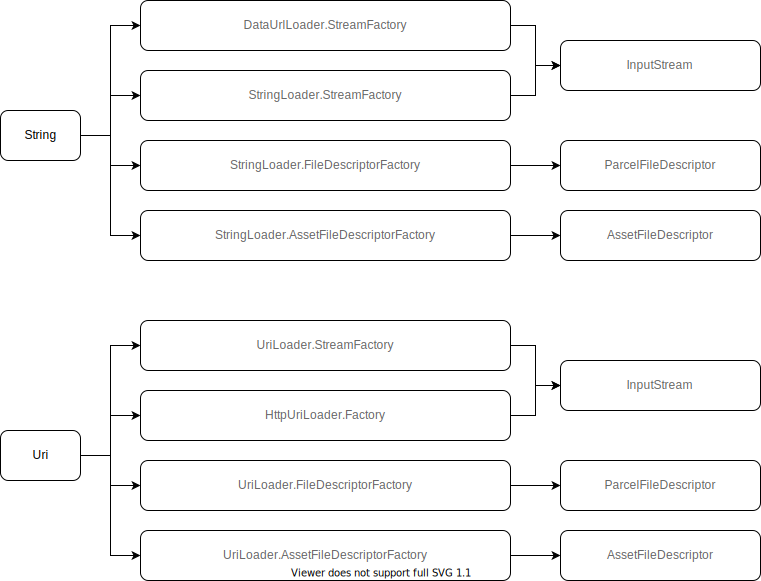

# Glide源码分析


## ModelLoader

`ModelLoader`类负责将`model`转换为`data`。`model`就是我们在调用`load`方法传入的值。`Glide`中`data`主要包括`InputStream`、`ParcelFileDescriptor`和`AssetFileDescriptor`。





```java
//StringLoader先将String转化为Uri
//通过MultiModelLoaderFactory获取一个MultiModelLoader对象
//内部调用的MultiModelLoader
public static class StreamFactory implements ModelLoaderFactory<String, InputStream> {

    @NonNull
    @Override
    public ModelLoader<String, InputStream> build(@NonNull MultiModelLoaderFactory multiFactory) {
      return new StringLoader<>(multiFactory.build(Uri.class, InputStream.class));
    }

    @Override
    public void teardown() {
      // Do nothing.
    }
}
```


```java
//DecodeHelper
//根据文件获取ModelLoader
List<ModelLoader<File, ?>> getModelLoaders(File file)
throws Registry.NoModelLoaderAvailableException {
    return glideContext.getRegistry()
        .getModelLoaders(file);
}
//DecodeHelper
//SourceGenerator方法
//根据Model获取对应的LoadData
List<LoadData<?>> getLoadData() {
    if (!isLoadDataSet) {
        isLoadDataSet = true;
        loadData.clear();
        List<ModelLoader<Object, ?>> modelLoaders = glideContext.getRegistry()
            .getModelLoaders(model);
        Log.d(TAG, "getLoadData: size = "+modelLoaders.size());
        //noinspection ForLoopReplaceableByForEach to improve perf
        for (int i = 0, size = modelLoaders.size(); i < size; i++) {
        ModelLoader<Object, ?> modelLoader = modelLoaders.get(i);

        LoadData<?> current = modelLoader.buildLoadData(model, width, height, options);
        Log.d(TAG, "getLoadData: "+(current==null));

        if (current != null) {
            loadData.add(current);
        }
        }
    }
    return loadData;
}
//Registry的getModelLoaders方法 
@NonNull
public <Model> List<ModelLoader<Model, ?>> getModelLoaders(@NonNull Model model) {
    List<ModelLoader<Model, ?>> result = modelLoaderRegistry.getModelLoaders(model);
    if (result.isEmpty()) {
        throw new NoModelLoaderAvailableException(model);
    }
    return result;
}

@NonNull
public <A> List<ModelLoader<A, ?>> getModelLoaders(@NonNull A model) {
    List<ModelLoader<A, ?>> modelLoaders = getModelLoadersForClass(getClass(model)); //
    int size = modelLoaders.size();
    boolean isEmpty = true;
    List<ModelLoader<A, ?>> filteredLoaders = Collections.emptyList();
    //noinspection ForLoopReplaceableByForEach to improve perf
    for (int i = 0; i < size; i++) {
        ModelLoader<A, ?> loader = modelLoaders.get(i);
        //根据ModelLoader的handles方法，过滤掉不匹配的
        //假设传入的是url，则过滤掉DataUrlLoader
        if (loader.handles(model)) {
            if (isEmpty) {
                filteredLoaders = new ArrayList<>(size - i);
                isEmpty = false;
            }
            filteredLoaders.add(loader);
        }
    }
    return filteredLoaders;
}

@NonNull
private synchronized <A> List<ModelLoader<A, ?>> getModelLoadersForClass(
    @NonNull Class<A> modelClass) {
    //从缓存中获取
    List<ModelLoader<A, ?>> loaders = cache.get(modelClass);
    if (loaders == null) {
        //缓存中不存在 则根据对应的model获取ModelLoader
        //如果glide是一个string根据上图会获得四个ModelLoader对象
        loaders = Collections.unmodifiableList(multiModelLoaderFactory.build(modelClass));
        cache.put(modelClass, loaders);
    }
    return loaders;
}
```

## 加载到内存的图片大小

默认大小为`ImageView`的大小。设置了`override`，则是设置的大小。如果设置值为`Target.SIZE_ORIGINAL`，则使用图片原始大小。

```java
//SingleRequest begin方法
if (Util.isValidDimensions(overrideWidth, overrideHeight)) {
    onSizeReady(overrideWidth, overrideHeight);
} else {
    target.getSize(this);
}
//ViewTarget getSize方法
public void getSize(@NonNull SizeReadyCallback cb) {
    sizeDeterminer.getSize(cb);
}
//SizeDeterminer getSize方法
void getSize(@NonNull SizeReadyCallback cb) {
    int currentWidth = getTargetWidth(); //获取宽
    int currentHeight = getTargetHeight(); //获取高
    if (isViewStateAndSizeValid(currentWidth, currentHeight)) {
        cb.onSizeReady(currentWidth, currentHeight);
        return;
    }

    // We want to notify callbacks in the order they were added and we only expect one or two
    // callbacks to be added a time, so a List is a reasonable choice.
    if (!cbs.contains(cb)) {
        cbs.add(cb);
    }
    if (layoutListener == null) {
        ViewTreeObserver observer = view.getViewTreeObserver();
        layoutListener = new SizeDeterminerLayoutListener(this);
        observer.addOnPreDrawListener(layoutListener);
    }
}
//CustomTarget默认是原图大小
public CustomTarget() {
    this(Target.SIZE_ORIGINAL, Target.SIZE_ORIGINAL);
}
//Downsampler decodeFromWrappedStreams方法
//获取图片的原始宽高
int[] sourceDimensions = getDimensions(is, options, callbacks, bitmapPool);
int sourceWidth = sourceDimensions[0];
int sourceHeight = sourceDimensions[1];
//如果设置Target.SIZE_ORIGINAL 则为原始宽高
int targetWidth = requestedWidth == Target.SIZE_ORIGINAL ? sourceWidth : requestedWidth;
int targetHeight = requestedHeight == Target.SIZE_ORIGINAL ? sourceHeight : requestedHeight;
```
