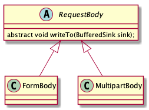

# Okhttp基本流程分析

## 基本流程

1. 创建`RequestBody`
2. 创建`Request`
3. 创建`OkhttpClient`
4. 调用`newCall`创建Call对象
5. 执行异步或同步操作。
6. 创建`Socket`连接
7. 发送请求并处理返回结果

## 创建RequestBody

`RequestBody`主要通过`writeTo`方法将请求内容写入到`BufferedSink`。`RequestBody`提供了3个`create`静态方法来创建`RequestBody`，此外`RequestBody`还包含两个子类。



`FormBody`用于表单提交，`MultipartBody`用于多内容提交。

## 创建Request

`Request`对象包含如下信息

```java
final HttpUrl url; //请求连接
final String method; //请求方法
final Headers headers; //请求头
final @Nullable RequestBody body; //请求体
final Map<Class<?>, Object> tags; //tags
```

## 创建OkHttpClient

`OkHttpClient`可配置的信息包括如下：

```java
final Dispatcher dispatcher; //调度器主要负责异步请求
final @Nullable Proxy proxy; //代理
final List<Protocol> protocols; //支持的协议 默认支持HTTP1.1 和HTTP2.0
final List<ConnectionSpec> connectionSpecs; //传输层版本和连接协议
final List<Interceptor> interceptors; //拦截器
final List<Interceptor> networkInterceptors;//网络拦截器
final EventListener.Factory eventListenerFactory; //
final ProxySelector proxySelector; //代理选择器
final CookieJar cookieJar;
final @Nullable Cache cache; //缓存
final @Nullable InternalCache internalCache; //内部缓存
final SocketFactory socketFactory; //工厂
final SSLSocketFactory sslSocketFactory; //安全套接层
final CertificateChainCleaner certificateChainCleaner; //验证确认响应书，适用HTTPS 请求连接的主机名
final HostnameVerifier hostnameVerifier;//主机名字确认
final CertificatePinner certificatePinner; //证书链
final Authenticator proxyAuthenticator; //代理身份验证
final Authenticator authenticator; //本地身份验证
final ConnectionPool connectionPool; //链接池 复用连接
final Dns dns; //DNS
final boolean followSslRedirects; //安全套接层重定向
final boolean followRedirects; //本地重定向
final boolean retryOnConnectionFailure; //重试连接失败
final int callTimeout; //默认0
final int connectTimeout; //连接超时时间 默认10s
final int readTimeout;  //读取超时时间默认10s
final int writeTimeout; //写入超时时间 默认10s
final int pingInterval;
```

## 调用newCall创建Call对象

`OkHttpClient`继承`Call.Factory`。

```java
interface Factory {
  Call newCall(Request request);
}
```

`OkHttpClient`的`newCall`方法调用

```java
override fun newCall(request: Request): Call = RealCall(this, request, forWebSocket = false)
```

## 执行网络请求

Call支持执行网络请求的方法`enqueue`和`execute()`。`enqueue`执行异步请求，`execute()`执行同步请求。

```java
@Override public void enqueue(Callback responseCallback) {
  synchronized (this) {
    if (executed) throw new IllegalStateException("Already Executed");
    executed = true;
  }
  transmitter.callStart();
  //调用Dispatcher的enqueue方法
 // AsyncCall继承自Runnable
  client.dispatcher().enqueue(new AsyncCall(responseCallback));
}
```

`Dispatcher`类

```java
void enqueue(AsyncCall call) {
  synchronized (this) {
    readyAsyncCalls.add(call); //添加到准备请求的队列中

    // Mutate the AsyncCall so that it shares the AtomicInteger of an existing running call to
    // the same host.
    if (!call.get().forWebSocket) {
      //寻找相同主机的Call
      AsyncCall existingCall = findExistingCallWithHost(call.host());
      //复用已经存在call的callsPerHost
      //也就是主机数相同的Call公用一个callsPerHost对象
      if (existingCall != null) call.reuseCallsPerHostFrom(existingCall);
    }
  }
  promoteAndExecute();
}
```

```java
  /**
   * Promotes eligible calls from {@link #readyAsyncCalls} to {@link #runningAsyncCalls} and runs
   * them on the executor service. Must not be called with synchronization because executing calls
   * can call into user code.
   *
   * @return true if the dispatcher is currently running calls.
   */
  private boolean promoteAndExecute() {
    assert (!Thread.holdsLock(this));

    List<AsyncCall> executableCalls = new ArrayList<>();
    boolean isRunning;
    synchronized (this) {
      for (Iterator<AsyncCall> i = readyAsyncCalls.iterator(); i.hasNext(); ) {
        AsyncCall asyncCall = i.next();
        //如果正在运行的Call的数量大于64 
        if (runningAsyncCalls.size() >= maxRequests) break; // Max capacity.
        if (asyncCall.callsPerHost().get() >= maxRequestsPerHost) continue; // Host max capacity.

        i.remove();
        asyncCall.callsPerHost().incrementAndGet();
        executableCalls.add(asyncCall);
        runningAsyncCalls.add(asyncCall);
      }
      isRunning = runningCallsCount() > 0;
    }

    for (int i = 0, size = executableCalls.size(); i < size; i++) {
      AsyncCall asyncCall = executableCalls.get(i);
      asyncCall.executeOn(executorService());
    }

    return isRunning;
  }
```

```java
//创建线程池
public synchronized ExecutorService executorService() {
  if (executorService == null) {
    executorService = new ThreadPoolExecutor(0, Integer.MAX_VALUE, 60, TimeUnit.SECONDS,
        new SynchronousQueue<>(), Util.threadFactory("OkHttp Dispatcher", false));
  }
  return executorService;
}
```

`AsyncCall`的`executeOn`方法

```java
void executeOn(ExecutorService executorService) {
  assert (!Thread.holdsLock(client.dispatcher()));
  boolean success = false;
  try {
    executorService.execute(this);//执行runnable
    success = true;
  } catch (RejectedExecutionException e) {
    InterruptedIOException ioException = new InterruptedIOException("executor rejected");
    ioException.initCause(e);
    transmitter.noMoreExchanges(ioException);
    responseCallback.onFailure(RealCall.this, ioException);
  } finally {
    if (!success) {
      client.dispatcher().finished(this); // This call is no longer running!
    }
  }
}
```

```java
@Override protected void execute() {
  boolean signalledCallback = false;
  transmitter.timeoutEnter();
  try {
    //责任链模式
    Response response = getResponseWithInterceptorChain();
    signalledCallback = true;
    responseCallback.onResponse(RealCall.this, response);
  } catch (IOException e) {
    if (signalledCallback) {
      // Do not signal the callback twice!
      Platform.get().log(INFO, "Callback failure for " + toLoggableString(), e);
    } else {
      responseCallback.onFailure(RealCall.this, e);
    }
  } catch (Throwable t) {
    cancel();
    if (!signalledCallback) {
      IOException canceledException = new IOException("canceled due to " + t);
      canceledException.addSuppressed(t);
      responseCallback.onFailure(RealCall.this, canceledException);
    }
    throw t;
  } finally {
    client.dispatcher().finished(this);
  }
}
```

## 拦截器

`RealInterceptorChain`的`proceed`会创建一个`InterceptorChain`，并调用拦截器的`intercept`方法。除了`CallServerInterceptor`外，所有拦截器的`intercept`都会调用创建的`InterceptorChain`的`proceed`方法。


```java
Response getResponseWithInterceptorChain() throws IOException {
  // Build a full stack of interceptors.
  List<Interceptor> interceptors = new ArrayList<>();
  interceptors.addAll(client.interceptors());
  interceptors.add(new RetryAndFollowUpInterceptor(client));
  interceptors.add(new BridgeInterceptor(client.cookieJar()));
  interceptors.add(new CacheInterceptor(client.internalCache()));
  interceptors.add(new ConnectInterceptor(client));
  if (!forWebSocket) {
    interceptors.addAll(client.networkInterceptors());
  }
  interceptors.add(new CallServerInterceptor(forWebSocket));
  //创建chain并把所有的拦截器传递给chain
  Interceptor.Chain chain = new RealInterceptorChain(interceptors, transmitter, null, 0,
      originalRequest, this, client.connectTimeoutMillis(),
      client.readTimeoutMillis(), client.writeTimeoutMillis());

  boolean calledNoMoreExchanges = false;
  try {
    //执行chain的proceed方法
    Response response = chain.proceed(originalRequest);
    if (transmitter.isCanceled()) {
      closeQuietly(response);
      throw new IOException("Canceled");
    }
    return response;
  } catch (IOException e) {
    calledNoMoreExchanges = true;
    throw transmitter.noMoreExchanges(e);
  } finally {
    if (!calledNoMoreExchanges) {
      transmitter.noMoreExchanges(null);
    }
  }
}
```

```java
public Response proceed(Request request, Transmitter transmitter, @Nullable Exchange exchange)
    throws IOException {
  if (index >= interceptors.size()) throw new AssertionError();

  calls++;

  // If we already have a stream, confirm that the incoming request will use it.
  if (this.exchange != null && !this.exchange.connection().supportsUrl(request.url())) {
    throw new IllegalStateException("network interceptor " + interceptors.get(index - 1)
        + " must retain the same host and port");
  }

  // If we already have a stream, confirm that this is the only call to chain.proceed().
  if (this.exchange != null && calls > 1) {
    throw new IllegalStateException("network interceptor " + interceptors.get(index - 1)
        + " must call proceed() exactly once");
  }

  // Call the next interceptor in the chain.
  //创建下一个chain 并传递给拦截器
  RealInterceptorChain next = new RealInterceptorChain(interceptors, transmitter, exchange,
      index + 1, request, call, connectTimeout, readTimeout, writeTimeout);
  Interceptor interceptor = interceptors.get(index);
  //调用拦截器的intercept方法 在interceptor中会调用next的proceed执行下一个拦截器
  Response response = interceptor.intercept(next);

  // Confirm that the next interceptor made its required call to chain.proceed().
  if (exchange != null && index + 1 < interceptors.size() && next.calls != 1) {
    throw new IllegalStateException("network interceptor " + interceptor
        + " must call proceed() exactly once");
  }

  // Confirm that the intercepted response isn't null.
  if (response == null) {
    throw new NullPointerException("interceptor " + interceptor + " returned null");
  }

  if (response.body() == null) {
    throw new IllegalStateException(
        "interceptor " + interceptor + " returned a response with no body");
  }

  return response;
}
```

## 建立连接

`OkHttp`通过`ConnectInterceptor`建立连接。在`ConnectInterceptor`的`intercept`方法中，通过调用`RealCall`的`initExchange`方法初始化一个`Exchange`对象。`Exchange`对象负责交换数据。

```kotlin
object ConnectInterceptor : Interceptor {
  @Throws(IOException::class)
  override fun intercept(chain: Interceptor.Chain): Response {
    val realChain = chain as RealInterceptorChain
    //调用RealCall的initExchange初始化Exchange
    val exchange = realChain.call.initExchange(chain)
    //创建一个新的Chain
    val connectedChain = realChain.copy(exchange = exchange)
    return connectedChain.proceed(realChain.request)
  }
}
```

### initExchange\(\)

```java
/** Finds a new or pooled connection to carry a forthcoming request and response. */
internal fun initExchange(chain: RealInterceptorChain): Exchange {
  synchronized(this) {
    check(expectMoreExchanges) { "released" }
    check(!responseBodyOpen)
    check(!requestBodyOpen)
  }
  //ExchangeFinder
  val exchangeFinder = this.exchangeFinder!!
  //ExchangeFinder调用find方法获取ExchangeCodec
  val codec = exchangeFinder.find(client, chain)
  //创建Exchange
  val result = Exchange(this, eventListener, exchangeFinder, codec)
  this.interceptorScopedExchange = result
  this.exchange = result
  synchronized(this) {
    this.requestBodyOpen = true
    this.responseBodyOpen = true
  }

  if (canceled) throw IOException("Canceled")
  return result
}
```

#### find\(\)

```kotlin
fun find(
  client: OkHttpClient,
  chain: RealInterceptorChain
): ExchangeCodec {
  try {
  //调用findHealthyConnection获取连接
    val resultConnection = findHealthyConnection(
        connectTimeout = chain.connectTimeoutMillis,
        readTimeout = chain.readTimeoutMillis,
        writeTimeout = chain.writeTimeoutMillis,
        pingIntervalMillis = client.pingIntervalMillis,
        connectionRetryEnabled = client.retryOnConnectionFailure,
        doExtensiveHealthChecks = chain.request.method != "GET"
    )
    //调用RealConnection的newCodec获取ExchangeCodec
    return resultConnection.newCodec(client, chain)
  } catch (e: RouteException) {
    trackFailure(e.lastConnectException)
    throw e
  } catch (e: IOException) {
    trackFailure(e)
    throw RouteException(e)
  }
}
```

### findHealthyConnection\(\)

```kotlin
@Throws(IOException::class)
private fun findHealthyConnection(
  connectTimeout: Int,
  readTimeout: Int,
  writeTimeout: Int,
  pingIntervalMillis: Int,
  connectionRetryEnabled: Boolean,
  doExtensiveHealthChecks: Boolean
): RealConnection {
  while (true) {
    //调用findConnection方法获取RealConnection
    val candidate = findConnection(
        connectTimeout = connectTimeout,
        readTimeout = readTimeout,
        writeTimeout = writeTimeout,
        pingIntervalMillis = pingIntervalMillis,
        connectionRetryEnabled = connectionRetryEnabled
    )
    // Confirm that the connection is good.
    //判断连接是否健康
    if (candidate.isHealthy(doExtensiveHealthChecks)) {
      return candidate
    }
    // If it isn't, take it out of the pool.
    candidate.noNewExchanges()
    // Make sure we have some routes left to try. One example where we may exhaust all the routes
    // would happen if we made a new connection and it immediately is detected as unhealthy.
    if (nextRouteToTry != null) continue
    val routesLeft = routeSelection?.hasNext() ?: true
    if (routesLeft) continue
    val routesSelectionLeft = routeSelector?.hasNext() ?: true
    if (routesSelectionLeft) continue
    throw IOException("exhausted all routes")
  }
}
```

### findConnection\(\)

1. 如果call里面的connection不为空，则复用call里面的connection。
2. 如果call中的connection为空，则从连接池中获取一个。
3. 如果缓存池里也没有就

```kotlin
@Throws(IOException::class)
private fun findConnection(
  connectTimeout: Int,
  readTimeout: Int,
  writeTimeout: Int,
  pingIntervalMillis: Int,
  connectionRetryEnabled: Boolean
): RealConnection {
  //如果取消抛异常
  if (call.isCanceled()) throw IOException("Canceled")
  // Attempt to reuse the connection from the call.
  //复用call里面的连接
  val callConnection = call.connection // This may be mutated by releaseConnectionNoEvents()!
  if (callConnection != null) {
    var toClose: Socket? = null
    synchronized(callConnection) {
      if (callConnection.noNewExchanges || !sameHostAndPort(callConnection.route().address.url)) {
        //释放连接
        toClose = call.releaseConnectionNoEvents()
      }
    }
    // If the call's connection wasn't released, reuse it. We don't call connectionAcquired() here
    // because we already acquired it.
    //如果call里面的connection不为空
    if (call.connection != null) {
      check(toClose == null)
      return callConnection
    }
    // The call's connection was released.
    toClose?.closeQuietly()
    eventListener.connectionReleased(call, callConnection)
  }
  // We need a new connection. Give it fresh stats.
  refusedStreamCount = 0
  connectionShutdownCount = 0
  otherFailureCount = 0
  // Attempt to get a connection from the pool.
  //尝试从连接池中获取一个连接
  if (connectionPool.callAcquirePooledConnection(address, call, null, false)) {
    val result = call.connection!!
    eventListener.connectionAcquired(call, result)
    return result
  }
  // Nothing in the pool. Figure out what route we'll try next.
  //没看懂这一块路由相关的逻辑
  val routes: List<Route>?
  val route: Route
  if (nextRouteToTry != null) {
    // Use a route from a preceding coalesced connection.
    routes = null
    route = nextRouteToTry!!
    nextRouteToTry = null
  } else if (routeSelection != null && routeSelection!!.hasNext()) {
    // Use a route from an existing route selection.
    routes = null
    route = routeSelection!!.next()
  } else {
    // Compute a new route selection. This is a blocking operation!
    var localRouteSelector = routeSelector
    if (localRouteSelector == null) {
      localRouteSelector = RouteSelector(address, call.client.routeDatabase, call, eventListener)
      this.routeSelector = localRouteSelector
    }
    val localRouteSelection = localRouteSelector.next()
    routeSelection = localRouteSelection
    routes = localRouteSelection.routes
    if (call.isCanceled()) throw IOException("Canceled")
    // Now that we have a set of IP addresses, make another attempt at getting a connection from
    // the pool. We have a better chance of matching thanks to connection coalescing.
    //再次尝试从连接池中获取
    if (connectionPool.callAcquirePooledConnection(address, call, routes, false)) {
      val result = call.connection!!
      eventListener.connectionAcquired(call, result)
      return result
    }
    route = localRouteSelection.next()
  }
  // Connect. Tell the call about the connecting call so async cancels work.
  //创建连接
  val newConnection = RealConnection(connectionPool, route)
  call.connectionToCancel = newConnection
  try {
    //建立连接
    newConnection.connect(
        connectTimeout,
        readTimeout,
        writeTimeout,
        pingIntervalMillis,
        connectionRetryEnabled,
        call,
        eventListener
    )
  } finally {
    call.connectionToCancel = null
  }
  call.client.routeDatabase.connected(newConnection.route())
  // If we raced another call connecting to this host, coalesce the connections. This makes for 3
  // different lookups in the connection pool!
  if (connectionPool.callAcquirePooledConnection(address, call, routes, true)) {
    val result = call.connection!!
    nextRouteToTry = route
    newConnection.socket().closeQuietly()
    eventListener.connectionAcquired(call, result)
    return result
  }
  synchronized(newConnection) {
    //存储到连接池中
    connectionPool.put(newConnection)
    //将connection赋值给call
    call.acquireConnectionNoEvents(newConnection)
  }
  eventListener.connectionAcquired(call, newConnection)
  return newConnection
}
```


## 执行网络请求

```java
/** This is the last interceptor in the chain. It makes a network call to the server. */
public final class CallServerInterceptor implements Interceptor {
  private final boolean forWebSocket;

  public CallServerInterceptor(boolean forWebSocket) {
    this.forWebSocket = forWebSocket;
  }

  @Override public Response intercept(Chain chain) throws IOException {
    RealInterceptorChain realChain = (RealInterceptorChain) chain;
    Exchange exchange = realChain.exchange();
    Request request = realChain.request();

    long sentRequestMillis = System.currentTimeMillis();

    exchange.writeRequestHeaders(request); //写入请求头

    boolean responseHeadersStarted = false;
    Response.Builder responseBuilder = null;
    if (HttpMethod.permitsRequestBody(request.method()) && request.body() != null) {
      // If there's a "Expect: 100-continue" header on the request, wait for a "HTTP/1.1 100
      // Continue" response before transmitting the request body. If we don't get that, return
      // what we did get (such as a 4xx response) without ever transmitting the request body.
      if ("100-continue".equalsIgnoreCase(request.header("Expect"))) {
        exchange.flushRequest();
        responseHeadersStarted = true;
        exchange.responseHeadersStart();
        responseBuilder = exchange.readResponseHeaders(true);
      }
      //写入请求体
      if (responseBuilder == null) {
        if (request.body().isDuplex()) {
          // Prepare a duplex body so that the application can send a request body later.
          exchange.flushRequest();
          BufferedSink bufferedRequestBody = Okio.buffer(
              exchange.createRequestBody(request, true));
          request.body().writeTo(bufferedRequestBody);
        } else {
          // Write the request body if the "Expect: 100-continue" expectation was met.
          BufferedSink bufferedRequestBody = Okio.buffer(
              exchange.createRequestBody(request, false));
          request.body().writeTo(bufferedRequestBody);
          bufferedRequestBody.close();
        }
      } else {
        exchange.noRequestBody();
        if (!exchange.connection().isMultiplexed()) {
          // If the "Expect: 100-continue" expectation wasn't met, prevent the HTTP/1 connection
          // from being reused. Otherwise we're still obligated to transmit the request body to
          // leave the connection in a consistent state.
          exchange.noNewExchangesOnConnection();
        }
      }
    } else {
      exchange.noRequestBody();
    }

    if (request.body() == null || !request.body().isDuplex()) {
      exchange.finishRequest();
    }

    if (!responseHeadersStarted) {
      exchange.responseHeadersStart();
    }

    if (responseBuilder == null) {
      responseBuilder = exchange.readResponseHeaders(false);
    }

    Response response = responseBuilder
        .request(request)
        .handshake(exchange.connection().handshake())
        .sentRequestAtMillis(sentRequestMillis)
        .receivedResponseAtMillis(System.currentTimeMillis())
        .build();

    int code = response.code();
    if (code == 100) {
      // server sent a 100-continue even though we did not request one.
      // try again to read the actual response
      response = exchange.readResponseHeaders(false)
          .request(request)
          .handshake(exchange.connection().handshake())
          .sentRequestAtMillis(sentRequestMillis)
          .receivedResponseAtMillis(System.currentTimeMillis())
          .build();

      code = response.code();
    }

    exchange.responseHeadersEnd(response);

    if (forWebSocket && code == 101) {
      // Connection is upgrading, but we need to ensure interceptors see a non-null response body.
      response = response.newBuilder()
          .body(Util.EMPTY_RESPONSE)
          .build();
    } else {
      response = response.newBuilder()
          .body(exchange.openResponseBody(response))
          .build();
    }

    if ("close".equalsIgnoreCase(response.request().header("Connection"))
        || "close".equalsIgnoreCase(response.header("Connection"))) {
      exchange.noNewExchangesOnConnection();
    }

    if ((code == 204 || code == 205) && response.body().contentLength() > 0) {
      throw new ProtocolException(
          "HTTP " + code + " had non-zero Content-Length: " + response.body().contentLength());
    }

    return response;
  }
}
```

