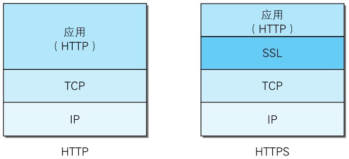
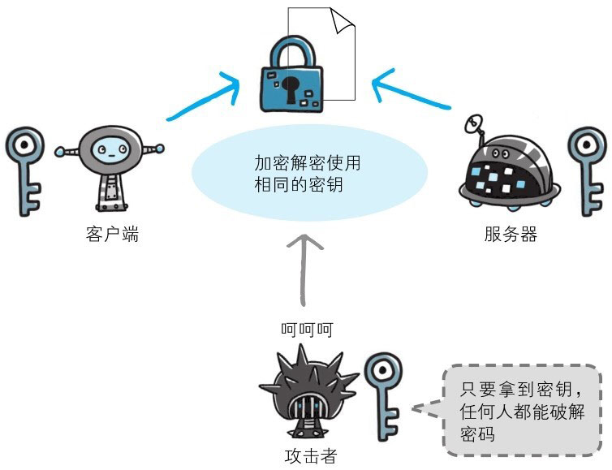

# Https

Http有以下缺点：

* 通信使用明文（不加密），内容可能会被窃听。HTTP协议通信过程中使用未经加密的明文，比如在Web页面中输入信用卡号，如果这条通信线路遭到窃听，那么信用卡号就暴露了。
* 不验证通信方的身份，因此有可能遭遇伪装对于HTTP来说，服务器也好，客户端也好，都是没有办法确认通信方的。因为很有可能并不是和原本预想的通信方在实际通信。并且还需要考虑到接收到的报文在通信途中已经遭到篡改这一可能性。
* 无法证明报文的完整性，所以有可能已遭篡改。

为了统一解决上述这些问题，需要在HTTP上再加入加密处理和认证等机制。我们把添加了加密及认证机制的HTTP称为HTTPS（HTTP Secure）。

HTTPS并非是应用层的一种新协议。只是HTTP通信接口部分用SSL（SecureSocket Layer）和TLS（Transport Layer Security）协议代替而已。通常，HTTP直接和TCP通信。当使用SSL时，则演变成先和SSL通信，再由SSL和TCP通信了。简言之，所谓HTTPS，其实就是身披SSL协议这层外壳的HTTP。

通常，HTTP直接和TCP通信。当使用SSL时，则演变成先和SSL通信，再由SSL和TCP通信了。简言之，所谓HTTPS，其实就是身披SSL协议这层外壳的HTTP。

在采用SSL后，HTTP就拥有了HTTPS的加密、证书和完整性保护这些功能。SSL是独立于HTTP的协议，所以不光是HTTP协议，其他运行在应用层的SMTP和Telnet等协议均可配合SSL协议使用。可以说SSL是当今世界上应用最为广泛的网络安全技术。

## 加密算法

公开密钥加密方式很好地解决了共享密钥加密的困难。公开密钥加密使用一对非对称的密钥。一把叫做私有密钥（private key），另一把叫做公开密钥（public key）。顾名思义，私有密钥不能让其他任何人知道，而公开密钥则可以随意发布，任何人都可以获得。

### 对称加密

加密和解密同用一个密钥的方式称为共享密钥加密（Common key cryptosystem），也被叫做对称加密。

以共享密钥方式加密时必须将密钥也发给对方。可究竟怎样才能安全地转交？在互联网上转发密钥时，如果通信被监听那么密钥就可会落入攻击者之手，同时也就失去了加密的意义。另外还得设法安全地保管接收到的密钥。

### 非对称加密

公开密钥加密方式很好地解决了共享密钥加密的困难。公开密钥加密使用一对非对称的密钥。一把叫做私有密钥（private key），另一把叫做公开密钥（public key）。顾名思义，私有密钥不能让其他任何人知道，而公开密钥则可以随意发布，任何人都可以获得。