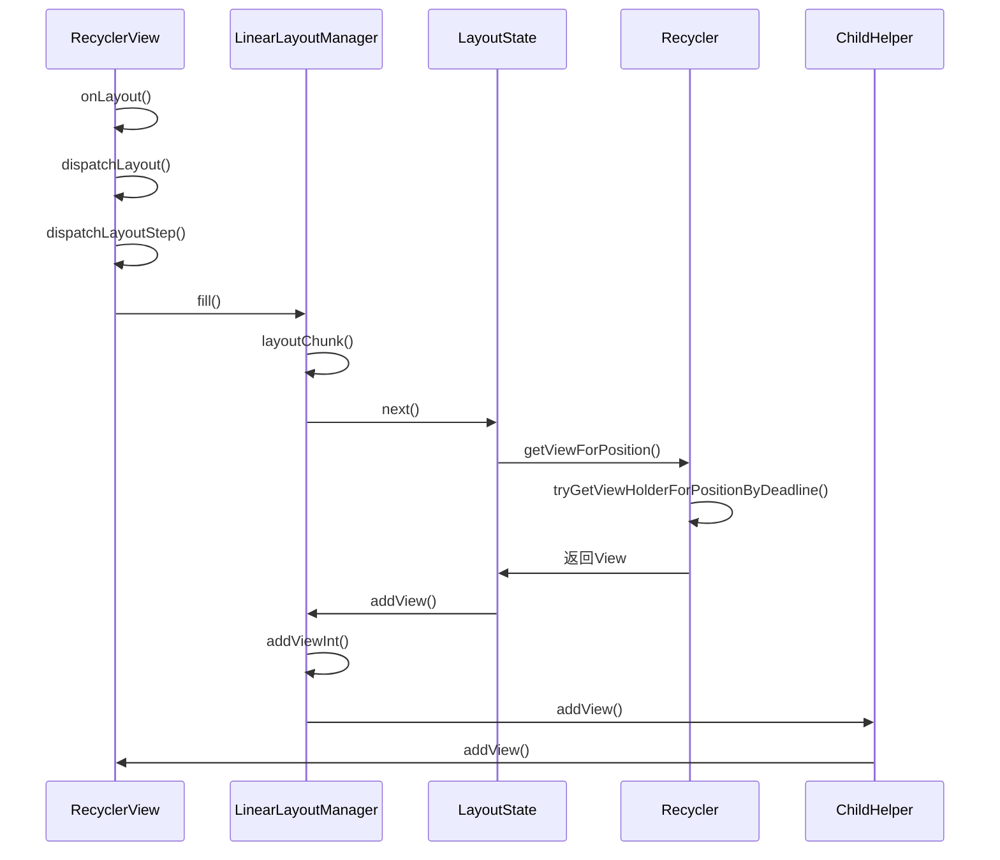

在上一篇文章中，我们主要分析了`RecyclerView`中的几个重要的内部类。今天我们就把它们串起来，看它们分别是如何工作的。

`RecyclerView`继承自`ViewGroup`。所以肯定是通过`addView`的方式来将所有的`item`添加进来的。所以在分析过程中，我先找到`addView`的调用位置，然后一步步倒推，看`view`是如何获取的。

首先，在创建`ChildHelper`时传入的`Callback`中调用了`addView()`方法。除了调用了`addView()`之外，还调用了`removeViewAt`等方法。

```java
private void initChildrenHelper() {
    mChildHelper = new ChildHelper(new ChildHelper.Callback() {
        @Override
        public int getChildCount() {
            return RecyclerView.this.getChildCount();
        }

        @Override
        public void addView(View child, int index) {
            if (VERBOSE_TRACING) {
                TraceCompat.beginSection("RV addView");
            }
            //调用ViewGroup的addView
            RecyclerView.this.addView(child, index);
            //...
        }

        @Override
        public int indexOfChild(View view) {
            return RecyclerView.this.indexOfChild(view);
        }

        @Override
        public void removeViewAt(int index) {
            final View child = RecyclerView.this.getChildAt(index);
            //...
            RecyclerView.this.removeViewAt(index);
            //...
        }

        @Override
        public View getChildAt(int offset) {
            return RecyclerView.this.getChildAt(offset);
        }

        @Override
        public void removeAllViews() {
            //...
            RecyclerView.this.removeAllViews();
        }

        @Override
        public ViewHolder getChildViewHolder(View view) {
            return getChildViewHolderInt(view);
        }

        @Override
        public void attachViewToParent(View child, int index,
                ViewGroup.LayoutParams layoutParams) {
            //...        
            RecyclerView.this.attachViewToParent(child, index, layoutParams);
        }

        @Override
        public void detachViewFromParent(int offset) {
            //...
            RecyclerView.this.detachViewFromParent(offset);
        }

        @Override
        public void onEnteredHiddenState(View child) {
            final ViewHolder vh = getChildViewHolderInt(child);
            if (vh != null) {
                vh.onEnteredHiddenState(RecyclerView.this);
            }
        }

        @Override
        public void onLeftHiddenState(View child) {
            final ViewHolder vh = getChildViewHolderInt(child);
            if (vh != null) {
                vh.onLeftHiddenState(RecyclerView.this);
            }
        }
    });
}
```

接下来，看何时执行`Callback`中的回调方法。

```java
//ChildHelper addView方法
void addView(View child, int index, boolean hidden) {
    final int offset;
    if (index < 0) {
        offset = mCallback.getChildCount();
    } else {
        offset = getOffset(index);
    }
    mBucket.insert(offset, hidden);
    if (hidden) {
        hideViewInternal(child);
    }
    //执行add方法
    mCallback.addView(child, offset);
}
//LayoutManager的addViewInt方法
private void addViewInt(View child, int index, boolean disappearing) {
    //....
    if (holder.wasReturnedFromScrap() || holder.isScrap()) {
        //...
    } else if (child.getParent() == mRecyclerView) { // it was not a scrap but a valid child
        // ensure in correct position
        //...
    } else {
        //调用addView方法
        mChildHelper.addView(child, index, false);
        lp.mInsetsDirty = true;
        if (mSmoothScroller != null && mSmoothScroller.isRunning()) {
            mSmoothScroller.onChildAttachedToWindow(child);
        }
    }
    if (lp.mPendingInvalidate) {
        holder.itemView.invalidate();
        lp.mPendingInvalidate = false;
    }
}
//LayoutManager的addView
public void addView(View child, int index) {
    addViewInt(child, index, false);
}
```

通过一路追踪，我们追踪到了`LayoutManager`的`addView`方法。接下来就是找，在哪里获取的view，然后调用的`addView`方法。这里我们以`LinearLayoutManager`为例。

```java
//LiearLayoutManager layoutChunk方法
void layoutChunk(RecyclerView.Recycler recycler, RecyclerView.State state,
        LayoutState layoutState, LayoutChunkResult result) {
    //获取view
    View view = layoutState.next(recycler);
    RecyclerView.LayoutParams params = (RecyclerView.LayoutParams) view.getLayoutParams();
    if (layoutState.mScrapList == null) {
        if (mShouldReverseLayout == (layoutState.mLayoutDirection
                == LayoutState.LAYOUT_START)) {
            addView(view);
        } else {
            addView(view, 0);
        }
    } else {
        //...
    }
    //...
}
```

`LinearLayoutManager`调用`LayoutState`的`next`方法获取`view`。`LayoutState`是一个工具类，用来保存`LayoutManager`填充时的临时状态。`LayoutState`方法调用了`Recycler`的`getViewForPosition`方法获取`ViewHolder`。 对于`getViewForPosition`之后的逻辑，涉及到`RecyclerView`的缓存，比较复杂，所以单独放到下一篇去讲。

```java
View next(RecyclerView.Recycler recycler) {
    if (mScrapList != null) {
        return nextViewFromScrapList();
    }
    final View view = recycler.getViewForPosition(mCurrentPosition);
    mCurrentPosition += mItemDirection;
    return view;
}
```

那么又是谁调用了`layoutChunk`呢。我们继续追踪：

```java
//LinearLayoutManager fill方法
int fill(RecyclerView.Recycler recycler, LayoutState layoutState,
        RecyclerView.State state, boolean stopOnFocusable) {
    //        
    int remainingSpace = layoutState.mAvailable + layoutState.mExtraFillSpace;
    LayoutChunkResult layoutChunkResult = mLayoutChunkResult;
    //不断循环获得新的item用于填充，直到没有填充空间
    while ((layoutState.mInfinite || remainingSpace > 0) && layoutState.hasMore(state)) {
        layoutChunkResult.resetInternal();
        //...
        layoutChunk(recycler, state, layoutState, layoutChunkResult);
        //...
    }
    return start - layoutState.mAvailable;
}
```

`fill`方法被`LinearLayoutManager`的`onLayoutChildren`方法调用。由于调用的次数比较多，而且代码比较长，这里就不贴代码了。

`onLayoutChildren`方法被`RecyclerView`的`dispatchLayoutStep1`和`dispatchLayoutStep2`调用，而这两个方法也在`RecyclerView`的`onMeasure`和`onLayout`方法调用。至此，`RecyclerView`整个流程分析完成。最后我们用一张图来总结一下。




