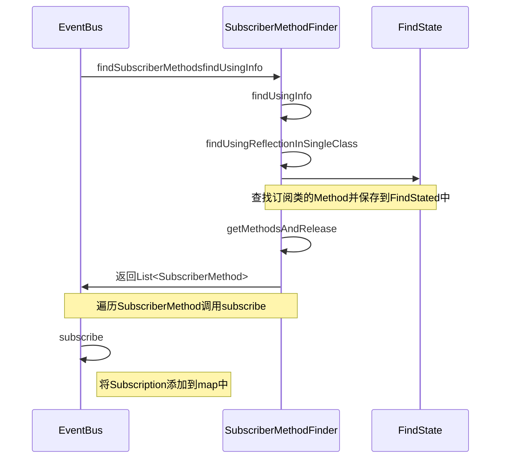
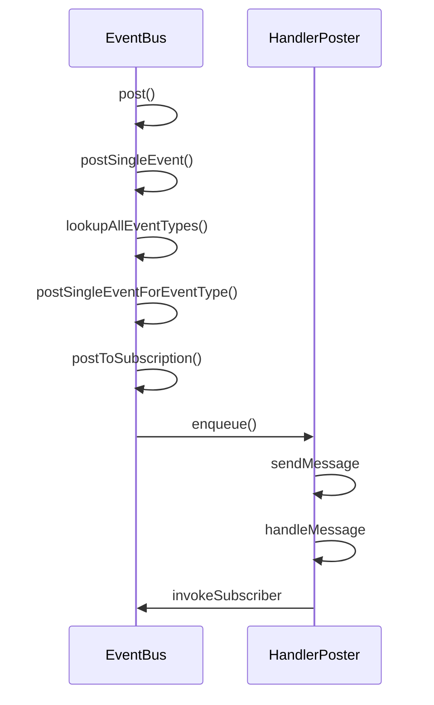
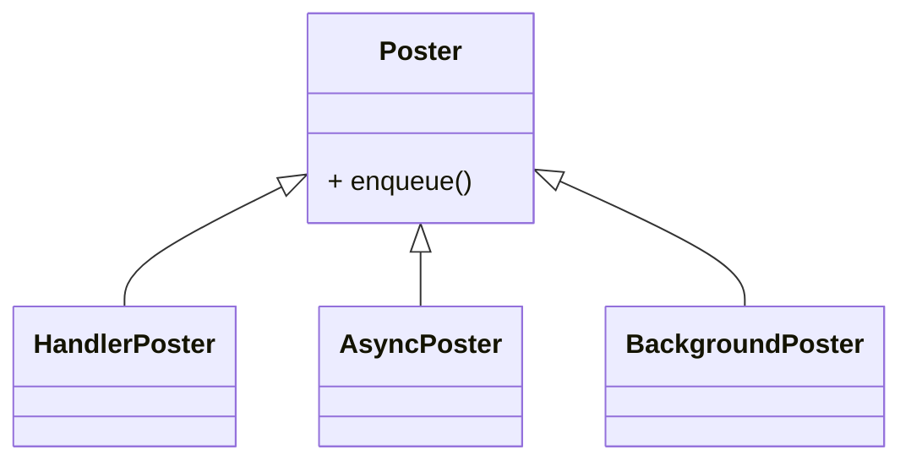

# EventBus源码分析

## EventBus创建

### getDefault()

在`getDefault()`中使用了双重校验并加锁的单例模式来创建`EventBus`实例。

```java
/** Convenience singleton for apps using a process-wide EventBus instance. */
public static EventBus getDefault() {
  EventBus instance = defaultInstance;
  if (instance == null) {
    synchronized (EventBus.class) {
      instance = EventBus.defaultInstance;
      if (instance == null) {
        instance = EventBus.defaultInstance = new EventBus();
      }
    }
  }
  return instance;
}
```

创建`EventBus`，传入了一个默认的`EventBusBuilder`。

```java
private static final EventBusBuilder DEFAULT_BUILDER = new EventBusBuilder();
public EventBus() {
  this(DEFAULT_BUILDER);
}
EventBus(EventBusBuilder builder) {
  logger = builder.getLogger();
  subscriptionsByEventType = new HashMap<>();
  typesBySubscriber = new HashMap<>();
  stickyEvents = new ConcurrentHashMap<>();
  mainThreadSupport = builder.getMainThreadSupport();
  //创建Poster
  mainThreadPoster = mainThreadSupport != null ? mainThreadSupport.createPoster(this) : null;
  backgroundPoster = new BackgroundPoster(this);
  asyncPoster = new AsyncPoster(this);
  indexCount = builder.subscriberInfoIndexes != null ? builder.subscriberInfoIndexes.size() : 0;
  subscriberMethodFinder = new SubscriberMethodFinder(builder.subscriberInfoIndexes,
          builder.strictMethodVerification, builder.ignoreGeneratedIndex);
  logSubscriberExceptions = builder.logSubscriberExceptions;
  logNoSubscriberMessages = builder.logNoSubscriberMessages;
  sendSubscriberExceptionEvent = builder.sendSubscriberExceptionEvent;
  sendNoSubscriberEvent = builder.sendNoSubscriberEvent;
  throwSubscriberException = builder.throwSubscriberException;
  eventInheritance = builder.eventInheritance;
  executorService = builder.executorService;
}
```

### EventBusBuilder

```java
public class EventBusBuilder{
      private final static ExecutorService DEFAULT_EXECUTOR_SERVICE = Executors.newCachedThreadPool(); //线程池

}
```

## register()

`register`

1. 查找订阅类，即通过`register`传入的对象里面所有使用`Subscribe`注释的方法，并将方法信息封装到`SubscriberMethod`对象中。
2. 遍历所有的`SubscriberMethod`对象，调用`subscribe`方法，每一个方法对应创建一个`Subscription`对象。
3. 将`Subscription`添加到`Map``subscriptionsByEventType`中，`key`是`EventType`的Class对象。`value`是订阅该事件的方法的集合。




```java
public void register(Object subscriber) {
    //获取当前类的Class
    Class<?> subscriberClass = subscriber.getClass();
    //获取当前类的所有SubscriberMethod
    List<SubscriberMethod> subscriberMethods = subscriberMethodFinder.findSubscriberMethods(subscriberClass);
    synchronized (this) {
        //遍历
        for (SubscriberMethod subscriberMethod : subscriberMethods) {
            subscribe(subscriber, subscriberMethod);
        }
    }
}
```

通过反射我们可以获取到类中`Subscribe`注释的方法，并将这些信息封装成一个`SubscriberMethod`对象。

### Subscribe

```java
public @interface Subscribe {
    ThreadMode threadMode() default ThreadMode.POSTING;

    /**
     * If true, delivers the most recent sticky event (posted with
     * {@link EventBus#postSticky(Object)}) to this subscriber (if event available).
     */
    boolean sticky() default false;

    /** Subscriber priority to influence the order of event delivery.
     * Within the same delivery thread ({@link ThreadMode}), higher priority subscribers will receive events before
     * others with a lower priority. The default priority is 0. Note: the priority does *NOT* affect the order of
     * delivery among subscribers with different {@link ThreadMode}s! */
    int priority() default 0;
}
```

### SubscriberMethod

```java
public class SubscriberMethod {
    final Method method; //方法
    final ThreadMode threadMode;
    final Class<?> eventType;
    final int priority;
    final boolean sticky;
    /** Used for efficient comparison */
    String methodString;
}
```

### findSubscriberMethods()

```java
//查找订阅方法
List<SubscriberMethod> findSubscriberMethods(Class<?> subscriberClass) {
  //先从缓存中查找
  List<SubscriberMethod> subscriberMethods = METHOD_CACHE.get(subscriberClass);
  if (subscriberMethods != null) {
    return subscriberMethods;
  }

  if (ignoreGeneratedIndex) { //默认是false
    subscriberMethods = findUsingReflection(subscriberClass);
  } else {
    subscriberMethods = findUsingInfo(subscriberClass);
  }
  if (subscriberMethods.isEmpty()) {
    throw new EventBusException("Subscriber " + subscriberClass
                                + " and its super classes have no public methods with the @Subscribe annotation");
  } else {
    METHOD_CACHE.put(subscriberClass, subscriberMethods);
    return subscriberMethods;
  }
}
```

### findUsingInfo()

```java
private List<SubscriberMethod> findUsingInfo(Class<?> subscriberClass) {
    FindState findState = prepareFindState(); //准备查询状态
    findState.initForSubscriber(subscriberClass); //初始化
    while (findState.clazz != null) {
        findState.subscriberInfo = getSubscriberInfo(findState);
        if (findState.subscriberInfo != null) { //null
            SubscriberMethod[] array = findState.subscriberInfo.getSubscriberMethods();
            for (SubscriberMethod subscriberMethod : array) {
                if (findState.checkAdd(subscriberMethod.method, subscriberMethod.eventType)) {
                    findState.subscriberMethods.add(subscriberMethod);
                }
            }
        } else {
            findUsingReflectionInSingleClass(findState);
        }
        findState.moveToSuperclass();
    }
    return getMethodsAndRelease(findState);
}
```

### findUsingReflectionInSingleClass()

```java
private void findUsingReflectionInSingleClass(FindState findState) {
  Method[] methods;
  try {
    // This is faster than getMethods, especially when subscribers are fat classes like Activities
    methods = findState.clazz.getDeclaredMethods();
  } catch (Throwable th) {
    // Workaround for java.lang.NoClassDefFoundError, see https://github.com/greenrobot/EventBus/issues/149
    try {
      methods = findState.clazz.getMethods();
    } catch (LinkageError error) { // super class of NoClassDefFoundError to be a bit more broad...
      String msg = "Could not inspect methods of " + findState.clazz.getName();
      if (ignoreGeneratedIndex) {
        msg += ". Please consider using EventBus annotation processor to avoid reflection.";
      } else {
        msg += ". Please make this class visible to EventBus annotation processor to avoid reflection.";
      }
      throw new EventBusException(msg, error);
    }
    findState.skipSuperClasses = true;
  }
  //遍历方法
  for (Method method : methods) {
    int modifiers = method.getModifiers();
    if ((modifiers & Modifier.PUBLIC) != 0 && (modifiers & MODIFIERS_IGNORE) == 0) {
      Class<?>[] parameterTypes = method.getParameterTypes();
      //判断参数个数是否是1如果不是1会抛出异常
      if (parameterTypes.length == 1) {
        //获取Subscribe注解
        Subscribe subscribeAnnotation = method.getAnnotation(Subscribe.class);
        //如果注解不为空
        if (subscribeAnnotation != null) {
          Class<?> eventType = parameterTypes[0]; //获取事件类型
          if (findState.checkAdd(method, eventType)) {
            ThreadMode threadMode = subscribeAnnotation.threadMode();
            //创建SubscriberMethod对象并添加到一个集合中
            findState.subscriberMethods.add(new SubscriberMethod(method, eventType, threadMode,
                                                                 subscribeAnnotation.priority(), subscribeAnnotation.sticky()));
          }
        }
      } else if (strictMethodVerification && method.isAnnotationPresent(Subscribe.class)) {
        String methodName = method.getDeclaringClass().getName() + "." + method.getName();
        throw new EventBusException("@Subscribe method " + methodName +
                                    "must have exactly 1 parameter but has " + parameterTypes.length);
      }
    } else if (strictMethodVerification && method.isAnnotationPresent(Subscribe.class)) {
      String methodName = method.getDeclaringClass().getName() + "." + method.getName();
      throw new EventBusException(methodName +
                                  " is a illegal @Subscribe method: must be public, non-static, and non-abstract");
    }
  }
}
```

### getMethodsAndRelease()

```java
private List<SubscriberMethod> getMethodsAndRelease(FindState findState) {
  List<SubscriberMethod> subscriberMethods = new ArrayList<>(findState.subscriberMethods);
  findState.recycle();
  synchronized (FIND_STATE_POOL) {
    for (int i = 0; i < POOL_SIZE; i++) {
      if (FIND_STATE_POOL[i] == null) {
        FIND_STATE_POOL[i] = findState;
        break;
      }
    }
  }
  return subscriberMethods;
}
```

### subscribe()

```java
private void subscribe(Object subscriber, SubscriberMethod subscriberMethod) {
  Class<?> eventType = subscriberMethod.eventType; //事件类型
  Subscription newSubscription = new Subscription(subscriber, subscriberMethod);//创建订阅对象
  CopyOnWriteArrayList<Subscription> subscriptions = subscriptionsByEventType.get(eventType);
  if (subscriptions == null) {
    subscriptions = new CopyOnWriteArrayList<>();
    subscriptionsByEventType.put(eventType, subscriptions);
  } else {
    if (subscriptions.contains(newSubscription)) {
      throw new EventBusException("Subscriber " + subscriber.getClass() + " already registered to event "
                                  + eventType);
    }
  }

  int size = subscriptions.size();
  for (int i = 0; i <= size; i++) {
    if (i == size || subscriberMethod.priority > subscriptions.get(i).subscriberMethod.priority) {
      subscriptions.add(i, newSubscription);
      break;
    }
  }

  List<Class<?>> subscribedEvents = typesBySubscriber.get(subscriber);
  if (subscribedEvents == null) {
    subscribedEvents = new ArrayList<>();
    typesBySubscriber.put(subscriber, subscribedEvents);
  }
  subscribedEvents.add(eventType);
  //判断是否是粘性事件
  if (subscriberMethod.sticky) {
    //如果是粘性时间，从stickyEvents获取事件
    if (eventInheritance) {
      // Existing sticky events of all subclasses of eventType have to be considered.
      // Note: Iterating over all events may be inefficient with lots of sticky events,
      // thus data structure should be changed to allow a more efficient lookup
      // (e.g. an additional map storing sub classes of super classes: Class -> List<Class>).
      Set<Map.Entry<Class<?>, Object>> entries = stickyEvents.entrySet();
      for (Map.Entry<Class<?>, Object> entry : entries) {
        Class<?> candidateEventType = entry.getKey();
        if (eventType.isAssignableFrom(candidateEventType)) {
          Object stickyEvent = entry.getValue();
          checkPostStickyEventToSubscription(newSubscription, stickyEvent);
        }
      }
    } else {
      //如果是粘性事件 则从stickyEvents取出事件调用发送
      Object stickyEvent = stickyEvents.get(eventType);
      checkPostStickyEventToSubscription(newSubscription, stickyEvent);
    }
  }
}
```

## post()



```java
public void post(Object event) {
  PostingThreadState postingState = currentPostingThreadState.get();
  List<Object> eventQueue = postingState.eventQueue;
  eventQueue.add(event);

  if (!postingState.isPosting) {
    postingState.isMainThread = isMainThread(); //判断是否是主线程
    postingState.isPosting = true;
    if (postingState.canceled) {
      throw new EventBusException("Internal error. Abort state was not reset");
    }
    try {
      while (!eventQueue.isEmpty()) {
        postSingleEvent(eventQueue.remove(0), postingState);
      }
    } finally {
      postingState.isPosting = false;
      postingState.isMainThread = false;
    }
  }
}
```

### postSingleEvent()

```java
private void postSingleEvent(Object event, PostingThreadState postingState) throws Error {
  Class<?> eventClass = event.getClass();
  boolean subscriptionFound = false;
  if (eventInheritance) { //默认为true
    List<Class<?>> eventTypes = lookupAllEventTypes(eventClass); //获取所有的事件类型
    int countTypes = eventTypes.size();
    for (int h = 0; h < countTypes; h++) {
      Class<?> clazz = eventTypes.get(h);
      subscriptionFound |= postSingleEventForEventType(event, postingState, clazz);
    }
  } else {
    subscriptionFound = postSingleEventForEventType(event, postingState, eventClass);
  }
  //如果没找到Subscription
  if (!subscriptionFound) {
    if (logNoSubscriberMessages) {
      logger.log(Level.FINE, "No subscribers registered for event " + eventClass);
    }
    if (sendNoSubscriberEvent && eventClass != NoSubscriberEvent.class &&
        eventClass != SubscriberExceptionEvent.class) {
      post(new NoSubscriberEvent(this, event));
    }
  }
}
```

### lookupAllEventTypes()

`lookupAllEventTypes`方法会找到当前事件类型的父类和接口，并且存放到`eventTypesCache`中，发送当前事件，订阅他的父类的方法也会收消息。

```java
public interface IMessageEvent {
}
public class MessageEvent implements IMessageEvent {
    public String message;

    public MessageEvent(String message) {
        this.message = message;
    }
}
```

```java
@Subscribe(threadMode = ThreadMode.MAIN)
public void onMessageEvent(MessageEvent event){
  Toast.makeText(this, event.message, Toast.LENGTH_SHORT).show();
}
@Subscribe(threadMode = ThreadMode.MAIN)
public void onIMessageEvent(IMessageEvent event){
  Toast.makeText(this, "onIMessageEvent", Toast.LENGTH_SHORT).show();
}
//发送这条消息，上面两个方法都会收到这个消息
EventBus.getDefault().post(new MessageEvent("这是一条消息"));
```

```java
private static List<Class<?>> lookupAllEventTypes(Class<?> eventClass) {
  synchronized (eventTypesCache) {
    List<Class<?>> eventTypes = eventTypesCache.get(eventClass);
    if (eventTypes == null) {
      eventTypes = new ArrayList<>();
      Class<?> clazz = eventClass;
      while (clazz != null) {
        eventTypes.add(clazz);
        addInterfaces(eventTypes, clazz.getInterfaces());
        clazz = clazz.getSuperclass();
      }
      eventTypesCache.put(eventClass, eventTypes);
    }
    return eventTypes;
  }
}
```

### postSingleEventForEventType()

```java
private boolean postSingleEventForEventType(Object event, PostingThreadState postingState, Class<?> eventClass) {
  CopyOnWriteArrayList<Subscription> subscriptions;
  synchronized (this) {
    subscriptions = subscriptionsByEventType.get(eventClass);
  }
  if (subscriptions != null && !subscriptions.isEmpty()) {
    for (Subscription subscription : subscriptions) {
      postingState.event = event;
      postingState.subscription = subscription;
      boolean aborted;
      try {
        postToSubscription(subscription, event, postingState.isMainThread);
        aborted = postingState.canceled;
      } finally {
        postingState.event = null;
        postingState.subscription = null;
        postingState.canceled = false;
      }
      if (aborted) {
        break;
      }
    }
    return true;
  }
  return false;
}
```

### postToSubscription()

* MAIN

> On Android, subscriber will be called in Android's main thread (UI thread). If the posting thread is the main thread, subscriber methods will be called directly, blocking the posting thread. Otherwise the event is queued for delivery (non-blocking). Subscribers using this mode must return quickly to avoid blocking the main thread. If not on Android, behaves the same as {@link #POSTING}.

在Android上，订阅者将在Android的主线程（UI线程）中被调用。如果发布线程是 主线程，订阅者方法将被直接调用，阻塞发布线程。否则，该事件 被排队传递（非阻塞）。使用这种模式的订阅者必须快速返回以避免阻塞主线程。 如果不在Android上，其行为与{@link #POSTING}相同。

* MAIN\_ORDER

> On Android, subscriber will be called in Android's main thread (UI thread). Different from {@link #MAIN}, the event will always be queued for delivery. This ensures that the post call is non-blocking.

在Android上，订阅者将在Android的主线程（UI线程）中被调用。与{@link #MAIN}不同。 事件将始终被排队传递。这确保了post的调用是无阻塞的。

* BACKGROUND

> On Android, subscriber will be called in a background thread. If posting thread is not the main thread, subscriber methods will be called directly in the posting thread. If the posting thread is the main thread, EventBus uses a single background thread, that will deliver all its events sequentially. Subscribers using this mode should try to return quickly to avoid blocking the background thread. If not on Android, always uses a background thread.

在Android上，订阅者将在一个后台线程中被调用。如果发布线程不是主线程，订阅者方法 将直接在发布线程中被调用。如果发布线程是主线程，EventBus使用一个单一的 后台线程，它将按顺序传递所有事件。使用这种模式的订阅者应尽量 迅速返回以避免阻塞后台线程。如果不在安卓系统上，则始终使用一个后台线程。

* ASYNC

> Subscriber will be called in a separate thread. This is always independent from the posting thread and the main thread. Posting events never wait for subscriber methods using this mode. Subscriber methods should use this mode if their execution might take some time, e.g. for network access. Avoid triggering a large number of long running asynchronous subscriber methods at the same time to limit the number of concurrent threads. EventBus uses a thread pool to efficiently reuse threads from completed asynchronous subscriber notifications.

订阅者将在一个单独的线程中被调用。这总是独立于发布线程和 主线程。使用这种模式，发布事件永远不会等待订阅者方法。订阅者方法应该 如果它们的执行可能需要一些时间，例如网络访问，就应该使用这种模式。避免触发大量的 长时间运行的异步订阅者方法，以限制并发线程的数量。EventBus 使用一个线程池来有效地重用来自已完成的异步订阅者通知的线程。

```java
private void postToSubscription(Subscription subscription, Object event, boolean isMainThread) {
  switch (subscription.subscriberMethod.threadMode) {
    case POSTING:
      invokeSubscriber(subscription, event);
      break;
    case MAIN:
      //判断当前发送的线程是否是主线程
      //如果是主线程直接调用Method的invoke方法，这样会阻塞UI线程
      if (isMainThread) {
        invokeSubscriber(subscription, event);
      } else {
        //不是主线程则调用mainThreadPoster的enqueue方法
        mainThreadPoster.enqueue(subscription, event);
      }
      break;
    case MAIN_ORDERED:
      //无论是否是UI线程，都会排队发送
      if (mainThreadPoster != null) {
        mainThreadPoster.enqueue(subscription, event);
      } else {
        // temporary: technically not correct as poster not decoupled from subscriber
        invokeSubscriber(subscription, event);
      }
      break;
    case BACKGROUND:
      //如果是UI线程会调用新的线程分发消息 如果不是UI线程直接调用
      if (isMainThread) {
        backgroundPoster.enqueue(subscription, event);
      } else {
        invokeSubscriber(subscription, event);
      }
      break;
    case ASYNC:
      //不管在什么线程都会开启一个新线程
      asyncPoster.enqueue(subscription, event);
      break;
    default:
      throw new IllegalStateException("Unknown thread mode: " + subscription.subscriberMethod.threadMode);
  }
}
```

### HandlerPoster



```java
public class HandlerPoster extends Handler implements Poster {
    //PendingPostQueue是链表实现的队列
    private final PendingPostQueue queue;
    private final int maxMillisInsideHandleMessage;
    private final EventBus eventBus;
    private boolean handlerActive;

    protected HandlerPoster(EventBus eventBus, Looper looper, int maxMillisInsideHandleMessage) {
        super(looper);
        this.eventBus = eventBus;
        this.maxMillisInsideHandleMessage = maxMillisInsideHandleMessage;
        queue = new PendingPostQueue();
    }

    public void enqueue(Subscription subscription, Object event) {
        PendingPost pendingPost = PendingPost.obtainPendingPost(subscription, event);
        synchronized (this) {
            //添加到队列中
            queue.enqueue(pendingPost);
            if (!handlerActive) {
                handlerActive = true;
                //发送消息
                if (!sendMessage(obtainMessage())) {
                    throw new EventBusException("Could not send handler message");
                }
            }
        }
    }

    @Override
    public void handleMessage(Message msg) {
        boolean rescheduled = false;
        try {
            long started = SystemClock.uptimeMillis();
            while (true) {
                //从队列中取出消息
                PendingPost pendingPost = queue.poll();
                if (pendingPost == null) {
                    synchronized (this) {
                        // Check again, this time in synchronized
                        pendingPost = queue.poll();
                        if (pendingPost == null) {
                            handlerActive = false;
                            return;
                        }
                    }
                }
                eventBus.invokeSubscriber(pendingPost);
                long timeInMethod = SystemClock.uptimeMillis() - started;
                if (timeInMethod >= maxMillisInsideHandleMessage) {
                    if (!sendMessage(obtainMessage())) {
                        throw new EventBusException("Could not send handler message");
                    }
                    rescheduled = true;
                    return;
                }
            }
        } finally {
            handlerActive = rescheduled;
        }
    }
}
```

### postSticky

```java
public void postSticky(Object event) {
    synchronized (stickyEvents) {
        //添加到stickyEvents中
        stickyEvents.put(event.getClass(), event);
    }
    // Should be posted after it is putted, in case the subscriber wants to remove immediately
    post(event);
}
```

## unregister()

```java
public synchronized void unregister(Object subscriber) {
  List<Class<?>> subscribedTypes = typesBySubscriber.get(subscriber);
  if (subscribedTypes != null) {
    for (Class<?> eventType : subscribedTypes) {
      unsubscribeByEventType(subscriber, eventType);
    }
    typesBySubscriber.remove(subscriber);
  } else {
    logger.log(Level.WARNING, "Subscriber to unregister was not registered before: " + subscriber.getClass());
  }
}
```

```java
private void unsubscribeByEventType(Object subscriber, Class<?> eventType) {
  List<Subscription> subscriptions = subscriptionsByEventType.get(eventType);
  if (subscriptions != null) {
    int size = subscriptions.size();
    for (int i = 0; i < size; i++) {
      Subscription subscription = subscriptions.get(i);
      if (subscription.subscriber == subscriber) {
        subscription.active = false;
        subscriptions.remove(i);
        i--;
        size--;
      }
    }
  }
}
```

## 参考

* [Android 面试题：EventBus 发送的消息，如何做到线程切换？](https://juejin.im/post/6844903944561377293)
* [用LiveDataBus替代RxBus、EventBus——Android消息总线的演进之路](https://juejin.im/post/6844903647554306056)
