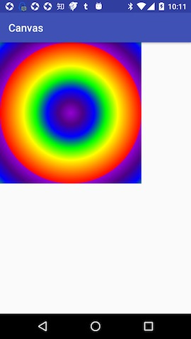

# Paint使用

## 基本方法

```java
public void setStrokeWidth(float width)
```

`setStrokeWidth`方法用来设置边的宽度。该方法只有在Paint的style设置为`STROKE`或者`FILL_AND_STROKE`时起作用。STROKE 的宽度均分两半，一半绘制在圆外，一半绘制在圆内。

```java
Paint mPaint = new Paint();
mPaint.setStyle(Paint.Style.STROKE);
mPaint.setStrokeWidth(128);
mPaint.setColor(getResources().getColor(R.color.orange));//#FF7F00
canvas.drawCircle(192,192,128,mPaint);//绘制带stroke的圆
mPaint.setColor(getResources().getColor(R.color.green));//半透明绿色#2200FF00
mPaint.setStyle(Paint.Style.FILL);
canvas.drawCircle(192,192,128,mPaint);//绘制实心圆
```


## MaskFilter

## ColorFilter

## Xfermode

Xfermode设置两张图片相交时的模式。Paint提供`public Xfermode setXfermode(Xfermode xfermode)`来为画笔设置Xfermode。Xfermode有三个子类：AvoidXfermode,PixelXorXfermode和PorterDuffXfermode，前两个类在API 16被遗弃了，所以这里不作介绍。PorterDuffXfermode类主要用于图形合成时的图像过渡模式计算，其概念来自于1984年在ACM SIGGRAPH计算机图形学出版物上发表了“Compositing digital images（合成数字图像）”的Tomas Porter和Tom Duff，合成图像的概念极大地推动了图形图像学的发展，PorterDuffXfermode类名就来源于这俩人的名字组合PorterDuff。

构造函数：

```java
public PorterDuffXfermode(PorterDuff.Mode mode)
```

PorterDuff.Mode代表混合模式，是一个枚举类型，他的值包括如下：CLEAR、SRC、DST、SRC\_OVER、DST\_OVER、SRC\_IN、DST\_IN、SRC\_OUT、DST\_OUT、SRC\_ATOP、DST\_ATOP、XOR、DARKEN、LIGHTEN、MULTIPLY、SCREEN。


## PathEffect

PathEffect本身是没有实现什么效果的，只是一个简单的基类，不过android.graphics提供了集中常见的效果，系统为了高效的实现不同效果，它们的实现都封装在native中。

* CornerPathEffect 线条的交汇角效果
* DashPathEffect 线条的虚线效果
* DiscretePathEffect 线条的离散
* PathDashPathEffect 使用Path做虚线的效果（Path可以画图像）
* ComposePathEffect 组合两种效果
* SumPathEffect 叠加向后纵效果

## 着色器

Shader即着色器，负责为定义的图形着色。

Paint提供了`public Shader setShader(Shader shader)`方法为画笔设置着色器。

`android.graphics.Shader`类有5个子类：

* BitmapShader
* LinearGradient
* RadialGradient
* SweepGradient
* ComposeShader

### BitmapShader

BitmapShader就是使用Bitmap对绘制的图形进行着色。

构造函数：

```java
public BitmapShader(@NonNull Bitmap bitmap, TileMode tileX, TileMode tileY)
```

第一个参数是一个bitmap对象。后两个参数用来设置当图片小于要绘制的图形的尺寸，x轴和y轴图片的绘制方式。

TileMode是一个枚举类型，可使用的类型包括如下：

* CLAMP：拉伸
* REPEAT：重复显示图片
* MIRROR：镜像

x轴和y轴都设置为REPEAT：

```java
mPaint = new Paint();
mPaint.setStyle(Paint.Style.FILL);//设置画笔样式为填充
mBitmap = BitmapFactory.decodeResource(getResources(), R.drawable.cat);
mPaint.setShader(new BitmapShader(mBitmap, Shader.TileMode.REPEAT, Shader.TileMode.REPEAT));
//绘制矩形
canvas.drawRect(0,0,800,800,mPaint);
```


x轴和y轴设置都为MIRROR：

```java
mPaint.setShader(new BitmapShader(mBitmap, Shader.TileMode.MIRROR, Shader.TileMode.MIRROR));
```


x轴和y轴设置都为CLAMP：

```java
mPaint.setShader(new BitmapShader(mBitmap, Shader.TileMode.CLAMP, Shader.TileMode.CLAMP));
```


BitmapShader一个常用的场景就是绘制特殊图形的图片，比如圆形图片和圆角矩形图片。

将上面的例子绘制矩形修改为绘制圆形就可以得到一个圆形图片。

```java
canvas.drawCircle(mBitmap.getWidth()/2, mBitmap.getWidth()/2, mBitmap.getWidth()/2, mPaint);
```


开源项目[CircleImageView](https://github.com/hdodenhof/CircleImageView)、[android-shape-imageview](https://github.com/siyamed/android-shape-imageview)本质都是利用BitmapShader实现的。

### LinearGradient

LinearGradient利用线性渐变填充图形。LinearGradient具有两个构造函数：

```java
 public LinearGradient(float x0, float y0, float x1, float y1, int color0, int color1,TileMode tile)

 public LinearGradient(float x0, float y0, float x1, float y1, int colors[], float positions[],TileMode tile)
```

第一个构造函数可以设置两种颜色。

```java
mPaint.setShader(new LinearGradient(0, 0, 100, 100, Color.RED, Color.YELLOW, Shader.TileMode.REPEAT));
canvas.drawRect(0,0,800,800,mPaint);
```


第二个构造函数可以设置多种颜色。

先定义一个字符串数组：

```markup
  <string-array name="rainbow">
    <item>#9400D3</item>
    <item>#4B0082</item>
    <item>#0000FF</item>
    <item>#00FF00</item>
    <item>#FFFF00</item>
    <item>#FF7F00</item>
    <item>#FF0000</item>
  </string-array>
```

```java
String[] colors = getResources().getStringArray(R.array.rainbow);
mPaint.setShader(new LinearGradient(0, 0, 800, 800, new int[]{
     Color.parseColor(colors[0]),
     Color.parseColor(colors[1]),
     Color.parseColor(colors[2]),
     Color.parseColor(colors[3]),
     Color.parseColor(colors[4]),
     Color.parseColor(colors[5]),
     Color.parseColor(colors[6]),
 }, null, Shader.TileMode.REPEAT));
canvas.drawRect(0,0,800,800,mPaint);
```


### RadialGradient

RadialGradient创建从中心向四周发散的辐射渐变效果。RadialGradient同样有两个构造函数：

```java
public RadialGradient(float centerX, float centerY, float radius,@NonNull int colors[], @Nullable float stops[], @NonNull TileMode tileMode) 

public RadialGradient(float centerX, float centerY, float radius,int centerColor, int edgeColor, @NonNull TileMode tileMode)
```

```java
mPaint.setShader(new RadialGradient(400, 400,400, new int[] {
    Color.parseColor(colors[0]), Color.parseColor(colors[1]), Color.parseColor(colors[2]),
    Color.parseColor(colors[3]), Color.parseColor(colors[4]), Color.parseColor(colors[5]),
    Color.parseColor(colors[6])
}, null, Shader.TileMode.REPEAT));
canvas.drawRect(0,0,800,800,mPaint);
```



### SweepGradient

SweepGradient可以用来创建360度颜色旋转渐变效果，具体来说颜色是围绕中心点360度顺时针旋转的，起点就是3点钟位置。

SweepGradient有两个构造函数：

```java
public SweepGradient(float cx, float cy,int colors[], float positions[])

public SweepGradient(float cx, float cy, int color0, int color1)
```

SweepGradient不支持TileMode参数。cx，cy决定了中心点的位置。

```java
mPaint.setShader(new SweepGradient(400, 400, new int[] {
    Color.parseColor(colors[0]), Color.parseColor(colors[1]), Color.parseColor(colors[2]),
    Color.parseColor(colors[3]), Color.parseColor(colors[4]), Color.parseColor(colors[5]),
    Color.parseColor(colors[6])
}, null));
canvas.drawCircle(400,400,400,mPaint);
```


### ComposeShader

ComposeShader它可以将两个Shader按照一定的Xfermode组合起来。

ComposeShader有两个构造函数:

```java
public ComposeShader(Shader shaderA, Shader shaderB, Xfermode mode)

public ComposeShader(Shader shaderA, Shader shaderB, PorterDuff.Mode mode)
```

下面我们将一个BitmapShader与LinearGradient进行混合。

BitmapShader使用的图片为下图：


```java
mBitmap = BitmapFactory.decodeResource(getResources(), R.drawable.android);
BitmapShader bitmapShader = new BitmapShader(mBitmap, Shader.TileMode.CLAMP, Shader.TileMode.CLAMP);
LinearGradient linearGradient = new LinearGradient(0, 0, mBitmap.getWidth(), mBitmap.getHeight(), Color.RED, Color.YELLOW, Shader.TileMode.REPEAT);
ComposeShader composeShader = new ComposeShader(bitmapShader, linearGradient, PorterDuff.Mode.MULTIPLY);
mPaint.setShader(composeShader);
canvas.drawRect(0,0,mBitmap.getWidth(),mBitmap.getHeight(),mPaint);
```


## 参考

* [各个击破搞明白PorterDuff.Mode](http://www.jianshu.com/p/d11892bbe055)
* [Shader](http://blog.csdn.net/aigestudio/article/details/41799811)
* [Android中Canvas绘图之PorterDuffXfermode使用及工作原理详解](http://blog.csdn.net/iispring/article/details/50472485)
* [Android Paint 浅坑—— Style 模式](http://blog.csdn.net/ziwang_/article/details/72857650)

