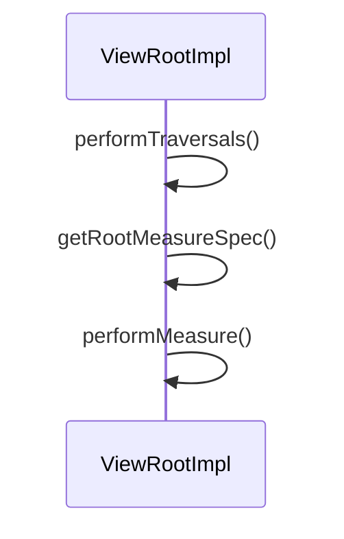

## MeasureSpec


MeasureSpec代表一个32位int值，高2位代表SpecMode，低30位代表SpecSize,SpecMode是指测量模式，而SpecSize是指在某种测量模式下的规格大小。

```java
//frameworks/base/core/java/android/view/View.java
//MeasureSpec是View的静态内部类
private static final int MODE_SHIFT = 30;
private static final int MODE_MASK  = 0x3 << MODE_SHIFT; //高两位是11其余都是0 
public static final int UNSPECIFIED = 0 << MODE_SHIFT;

public static final int EXACTLY     = 1 << MODE_SHIFT;

public static final int AT_MOST     = 2 << MODE_SHIFT;
public static int makeMeasureSpec(@IntRange(from = 0, to = (1 << MeasureSpec.MODE_SHIFT) - 1) int size,
                                  @MeasureSpecMode int mode) {
    if (sUseBrokenMakeMeasureSpec) {
        return size + mode;
    } else {
        return (size & ~MODE_MASK) | (mode & MODE_MASK);
    }
}
public static int getMode(int measureSpec) {
    //noinspection ResourceType
    return (measureSpec & MODE_MASK);
}
public static int getSize(int measureSpec) {
    return (measureSpec & ~MODE_MASK);
}
```

MeasureSpec通过将SpecMode和SpecSize打包成一个int值来避免过多的对象内存分配，为了方便操作，其提供了打包和解包方法。SpecMode和SpecSize也是一个int值，一组SpecMode和SpecSize可以打包为一个MeasureSpec，而一个MeasureSpec可以通过解包的形式来得出其原始的SpecMode和SpecSize，需要注意的是这里提到的MeasureSpec是指MeasureSpec所代表的int值，而并非MeasureSpec本身。

SpecMode有三类，每一类都表示特殊的含义，如下所示。

* UNSPECIFIED父容器不对View有任何限制，要多大给多大，这种情况一般用于系统内部，表示一种测量的状态。

* EXACTLY父容器已经检测出View所需要的精确大小，这个时候View的最终大小就是SpecSize所指定的值。它对应于LayoutParams中的match_parent和具体的数值这两种模式。

* AT_MOST父容器指定了一个可用大小即SpecSize, View的大小不能大于这个值，具体是什么值要看不同View的具体实现。它对应于LayoutParams中的wrap_content。


## measure过程




### performTraversals()

```java
//frameworks/base/core/java/android/view/ViewRootImpl.java
private void performTraversals() {
        // TODO: In the CL "ViewRootImpl: Fix issue with early draw report in
        // seamless rotation". We moved processing of RELAYOUT_RES_BLAST_SYNC
        // earlier in the function, potentially triggering a call to
        // reportNextDraw(). That same CL changed this and the next reference
        // to wasReportNextDraw, such that this logic would remain undisturbed
        // (it continues to operate as if the code was never moved). This was
        // done to achieve a more hermetic fix for S, but it's entirely
        // possible that checking the most recent value is actually more
        // correct here.
				//当Activity不可见时，mStopped为true不会执行measure、
        if (!mStopped || wasReportNextDraw) {
            boolean focusChangedDueToTouchMode = ensureTouchModeLocally(
                    (relayoutResult&WindowManagerGlobal.RELAYOUT_RES_IN_TOUCH_MODE) != 0);
            if (focusChangedDueToTouchMode || mWidth != host.getMeasuredWidth()
                    || mHeight != host.getMeasuredHeight() || dispatchApplyInsets ||
                    updatedConfiguration) {
								//获取MeasureSpec
                int childWidthMeasureSpec = getRootMeasureSpec(mWidth, lp.width);
                int childHeightMeasureSpec = getRootMeasureSpec(mHeight, lp.height);

   
                //执行绘制
                 // Ask host how big it wants to be
                performMeasure(childWidthMeasureSpec, childHeightMeasureSpec);

                // Implementation of weights from WindowManager.LayoutParams
                // We just grow the dimensions as needed and re-measure if
                // needs be
                int width = host.getMeasuredWidth();
                int height = host.getMeasuredHeight();
                boolean measureAgain = false;

                if (lp.horizontalWeight > 0.0f) {
                    width += (int) ((mWidth - width) * lp.horizontalWeight);
                    childWidthMeasureSpec = MeasureSpec.makeMeasureSpec(width,
                            MeasureSpec.EXACTLY);
                    measureAgain = true;
                }
                if (lp.verticalWeight > 0.0f) {
                    height += (int) ((mHeight - height) * lp.verticalWeight);
                    childHeightMeasureSpec = MeasureSpec.makeMeasureSpec(height,
                            MeasureSpec.EXACTLY);
                    measureAgain = true;
                }

                if (measureAgain) {
                    if (DEBUG_LAYOUT) Log.v(mTag,
                            "And hey let's measure once more: width=" + width
                            + " height=" + height);
                    performMeasure(childWidthMeasureSpec, childHeightMeasureSpec);
                }
                layoutRequested = true;
            }
        }
    } else {
        // Not the first pass and no window/insets/visibility change but the window
        // may have moved and we need check that and if so to update the left and right
        // in the attach info. We translate only the window frame since on window move
        // the window manager tells us only for the new frame but the insets are the
        // same and we do not want to translate them more than once.
        maybeHandleWindowMove(frame);
    } 
		//...
}
```


```java
//frameworks/base/core/java/android/app/Activity.java
final void performStop(boolean preserveWindow, String reason) {
  //...
    if (!mStopped) {
        // If we're preserving the window, don't setStoppedState to true, since we
        // need the window started immediately again. Stopping the window will
        // destroys hardware resources and causes flicker.
        if (!preserveWindow && mToken != null && mParent == null) {
            WindowManagerGlobal.getInstance().setStoppedState(mToken, true);
        }

        mFragments.dispatchStop();
        mCalled = false;
        //调用onStop方法
        mInstrumentation.callActivityOnStop(this);
        //...
        mStopped = true;
        dispatchActivityPostStopped();
    }
    mResumed = false;
    Trace.traceEnd(Trace.TRACE_TAG_WINDOW_MANAGER);
}
```


```java
//frameworks/base/core/java/android/view/WindowManagerGlobal.java
public void setStoppedState(IBinder token, boolean stopped) {
    ArrayList<ViewRootImpl> nonCurrentThreadRoots = null;
    synchronized (mLock) {
        int count = mViews.size();
        for (int i = count - 1; i >= 0; i--) {
            if (token == null || mParams.get(i).token == token) {
                ViewRootImpl root = mRoots.get(i);
                // Client might remove the view by "stopped" event.
                if (root.mThread == Thread.currentThread()) {
                    //调用ViewRootImpl的setWindowStopped方法
                    root.setWindowStopped(stopped);
                } else {
                    //...
                }
                // Recursively forward stopped state to View's attached
                // to this Window rather than the root application token,
                // e.g. PopupWindow's.
                setStoppedState(root.mAttachInfo.mWindowToken, stopped);
            }
        }
    }
    //...
}
```


```java
//frameworks/base/core/java/android/view/ViewRootImpl.java
boolean mStopped = false;
 void setWindowStopped(boolean stopped) {
    checkThread();
    if (mStopped != stopped) {
        mStopped = stopped;
       //...
    }
}
```


### getRootMeasureSpec()

```java
//frameworks/base/core/java/android/view/ViewRootImpl.java
private static int getRootMeasureSpec(int windowSize, int rootDimension) {
    int measureSpec;
    switch (rootDimension) {

    case ViewGroup.LayoutParams.MATCH_PARENT:
        // Window can't resize. Force root view to be windowSize.
        measureSpec = MeasureSpec.makeMeasureSpec(windowSize, MeasureSpec.EXACTLY);
        break;
    case ViewGroup.LayoutParams.WRAP_CONTENT:
        // Window can resize. Set max size for root view.
        measureSpec = MeasureSpec.makeMeasureSpec(windowSize, MeasureSpec.AT_MOST);
        break;
    default:
        // Window wants to be an exact size. Force root view to be that size.
        measureSpec = MeasureSpec.makeMeasureSpec(rootDimension, MeasureSpec.EXACTLY);
        break;
    }
    return measureSpec;
}
```


### performMeasure()

```java
//frameworks/base/core/java/android/view/ViewRootImpl.java
private void performMeasure(int childWidthMeasureSpec, int childHeightMeasureSpec) {
    if (mView == null) {
        return;
    }
    Trace.traceBegin(Trace.TRACE_TAG_VIEW, "measure");
    try {
				//调用View的measure
        mView.measure(childWidthMeasureSpec, childHeightMeasureSpec);
    } finally {
        Trace.traceEnd(Trace.TRACE_TAG_VIEW);
    }
}
```


### View的measure过程

`View`的`measure`过程由其`measure`方法来完成，`measure`方法是一个`final`类型的方法，这意味着子类不能重写此方法，在`View`的`measure`方法中会去调用`View`的`onMeasure`方法，因此只需要看`onMeasure`的实现即可，`View`的`onMeasure`方法如下所示。


```java
public final void measure(int widthMeasureSpec, int heightMeasureSpec) {
    final boolean forceLayout = (mPrivateFlags & PFLAG_FORCE_LAYOUT) == PFLAG_FORCE_LAYOUT;
    //...
    if (forceLayout || needsLayout) {
        // first clears the measured dimension flag
        mPrivateFlags &= ~PFLAG_MEASURED_DIMENSION_SET;

        resolveRtlPropertiesIfNeeded();

        int cacheIndex = forceLayout ? -1 : mMeasureCache.indexOfKey(key);
        if (cacheIndex < 0 || sIgnoreMeasureCache) {
            // measure ourselves, this should set the measured dimension flag back
            onMeasure(widthMeasureSpec, heightMeasureSpec);
            mPrivateFlags3 &= ~PFLAG3_MEASURE_NEEDED_BEFORE_LAYOUT;
        } else {
            long value = mMeasureCache.valueAt(cacheIndex);
            // Casting a long to int drops the high 32 bits, no mask needed
            setMeasuredDimensionRaw((int) (value >> 32), (int) value);
            mPrivateFlags3 |= PFLAG3_MEASURE_NEEDED_BEFORE_LAYOUT;
        }
        //...
    }
    //...
}
```

```java
//frameworks/base/core/java/android/view/View.java
protected void onMeasure(int widthMeasureSpec, int heightMeasureSpec) {
    setMeasuredDimension(getDefaultSize(getSuggestedMinimumWidth(), widthMeasureSpec),
            getDefaultSize(getSuggestedMinimumHeight(), heightMeasureSpec));
}
```


```java
protected final void setMeasuredDimension(int measuredWidth, int measuredHeight) {
    boolean optical = isLayoutModeOptical(this);
    if (optical != isLayoutModeOptical(mParent)) {
        Insets insets = getOpticalInsets();
        int opticalWidth  = insets.left + insets.right;
        int opticalHeight = insets.top  + insets.bottom;

        measuredWidth  += optical ? opticalWidth  : -opticalWidth;
        measuredHeight += optical ? opticalHeight : -opticalHeight;
    }
    setMeasuredDimensionRaw(measuredWidth, measuredHeight);
}
```


```java
private void setMeasuredDimensionRaw(int measuredWidth, int measuredHeight) {
    mMeasuredWidth = measuredWidth;
    mMeasuredHeight = measuredHeight;

    mPrivateFlags |= PFLAG_MEASURED_DIMENSION_SET;
}
```


```java
public final int getMeasuredWidth() {
    return mMeasuredWidth & MEASURED_SIZE_MASK;
}
```


### getDefaultSize()

```java
//frameworks/base/core/java/android/view/View.java
public static int getDefaultSize(int size, int measureSpec) {
    int result = size;
    int specMode = MeasureSpec.getMode(measureSpec);
    int specSize = MeasureSpec.getSize(measureSpec);

    switch (specMode) {
    case MeasureSpec.UNSPECIFIED:
        result = size;
        break;
    //View中wrap_content和match_parent效果是一样的
    case MeasureSpec.AT_MOST:
    case MeasureSpec.EXACTLY:
        result = specSize;
        break;
    }
    return result;
}
```


### ViewGroup的measure过程

对于ViewGroup来说，除了完成自己的measure过程以外，还会遍历去调用所有子元素的measure方法，各个子元素再递归去执行这个过程。ViewGroup没有重写View的onMeasure方法，但是它提供了一个叫measureChildren的方法。


```java
//frameworks/base/core/java/android/widget/LinearLayout.java
@Override
protected void onMeasure(int widthMeasureSpec, int heightMeasureSpec) {
    if (mOrientation == VERTICAL) {
        measureVertical(widthMeasureSpec, heightMeasureSpec);
    } else {
        measureHorizontal(widthMeasureSpec, heightMeasureSpec);
    }
}
```

 从上面这段代码可以看出，系统会遍历子元素并对每个子元素执行measureChildBeforeLayout方法，这个方法内部会调用子元素的measure方法，这样各个子元素就开始依次进入measure过程，并且系统会通过mTotalLength这个变量来存储LinearLayout在竖直方向的初步高度。每测量一个子元素，mTotalLength就会增加，增加的部分主要包括了子元素的高度以及子元素在竖直方向上的margin等。当子元素测量完毕后，LinearLayout会测量自己的大小，

```java
void measureChildBeforeLayout(View child, int childIndex,
        int widthMeasureSpec, int totalWidth, int heightMeasureSpec,
        int totalHeight) {
    measureChildWithMargins(child, widthMeasureSpec, totalWidth,
            heightMeasureSpec, totalHeight);
}
```

```java
//frameworks/base/core/java/android/view/ViewGroup.java
protected void measureChildWithMargins(View child,
        int parentWidthMeasureSpec, int widthUsed,
        int parentHeightMeasureSpec, int heightUsed) {
    //获取子类的LayoutParams
    final MarginLayoutParams lp = (MarginLayoutParams) child.getLayoutParams();

    final int childWidthMeasureSpec = getChildMeasureSpec(parentWidthMeasureSpec,
            mPaddingLeft + mPaddingRight + lp.leftMargin + lp.rightMargin
                    + widthUsed, lp.width);
    final int childHeightMeasureSpec = getChildMeasureSpec(parentHeightMeasureSpec,
            mPaddingTop + mPaddingBottom + lp.topMargin + lp.bottomMargin
                    + heightUsed, lp.height);

    child.measure(childWidthMeasureSpec, childHeightMeasureSpec);
}
```


### getChildMeasureSpec


```java
//frameworks/base/core/java/android/view/ViewGroup.java
public static int getChildMeasureSpec(int spec, int padding, int childDimension) {
		//父布局模式
    int specMode = MeasureSpec.getMode(spec);
    int specSize = MeasureSpec.getSize(spec);

    int size = Math.max(0, specSize - padding);

    int resultSize = 0;
    int resultMode = 0;

    switch (specMode) {
    // Parent has imposed an exact size on us
    case MeasureSpec.EXACTLY:
        if (childDimension >= 0) {
            resultSize = childDimension;
            resultMode = MeasureSpec.EXACTLY;
        } else if (childDimension == LayoutParams.MATCH_PARENT) {
            // Child wants to be our size. So be it.
            resultSize = size;
            resultMode = MeasureSpec.EXACTLY;
        } else if (childDimension == LayoutParams.WRAP_CONTENT) {
            // Child wants to determine its own size. It can't be
            // bigger than us.
            resultSize = size;
            resultMode = MeasureSpec.AT_MOST;
        }
        break;

    // Parent has imposed a maximum size on us
    case MeasureSpec.AT_MOST:
        if (childDimension >= 0) {
            // Child wants a specific size... so be it
            resultSize = childDimension;
            resultMode = MeasureSpec.EXACTLY;
        } else if (childDimension == LayoutParams.MATCH_PARENT) {
            // Child wants to be our size, but our size is not fixed.
            // Constrain child to not be bigger than us.
            resultSize = size;
            resultMode = MeasureSpec.AT_MOST;
        } else if (childDimension == LayoutParams.WRAP_CONTENT) {
            // Child wants to determine its own size. It can't be
            // bigger than us.
            resultSize = size;
            resultMode = MeasureSpec.AT_MOST;
        }
        break;

    // Parent asked to see how big we want to be
    case MeasureSpec.UNSPECIFIED:
        if (childDimension >= 0) {
            // Child wants a specific size... let them have it
            resultSize = childDimension;
            resultMode = MeasureSpec.EXACTLY;
        } else if (childDimension == LayoutParams.MATCH_PARENT) {
            // Child wants to be our size... find out how big it should
            // be
            resultSize = View.sUseZeroUnspecifiedMeasureSpec ? 0 : size;
            resultMode = MeasureSpec.UNSPECIFIED;
        } else if (childDimension == LayoutParams.WRAP_CONTENT) {
            // Child wants to determine its own size.... find out how
            // big it should be
            resultSize = View.sUseZeroUnspecifiedMeasureSpec ? 0 : size;
            resultMode = MeasureSpec.UNSPECIFIED;
        }
        break;
    }
    //noinspection ResourceType
    return MeasureSpec.makeMeasureSpec(resultSize, resultMode);
}
```


## layout流程


```java
final boolean didLayout = layoutRequested && (!mStopped || wasReportNextDraw);
```

```java
//frameworks/base/core/java/android/view/ViewRootImpl.java
private void performLayout(WindowManager.LayoutParams lp, int desiredWindowWidth,
        int desiredWindowHeight) {
    mScrollMayChange = true;
    mInLayout = true;
    //赋值host
    final View host = mView;
    //...
    try {
        host.layout(0, 0, host.getMeasuredWidth(), host.getMeasuredHeight());
        //...
    } finally {
        Trace.traceEnd(Trace.TRACE_TAG_VIEW);
    }
    mInLayout = false;
}
```

Layout的作用是ViewGroup用来确定子元素的位置，当ViewGroup的位置被确定后，它在onLayout中会遍历所有的子元素并调用其layout方法，在layout方法中onLayout方法又会被调用。Layout过程和measure过程相比就简单多了，layout方法确定View本身的位置，而onLayout方法则会确定所有子元素的位置，先看View的layout方法。

```java
//frameworks/base/core/java/android/view/View.java
public void layout(int l, int t, int r, int b) {
    if ((mPrivateFlags3 & PFLAG3_MEASURE_NEEDED_BEFORE_LAYOUT) != 0) {
        onMeasure(mOldWidthMeasureSpec, mOldHeightMeasureSpec);
        mPrivateFlags3 &= ~PFLAG3_MEASURE_NEEDED_BEFORE_LAYOUT;
    }

    int oldL = mLeft;
    int oldT = mTop;
    int oldB = mBottom;
    int oldR = mRight;

    boolean changed = isLayoutModeOptical(mParent) ?
            setOpticalFrame(l, t, r, b) : setFrame(l, t, r, b);

    if (changed || (mPrivateFlags & PFLAG_LAYOUT_REQUIRED) == PFLAG_LAYOUT_REQUIRED) {
        onLayout(changed, l, t, r, b);
        //...
    }
    //...
}
```


```java
//frameworks/base/core/java/android/widget/LinearLayout.java
@Override
protected void onLayout(boolean changed, int l, int t, int r, int b) {
    if (mOrientation == VERTICAL) {
        layoutVertical(l, t, r, b);
    } else {
        layoutHorizontal(l, t, r, b);
    }
}
```


```java
//frameworks/base/core/java/android/widget/LinearLayout.java
void layoutVertical(int left, int top, int right, int bottom) {
    //...
    //遍历所有的子View
    for (int i = 0; i < count; i++) {
        final View child = getVirtualChildAt(i);
        if (child == null) {
            childTop += measureNullChild(i);
        } else if (child.getVisibility() != GONE) {
            //获取子类的宽和高
            final int childWidth = child.getMeasuredWidth();
            final int childHeight = child.getMeasuredHeight();

            final LinearLayout.LayoutParams lp =
                    (LinearLayout.LayoutParams) child.getLayoutParams();

            int gravity = lp.gravity;
            if (gravity < 0) {
                gravity = minorGravity;
            }
            final int layoutDirection = getLayoutDirection();
            final int absoluteGravity = Gravity.getAbsoluteGravity(gravity, layoutDirection);
            switch (absoluteGravity & Gravity.HORIZONTAL_GRAVITY_MASK) {
                case Gravity.CENTER_HORIZONTAL:
                    childLeft = paddingLeft + ((childSpace - childWidth) / 2)
                            + lp.leftMargin - lp.rightMargin;
                    break;

                case Gravity.RIGHT:
                    childLeft = childRight - childWidth - lp.rightMargin;
                    break;

                case Gravity.LEFT:
                default:
                    childLeft = paddingLeft + lp.leftMargin;
                    break;
            }

            if (hasDividerBeforeChildAt(i)) {
                childTop += mDividerHeight;
            }

            childTop += lp.topMargin;
            setChildFrame(child, childLeft, childTop + getLocationOffset(child),
                    childWidth, childHeight);
            childTop += childHeight + lp.bottomMargin + getNextLocationOffset(child);

            i += getChildrenSkipCount(child, i);
        }
    }
}
```


```java
private void setChildFrame(View child, int left, int top, int width, int height) {
    child.layout(left, top, left + width, top + height);
}
```


```java
public final int getWidth() {
    return mRight - mLeft;
}
```


## draw流程


```java
//frameworks/base/core/java/android/view/ViewRootImpl.java
private void performDraw() {
    //...
    try {
        boolean canUseAsync = draw(fullRedrawNeeded);
        if (usingAsyncReport && !canUseAsync) {
            mAttachInfo.mThreadedRenderer.setFrameCompleteCallback(null);
            usingAsyncReport = false;
        }
    } finally {
        mIsDrawing = false;
        Trace.traceEnd(Trace.TRACE_TAG_VIEW);
    }
    //...
}
```

draw过程就比较简单了，它的作用是将View绘制到屏幕上面。View的绘制过程遵循如下几步：

```java
public void draw(Canvas canvas) {
    final int privateFlags = mPrivateFlags;
    mPrivateFlags = (privateFlags & ~PFLAG_DIRTY_MASK) | PFLAG_DRAWN;

    /*
     * Draw traversal performs several drawing steps which must be executed
     * in the appropriate order:
     *
     *      1. Draw the background
     *      2. If necessary, save the canvas' layers to prepare for fading
     *      3. Draw view's content
     *      4. Draw children
     *      5. If necessary, draw the fading edges and restore layers
     *      6. Draw decorations (scrollbars for instance)
     *      7. If necessary, draw the default focus highlight
     */

    // Step 1, draw the background, if needed
    int saveCount;

    drawBackground(canvas);

    // skip step 2 & 5 if possible (common case)
    final int viewFlags = mViewFlags;
    boolean horizontalEdges = (viewFlags & FADING_EDGE_HORIZONTAL) != 0;
    boolean verticalEdges = (viewFlags & FADING_EDGE_VERTICAL) != 0;
    if (!verticalEdges && !horizontalEdges) {
        // Step 3, draw the content
        onDraw(canvas);

        // Step 4, draw the children
        dispatchDraw(canvas);

        drawAutofilledHighlight(canvas);

        // Overlay is part of the content and draws beneath Foreground
        if (mOverlay != null && !mOverlay.isEmpty()) {
            mOverlay.getOverlayView().dispatchDraw(canvas);
        }

        // Step 6, draw decorations (foreground, scrollbars)
        onDrawForeground(canvas);

        // Step 7, draw the default focus highlight
        drawDefaultFocusHighlight(canvas);

        if (isShowingLayoutBounds()) {
            debugDrawFocus(canvas);
        }

        // we're done...
        return;
    }

    /*
     * Here we do the full fledged routine...
     * (this is an uncommon case where speed matters less,
     * this is why we repeat some of the tests that have been
     * done above)
     */

    boolean drawTop = false;
    boolean drawBottom = false;
    boolean drawLeft = false;
    boolean drawRight = false;

    float topFadeStrength = 0.0f;
    float bottomFadeStrength = 0.0f;
    float leftFadeStrength = 0.0f;
    float rightFadeStrength = 0.0f;

    // Step 2, save the canvas' layers
    int paddingLeft = mPaddingLeft;

    final boolean offsetRequired = isPaddingOffsetRequired();
    if (offsetRequired) {
        paddingLeft += getLeftPaddingOffset();
    }

    int left = mScrollX + paddingLeft;
    int right = left + mRight - mLeft - mPaddingRight - paddingLeft;
    int top = mScrollY + getFadeTop(offsetRequired);
    int bottom = top + getFadeHeight(offsetRequired);

    if (offsetRequired) {
        right += getRightPaddingOffset();
        bottom += getBottomPaddingOffset();
    }

    final ScrollabilityCache scrollabilityCache = mScrollCache;
    final float fadeHeight = scrollabilityCache.fadingEdgeLength;
    int length = (int) fadeHeight;

    // clip the fade length if top and bottom fades overlap
    // overlapping fades produce odd-looking artifacts
    if (verticalEdges && (top + length > bottom - length)) {
        length = (bottom - top) / 2;
    }

    // also clip horizontal fades if necessary
    if (horizontalEdges && (left + length > right - length)) {
        length = (right - left) / 2;
    }

    if (verticalEdges) {
        topFadeStrength = Math.max(0.0f, Math.min(1.0f, getTopFadingEdgeStrength()));
        drawTop = topFadeStrength * fadeHeight > 1.0f;
        bottomFadeStrength = Math.max(0.0f, Math.min(1.0f, getBottomFadingEdgeStrength()));
        drawBottom = bottomFadeStrength * fadeHeight > 1.0f;
    }

    if (horizontalEdges) {
        leftFadeStrength = Math.max(0.0f, Math.min(1.0f, getLeftFadingEdgeStrength()));
        drawLeft = leftFadeStrength * fadeHeight > 1.0f;
        rightFadeStrength = Math.max(0.0f, Math.min(1.0f, getRightFadingEdgeStrength()));
        drawRight = rightFadeStrength * fadeHeight > 1.0f;
    }

    saveCount = canvas.getSaveCount();
    int topSaveCount = -1;
    int bottomSaveCount = -1;
    int leftSaveCount = -1;
    int rightSaveCount = -1;

    int solidColor = getSolidColor();
    if (solidColor == 0) {
        if (drawTop) {
            topSaveCount = canvas.saveUnclippedLayer(left, top, right, top + length);
        }

        if (drawBottom) {
            bottomSaveCount = canvas.saveUnclippedLayer(left, bottom - length, right, bottom);
        }

        if (drawLeft) {
            leftSaveCount = canvas.saveUnclippedLayer(left, top, left + length, bottom);
        }

        if (drawRight) {
            rightSaveCount = canvas.saveUnclippedLayer(right - length, top, right, bottom);
        }
    } else {
        scrollabilityCache.setFadeColor(solidColor);
    }

    // Step 3, draw the content
    onDraw(canvas);

    // Step 4, draw the children
    dispatchDraw(canvas);

    // Step 5, draw the fade effect and restore layers
    final Paint p = scrollabilityCache.paint;
    final Matrix matrix = scrollabilityCache.matrix;
    final Shader fade = scrollabilityCache.shader;

    // must be restored in the reverse order that they were saved
    if (drawRight) {
        matrix.setScale(1, fadeHeight * rightFadeStrength);
        matrix.postRotate(90);
        matrix.postTranslate(right, top);
        fade.setLocalMatrix(matrix);
        p.setShader(fade);
        if (solidColor == 0) {
            canvas.restoreUnclippedLayer(rightSaveCount, p);

        } else {
            canvas.drawRect(right - length, top, right, bottom, p);
        }
    }

    if (drawLeft) {
        matrix.setScale(1, fadeHeight * leftFadeStrength);
        matrix.postRotate(-90);
        matrix.postTranslate(left, top);
        fade.setLocalMatrix(matrix);
        p.setShader(fade);
        if (solidColor == 0) {
            canvas.restoreUnclippedLayer(leftSaveCount, p);
        } else {
            canvas.drawRect(left, top, left + length, bottom, p);
        }
    }

    if (drawBottom) {
        matrix.setScale(1, fadeHeight * bottomFadeStrength);
        matrix.postRotate(180);
        matrix.postTranslate(left, bottom);
        fade.setLocalMatrix(matrix);
        p.setShader(fade);
        if (solidColor == 0) {
            canvas.restoreUnclippedLayer(bottomSaveCount, p);
        } else {
            canvas.drawRect(left, bottom - length, right, bottom, p);
        }
    }

    if (drawTop) {
        matrix.setScale(1, fadeHeight * topFadeStrength);
        matrix.postTranslate(left, top);
        fade.setLocalMatrix(matrix);
        p.setShader(fade);
        if (solidColor == 0) {
            canvas.restoreUnclippedLayer(topSaveCount, p);
        } else {
            canvas.drawRect(left, top, right, top + length, p);
        }
    }

    canvas.restoreToCount(saveCount);

    drawAutofilledHighlight(canvas);

    // Overlay is part of the content and draws beneath Foreground
    if (mOverlay != null && !mOverlay.isEmpty()) {
        mOverlay.getOverlayView().dispatchDraw(canvas);
    }

    // Step 6, draw decorations (foreground, scrollbars)
    onDrawForeground(canvas);

    // Step 7, draw the default focus highlight
    drawDefaultFocusHighlight(canvas);

    if (isShowingLayoutBounds()) {
        debugDrawFocus(canvas);
    }
}
```

view绘制过程的传递是通过dispatchDraw来实现的，dispatchDraw会遍历调用所有子元素的draw方法，如此draw事件就一层层地传递了下去。View有一个特殊的方法setWillNotDraw，先看一下它的源码，如下所示。

```java
/**
 * If this view doesn't do any drawing on its own, set this flag to
 * allow further optimizations. By default, this flag is not set on
 * View, but could be set on some View subclasses such as ViewGroup.
 *
 * Typically, if you override {@link #onDraw(android.graphics.Canvas)}
 * you should clear this flag.
 *
 * @param willNotDraw whether or not this View draw on its own
 */
public void setWillNotDraw(boolean willNotDraw) {
    setFlags(willNotDraw ? WILL_NOT_DRAW : 0, DRAW_MASK);
}
```

从setWillNotDraw这个方法的注释中可以看出，如果一个View不需要绘制任何内容，那么设置这个标记位为true以后，系统会进行相应的优化。默认情况下，View没有启用这个优化标记位，但是ViewGroup会默认启用这个优化标记位。这个标记位对实际开发的意义是：当我们的自定义控件继承于ViewGroup并且本身不具备绘制功能时，就可以开启这个标记位从而便于系统进行后续的优化。当然，当明确知道一个ViewGroup需要通过onDraw来绘制内容时，我们需要显式地关闭WILL_NOT_DRAW这个标记位。


## requestLayout


```java
//frameworks/base/core/java/android/view/ViewRootImpl.java
public void requestLayout() {
		//清除测量标记
    if (mMeasureCache != null) mMeasureCache.clear();

    if (mAttachInfo != null && mAttachInfo.mViewRequestingLayout == null) {
        // Only trigger request-during-layout logic if this is the view requesting it,
        // not the views in its parent hierarchy
        ViewRootImpl viewRoot = getViewRootImpl();
        if (viewRoot != null && viewRoot.isInLayout()) {
            if (!viewRoot.requestLayoutDuringLayout(this)) {
                return;
            }
        }
        mAttachInfo.mViewRequestingLayout = this;
    }
    //设置标志位
    mPrivateFlags |= PFLAG_FORCE_LAYOUT;
    mPrivateFlags |= PFLAG_INVALIDATED;
		//如果mParent没有调用过requestLayout，则调用之。换句话说，如果调用过，则不会继续调用
    if (mParent != null && !mParent.isLayoutRequested()) {
        mParent.requestLayout();
    }
    if (mAttachInfo != null && mAttachInfo.mViewRequestingLayout == this) {
        mAttachInfo.mViewRequestingLayout = null;
    }
}
```


```java
public void requestLayout() {
    if (!mHandlingLayoutInLayoutRequest) {
        checkThread();
        mLayoutRequested = true;
        scheduleTraversals();
    }
}
```


```java
//frameworks/base/core/java/android/view/ViewRootImpl.java
final TraversalRunnable mTraversalRunnable = new TraversalRunnable();
void scheduleTraversals() {
    if (!mTraversalScheduled) {
        mTraversalScheduled = true;
        mTraversalBarrier = mHandler.getLooper().getQueue().postSyncBarrier();
        mChoreographer.postCallback(
                Choreographer.CALLBACK_TRAVERSAL, mTraversalRunnable, null);
        notifyRendererOfFramePending();
        pokeDrawLockIfNeeded();
    }
}
final class TraversalRunnable implements Runnable {
    @Override
    public void run() {
        doTraversal();
    }
}
```


```java
void doTraversal() {
    if (mTraversalScheduled) {
        mTraversalScheduled = false;
        mHandler.getLooper().getQueue().removeSyncBarrier(mTraversalBarrier);

        if (mProfile) {
            Debug.startMethodTracing("ViewAncestor");
        }

        performTraversals();

        if (mProfile) {
            Debug.stopMethodTracing();
            mProfile = false;
        }
    }
}
```


## 面试题

* MeasureSpec 参数

* 绘制流程

* View绘制流程；requestLayout和invalidate区别；invalidate每次都会触发onDraw么？View#onLayout每次会触发么？

* 讲下你的自定义View，为何如此设计？

* requestLayout调用后，都会调用哪些方法？

* onMeasure、onLayout、onDraw这三个方法中，哪个最耗时？onMeasure和onLayout呢？

* Choreography的作用。它的上游和下游各自是哪个。Choreography发布了订阅消息，同类型的Callback还有哪些？这些Callback之间的优先级如何？vsync机制。

* Surface对象了解么？作用，何时初始化，怎么使用的。

* 一个Button的点击事件中，调用requestLayout，接下来哪些方法会被调用？

* Surface和Window的关系

* SurfaceView的实现

* View#draw()方法细节

* 绘制的数据是如何提交到远端的SurfaceFlinger

* GPU和surfaceFlinger之间的设计思想是什么？surfaceFlinger具体作用是什么？它对数据做了哪些操作？

* 硬件加速了解么？GPU如何高效绘制？

