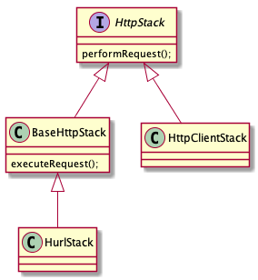

# Volley源码分析

Volley的基本流程就是：

1. 创建一个RequestQueue
2. 在RequestQueue中创建缓存线程和请求线程
3. 在请求线程中不断的执行请求
4. 执行完请求之后通过handler发送到主线程

## 创建RequestQueue

```java
/**
 * Creates a default instance of the worker pool and calls {@link RequestQueue#start()} on it.
 *
 * @param context A {@link Context} to use for creating the cache dir.
 * @return A started {@link RequestQueue} instance.
 */
public static RequestQueue newRequestQueue(Context context) {
    return newRequestQueue(context, (BaseHttpStack) null);
}
```

```java
    /**
     * Creates a default instance of the worker pool and calls {@link RequestQueue#start()} on it.
     *
     * @param context A {@link Context} to use for creating the cache dir.
     * @param stack A {@link BaseHttpStack} to use for the network, or null for default.
     * @return A started {@link RequestQueue} instance.
     */
    public static RequestQueue newRequestQueue(Context context, BaseHttpStack stack) {
      //这个构造函数负责构建
        BasicNetwork network;
        if (stack == null) {
            if (Build.VERSION.SDK_INT >= 9) {
                network = new BasicNetwork(new HurlStack());
            } else {
                // Prior to Gingerbread, HttpUrlConnection was unreliable.
                // See: http://android-developers.blogspot.com/2011/09/androids-http-clients.html
                // At some point in the future we'll move our minSdkVersion past Froyo and can
                // delete this fallback (along with all Apache HTTP code).
                String userAgent = "volley/0";
                try {
                    String packageName = context.getPackageName();
                    PackageInfo info =
                            context.getPackageManager().getPackageInfo(packageName, /* flags= */ 0);
                    userAgent = packageName + "/" + info.versionCode;
                } catch (NameNotFoundException e) {
                }

                network =
                        new BasicNetwork(
                                new HttpClientStack(AndroidHttpClient.newInstance(userAgent)));
            }
        } else {
            network = new BasicNetwork(stack);
        }

        return newRequestQueue(context, network);
    }
```

```java
    private static RequestQueue newRequestQueue(Context context, Network network) {
        final Context appContext = context.getApplicationContext();
        // Use a lazy supplier for the cache directory so that newRequestQueue() can be called on
        // main thread without causing strict mode violation.
        DiskBasedCache.FileSupplier cacheSupplier =
                new DiskBasedCache.FileSupplier() {
                    private File cacheDir = null;

                    @Override
                    public File get() {
                        if (cacheDir == null) {
                            cacheDir = new File(appContext.getCacheDir(), DEFAULT_CACHE_DIR);
                        }
                        return cacheDir;
                    }
                };
        //创建RequestQueue
        RequestQueue queue = new RequestQueue(new DiskBasedCache(cacheSupplier), network);
        //调用start方法
        queue.start();
        return queue;
    }
```

`HttpStack`是对网络请求的封装，`HurlStack`使用的是`HttpUrlConnection`，`HttpClientStack`使用的是`HttpClient`。可以通过代码看到，Android Api9以上使用`HttpUrlConnection`以下使用`HttpClient`进行请求。



`RequestQueue`构造函数

```java
    /**
     * Creates the worker pool. Processing will not begin until {@link #start()} is called.
     *
     * @param cache A Cache to use for persisting responses to disk
     * @param network A Network interface for performing HTTP requests
     */
    public RequestQueue(Cache cache, Network network) {
        this(cache, network, DEFAULT_NETWORK_THREAD_POOL_SIZE); //默认缓存池大小
    }
```

```java
    /**
     * Creates the worker pool. Processing will not begin until {@link #start()} is called.
     *
     * @param cache A Cache to use for persisting responses to disk
     * @param network A Network interface for performing HTTP requests
     * @param threadPoolSize Number of network dispatcher threads to create
     */
    public RequestQueue(Cache cache, Network network, int threadPoolSize) {
        this(
                cache,
                network,
                threadPoolSize,
                new ExecutorDelivery(new Handler(Looper.getMainLooper())));
    }
```

## 在RequestQueue中创建缓存线程和请求线程

`RequestQueue`的`start`方法

```java
    /** Starts the dispatchers in this queue. */
    public void start() {
        stop(); // Make sure any currently running dispatchers are stopped.
        // Create the cache dispatcher and start it.
        mCacheDispatcher = new CacheDispatcher(mCacheQueue, mNetworkQueue, mCache, mDelivery);
        mCacheDispatcher.start();
        // Create network dispatchers (and corresponding threads) up to the pool size.
        for (int i = 0; i < mDispatchers.length; i++) {
            NetworkDispatcher networkDispatcher =
                    new NetworkDispatcher(mNetworkQueue, mNetwork, mCache, mDelivery);
            mDispatchers[i] = networkDispatcher;
            networkDispatcher.start();
        }
    }
```

`CacheDispatcher`和`NetworkDispatcher`都继承自`Thread`，分别是缓存线程和网络请求线程。

### CacheDispatcher

```java
public CacheDispatcher(
        BlockingQueue<Request<?>> cacheQueue,
        BlockingQueue<Request<?>> networkQueue,
        Cache cache,
        ResponseDelivery delivery) {
    mCacheQueue = cacheQueue; //缓存队列
    mNetworkQueue = networkQueue; //网络请求队列
    mCache = cache; //缓存 
    mDelivery = delivery; 
    mWaitingRequestManager = new WaitingRequestManager(this);
}
```

```java
@Override
public void run() {
    if (DEBUG) VolleyLog.v("start new dispatcher");
    Process.setThreadPriority(Process.THREAD_PRIORITY_BACKGROUND);

    // Make a blocking call to initialize the cache.
    mCache.initialize();

    while (true) {
        try {
            processRequest();
        } catch (InterruptedException e) {
            // We may have been interrupted because it was time to quit.
            if (mQuit) {
                Thread.currentThread().interrupt();
                return;
            }
            VolleyLog.e(
                    "Ignoring spurious interrupt of CacheDispatcher thread; "
                            + "use quit() to terminate it");
        }
    }
}
```

```java
@VisibleForTesting
void processRequest(final Request<?> request) throws InterruptedException {
    request.addMarker("cache-queue-take");
    request.sendEvent(RequestQueue.RequestEvent.REQUEST_CACHE_LOOKUP_STARTED);

    try {
        // If the request has been canceled, don't bother dispatching it.
        if (request.isCanceled()) {
            request.finish("cache-discard-canceled");
            return;
        }
        // Attempt to retrieve this item from cache.
        Cache.Entry entry = mCache.get(request.getCacheKey());
        if (entry == null) {
            request.addMarker("cache-miss");
            // Cache miss; send off to the network dispatcher.
            //没有在等待队列中添加到请求队列中
            if (!mWaitingRequestManager.maybeAddToWaitingRequests(request)) {
                mNetworkQueue.put(request);
            }
            return;
        }

        // If it is completely expired, just send it to the network.
        if (entry.isExpired()) {
            request.addMarker("cache-hit-expired");
            request.setCacheEntry(entry);
            if (!mWaitingRequestManager.maybeAddToWaitingRequests(request)) {
                mNetworkQueue.put(request);
            }
            return;
        }

        // We have a cache hit; parse its data for delivery back to the request.
        request.addMarker("cache-hit");
        Response<?> response =
                request.parseNetworkResponse(
                        new NetworkResponse(entry.data, entry.responseHeaders));
        request.addMarker("cache-hit-parsed");

        if (!entry.refreshNeeded()) {
            // Completely unexpired cache hit. Just deliver the response.
            mDelivery.postResponse(request, response);
        } else {
            // Soft-expired cache hit. We can deliver the cached response,
            // but we need to also send the request to the network for
            // refreshing.
            request.addMarker("cache-hit-refresh-needed");
            request.setCacheEntry(entry);
            // Mark the response as intermediate.
            response.intermediate = true;

            if (!mWaitingRequestManager.maybeAddToWaitingRequests(request)) {
                // Post the intermediate response back to the user and have
                // the delivery then forward the request along to the network.
                mDelivery.postResponse(
                        request,
                        response,
                        new Runnable() {
                            @Override
                            public void run() {
                                try {
                                    mNetworkQueue.put(request);
                                } catch (InterruptedException e) {
                                    // Restore the interrupted status
                                    Thread.currentThread().interrupt();
                                }
                            }
                        });
            } else {
                // request has been added to list of waiting requests
                // to receive the network response from the first request once it returns.
                mDelivery.postResponse(request, response);
            }
        }
    } finally {
        request.sendEvent(RequestQueue.RequestEvent.REQUEST_CACHE_LOOKUP_FINISHED);
    }
}
```

### NetworkDispatcher

```java
@VisibleForTesting
void processRequest(Request<?> request) {
    long startTimeMs = SystemClock.elapsedRealtime();
    request.sendEvent(RequestQueue.RequestEvent.REQUEST_NETWORK_DISPATCH_STARTED);
    try {
        request.addMarker("network-queue-take");

        // If the request was cancelled already, do not perform the
        // network request.
        if (request.isCanceled()) {
            request.finish("network-discard-cancelled");
            request.notifyListenerResponseNotUsable();
            return;
        }

        addTrafficStatsTag(request);

        // Perform the network request.
        NetworkResponse networkResponse = mNetwork.performRequest(request);
        request.addMarker("network-http-complete");

        // If the server returned 304 AND we delivered a response already,
        // we're done -- don't deliver a second identical response.
        if (networkResponse.notModified && request.hasHadResponseDelivered()) {
            request.finish("not-modified");
            request.notifyListenerResponseNotUsable();
            return;
        }
        //负责解析返回值
        // Parse the response here on the worker thread.
        Response<?> response = request.parseNetworkResponse(networkResponse);
        request.addMarker("network-parse-complete");

        // Write to cache if applicable.
        // TODO: Only update cache metadata instead of entire record for 304s.
        if (request.shouldCache() && response.cacheEntry != null) {
            mCache.put(request.getCacheKey(), response.cacheEntry);
            request.addMarker("network-cache-written");
        }

        // Post the response back.
        request.markDelivered();
        mDelivery.postResponse(request, response);
        request.notifyListenerResponseReceived(response);
    } catch (VolleyError volleyError) {
        volleyError.setNetworkTimeMs(SystemClock.elapsedRealtime() - startTimeMs);
        parseAndDeliverNetworkError(request, volleyError);
        request.notifyListenerResponseNotUsable();
    } catch (Exception e) {
        VolleyLog.e(e, "Unhandled exception %s", e.toString());
        VolleyError volleyError = new VolleyError(e);
        volleyError.setNetworkTimeMs(SystemClock.elapsedRealtime() - startTimeMs);
        mDelivery.postError(request, volleyError);
        request.notifyListenerResponseNotUsable();
    } finally {
        request.sendEvent(RequestQueue.RequestEvent.REQUEST_NETWORK_DISPATCH_FINISHED);
    }
}
```

## 执行完请求之后通过handler发送到主线程

`ExecutorDelivery`负责将请求结果传递给主线程

```java
    public ExecutorDelivery(final Handler handler) {
        // Make an Executor that just wraps the handler.
        mResponsePoster =
                new Executor() {
                    @Override
                    public void execute(Runnable command) {
                        handler.post(command); //将结果发动到主线程
                    }
                };
    }
```

```java
@Override
public void postResponse(Request<?> request, Response<?> response, Runnable runnable) {
    request.markDelivered();
    request.addMarker("post-response");
    mResponsePoster.execute(new ResponseDeliveryRunnable(request, response, runnable));
}
```

## 总结

`Volley`和`Retrofit`是类似的框架，是对网络请求客户端的封装，让请求更加便捷。内部可以选择使用`HttpUrlConnection`、`Okhttp`或者`HttpClient`。

## 参考

* [OkHttpStack](https://gist.github.com/bryanstern/4e8f1cb5a8e14c202750)
* [Android Volley完全解析\(四\)，带你从源码的角度理解Volley](https://blog.csdn.net/guolin_blog/article/details/17656437)
* [Android访问网络，使用HttpURLConnection还是HttpClient](https://blog.csdn.net/guolin_blog/article/details/12452307)

