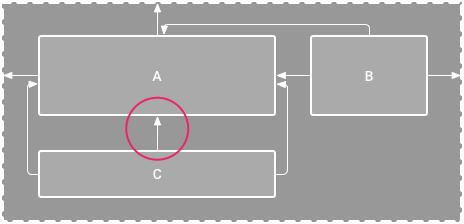

# constraintlayout

> [`ConstraintLayout`](https://developer.android.com/reference/android/support/constraint/ConstraintLayout.html) allows you to create large and complex layouts with a flat view hierarchy \(no nested view groups\). It's similar to [`RelativeLayout`](https://developer.android.com/reference/android/widget/RelativeLayout.html) in that all views are laid out according to relationships between sibling views and the parent layout, but it's more flexible than `RelativeLayout` and easier to use with Android Studio's Layout Editor.

`ConstraintLayout`允许您使用平面视图层次结构创建大而复杂的布局（无嵌套视图组）。它类似于`RelativeLayout`，因为所有视图都是根据兄弟视图和父布局之间的关系来布局的，但它比`RelativeLayout`更灵活，并且更易于与Android Studio的布局编辑器一起使用。

> All the power of `ConstraintLayout` is available directly from the Layout Editor's visual tools, because the layout API and the Layout Editor were specially built for each other. So you can build your layout with `ConstraintLayout` entirely by drag-and-dropping instead of editing the XML.

`ConstraintLayout`的所有功能都可以直接从布局编辑器的可视化工具中获得，因为布局API和布局编辑器是专门为彼此构建的。因此，您可以使用ConstraintLayout完全通过拖放而不是编辑XML来构建布局。

> [`ConstraintLayout`](https://developer.android.com/reference/android/support/constraint/ConstraintLayout.html) is available in an API library that's compatible with Android 2.3 \(API level 9\) and higher. This page provides a guide to building a layout with `ConstraintLayout` in Android Studio 3.0 or higher. If you'd like more information about the Layout Editor itself, see the Android Studio guide to [Build a UI with Layout Editor](https://developer.android.com/studio/write/layout-editor.html).

ConstraintLayout适用于与Android 2.3（API级别9）及更高版本兼容的API库。

## 约束概述

> To define a view's position in `ConstraintLayout`, you must add at least one horizontal and one vertical constraint for the view. Each constraint represents a connection or alignment to another view, the parent layout, or an invisible guideline. Each constraint defines the view's position along either the vertical or horizontal axis; so each view must have a minimum of one constraint for each axis, but often more are necessary.

要在ConstraintLayout中定义视图的位置，您必须为视图添加至少一个水平和一个垂直约束。每个约束表示与另一个视图，父布局或不可见的`guideline`的连接或对齐。每个约束定义视图在垂直或水平轴上的位置;因此每个视图必须对每个轴至少有一个约束，但通常需要更多的约束。

> When you drop a view into the Layout Editor, it stays where you leave it even if it has no constraints. However, this is only to make editing easier; if a view has no constraints when you run your layout on a device, it is drawn at position \[0,0\] \(the top-left corner\).

当您将视图拖放到布局编辑器中时，即使没有约束，它仍然保留在您离开的位置。但是，这只是使编辑更容易;如果视图在设备上运行布局时没有约束，则绘制在位置\[0,0\]（左上角）。

> In figure 1, the layout looks good in the editor, but there's no vertical constraint on view C. When this layout draws on a device, view C horizontally aligns with the left and right edges of view A, but appears at the top of the screen because it has no vertical constraint.

  
在图1中，编辑器中的布局看起来很好，但是视图C上没有垂直约束。当此布局在设备上绘制时，视图C水平对齐视图A的左右边缘，但显示在顶部屏幕，因为它没有垂直约束。


  




> Although a missing constraint won't cause a compilation error, the Layout Editor indicates missing constraints as an error in the toolbar. To view the errors and other warnings, click **Show Warnings and Errors** . To help you avoid missing constraints, the Layout Editor can automatically add constraints for you with the [Autoconnect and infer constraints](https://developer.android.com/training/constraint-layout/#use-autoconnect-and-infer-constraints)features.

虽然缺少的约束不会导致编译错误，但是布局编辑器则指出缺少的约束作为工具栏中的错误。要查看错误和其他警告，请单击显示警告和错误。为了帮助您避免缺少约束，布局编辑器可以使用自动连接和推断约束功能为您自动添加约束。

## 将ConstraintLayout添加到项目中

要在项目中使用ConstraintLayout，请按照下列步骤操作：

1. 确保您的模块级build.gradle文件中声明了`maven.google.com`存储库

   ```groovy
   repositories {
       google()
   }
   ```

2. 在相同的build.gradle文件中将库添加为依赖关系：

   ```groovy
   dependencies {
       implementation 'com.android.support.constraint:constraint-layout:1.1.2'
   }
   ```

3. 在工具栏或同步通知中，单击同步项目与Gradle文件。

现在，您可以使用ConstraintLayout构建您的布局。

### 转换布局

要将现有布局转换为约束布局，请按照下列步骤操作：

1. 在Android Studio中打开您的布局，然后单击编辑器窗口底部的“设计”选项卡。
2. 在“组件树”窗口中，右键单击布局，然后单击“将布局转换为ConstraintLayout”。


### 创建一个新的布局

要启动新的约束布局文件，请按照下列步骤操作：

* 在项目窗口中，单击模块文件夹，然后选择文件&gt;新建&gt; XML&gt;布局XML。
* 输入布局文件的名称，并为根标记输入“android.support.constraint.ConstraintLayout”。

  单击完成。

## 添加或移除约束


## 参考

* [Build a Responsive UI with ConstraintLayout](https://developer.android.com/training/constraint-layout/index.html)
* [ConstraintLayout完全解析](http://blog.csdn.net/guolin_blog/article/details/53122387)

