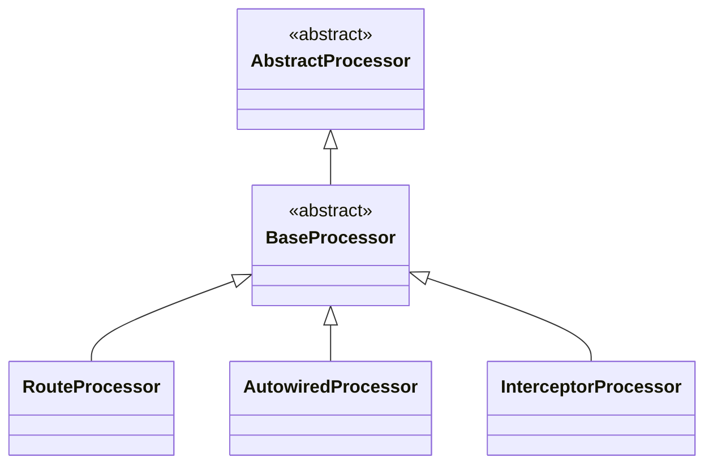
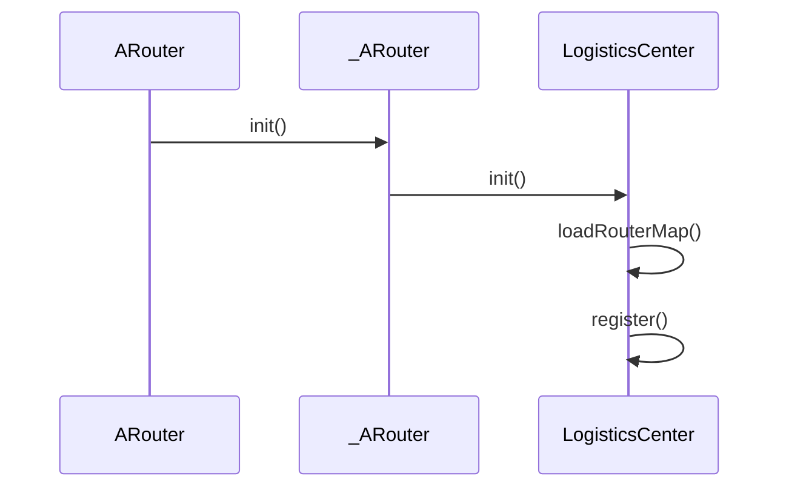

## ARouter原理如下

编译期，会扫描`@Route`注解，将注解里的信息封装成一个`RouteMeta`对象。并生成一个辅助类`ARouter$$Group$$groupName`，`groupName`即分组的名字，这也意味着同一个`group`只会生成一个辅助类。该类继承自`IRouteGroup`，有一个`loadInto()`方法。LogisticsCenter的addRouteGroupDynamic方法会调用`loadInto()`方法，将`@Route`中的`path`作为`key`，封装的`RouteMeta`作为`value`存储到`Warehouse`的`routes`中。

每一个`module`都会生成一个`ARouter$$Root$$moduleName` ，该类继承自`IRouteRoot`，在`LogisticsCenter`的`loadRouterMap`方法中调用`loadInto()`方法，将当前所有`module`下所有的`group`名称和生成的`Group`类的映射关系存储到`Warehouse`的`groupsIndex`中。

此外，每一个`module`还会生成`ARouter$$Interceptors$$moduleName`和`ARouter$$Providers$$moduleName`负责将拦截器和`Provider`添加到`Warehouse`的对应字段中。

调用`build`方法会创建一个`Postcard`对象，`Postcard`会根据传入的`Path`从`Warehouse`对象获取对应的对应的`RouteMeta`对象，然后找到对应的`Class`类，封装成Intent，调用系统的`startActivity()`进行跳转。


## 代码生成




```java
//RouteProcessor的parseRoutes方法
//遍历所有元素
for (Element element : routeElements) {
    TypeMirror tm = element.asType();
    //获取注解
    Route route = element.getAnnotation(Route.class);
    RouteMeta routeMeta;
    // Activity or Fragment
    //判断注解作用的类，是否是Activity或者Fragment的子类
    if (types.isSubtype(tm, type_Activity) || types.isSubtype(tm, fragmentTm) || types.isSubtype(tm, fragmentTmV4)) {
        // Get all fields annotation by @Autowired
        Map<String, Integer> paramsType = new HashMap<>();
        Map<String, Autowired> injectConfig = new HashMap<>();
        injectParamCollector(element, paramsType, injectConfig);
        //如果是Activity
        if (types.isSubtype(tm, type_Activity)) {
            // Activity
            logger.info(">>> Found activity route: " + tm.toString() + " <<<");
            routeMeta = new RouteMeta(route, element, RouteType.ACTIVITY, paramsType);
        } else {
            //若果是Fragment
            // Fragment
            logger.info(">>> Found fragment route: " + tm.toString() + " <<<");
            routeMeta = new RouteMeta(route, element, RouteType.parse(FRAGMENT), paramsType);
        }
        routeMeta.setInjectConfig(injectConfig);
    } else if (types.isSubtype(tm, iProvider)) {         // IProvider
        logger.info(">>> Found provider route: " + tm.toString() + " <<<");
        routeMeta = new RouteMeta(route, element, RouteType.PROVIDER, null);
    } else if (types.isSubtype(tm, type_Service)) {           // Service
        logger.info(">>> Found service route: " + tm.toString() + " <<<");
        routeMeta = new RouteMeta(route, element, RouteType.parse(SERVICE), null);
    } else {
        throw new RuntimeException("The @Route is marked on unsupported class, look at [" + tm.toString() + "].");
    }
    categories(routeMeta);
}
```

```java
private void categories(RouteMeta routeMete) {
    //校验
    if (routeVerify(routeMete)) {
        logger.info(">>> Start categories, group = " + routeMete.getGroup() + ", path = " + routeMete.getPath() + " <<<");
        Set<RouteMeta> routeMetas = groupMap.get(routeMete.getGroup());
        //如果是空则创建Set，并将routeMeta添加到Set中，最后将Set添加到Map中
        if (CollectionUtils.isEmpty(routeMetas)) {
            //创建TreeSet保持有序
            Set<RouteMeta> routeMetaSet = new TreeSet<>(new Comparator<RouteMeta>() {
                @Override
                public int compare(RouteMeta r1, RouteMeta r2) {
                    try {
                        return r1.getPath().compareTo(r2.getPath());
                    } catch (NullPointerException npe) {
                        logger.error(npe.getMessage());
                        return 0;
                    }
                }
            });
            routeMetaSet.add(routeMete);
            groupMap.put(routeMete.getGroup(), routeMetaSet);
        } else {
            routeMetas.add(routeMete);
        }
    } else {
        logger.warning(">>> Route meta verify error, group is " + routeMete.getGroup() + " <<<");
    }
}
```

```java
private boolean routeVerify(RouteMeta meta) {
    String path = meta.getPath();
    //如果path是空或者不是以/开头直接返回false
    //这里设计是否可以优化一下呢？能否在编译时报错，而不是到运行时才校验？
    if (StringUtils.isEmpty(path) || !path.startsWith("/")) {   // The path must be start with '/' and not empty!
        return false;
    }
    //如果Group是空，则截取第一个/和第二个/之间的字符串为Group
    if (StringUtils.isEmpty(meta.getGroup())) { // Use default group(the first word in path)
        try {
            String defaultGroup = path.substring(1, path.indexOf("/", 1));
            logger.info("routeVerify path"+path);
            logger.info("routeVerify "+defaultGroup);
            if (StringUtils.isEmpty(defaultGroup)) {
                return false;
            }
            meta.setGroup(defaultGroup);
            return true;
        } catch (Exception e) {
            logger.error("Failed to extract default group! " + e.getMessage());
            return false;
        }
    }
    return true;
}
```

```java
//遍历HashMap
for (Map.Entry<String, Set<RouteMeta>> entry : groupMap.entrySet()) {
  String groupName = entry.getKey();
  //loadInto方法
  MethodSpec.Builder loadIntoMethodOfGroupBuilder = MethodSpec.methodBuilder(METHOD_LOAD_INTO)
          .addAnnotation(Override.class)
          .addModifiers(PUBLIC)
          .addParameter(groupParamSpec);

  List<RouteDoc> routeDocList = new ArrayList<>();

  // Build group method body
  //获取相同Group的RouteMeta
  Set<RouteMeta> groupData = entry.getValue();
  for (RouteMeta routeMeta : groupData) {
      //将RouteMeta映射为RouteDoc
      RouteDoc routeDoc = extractDocInfo(routeMeta);

      ClassName className = ClassName.get((TypeElement) routeMeta.getRawType());
      //如果是Provider
      switch (routeMeta.getType()) {
          case PROVIDER:  // Need cache provider's super class
              List<? extends TypeMirror> interfaces = ((TypeElement) routeMeta.getRawType()).getInterfaces();
              for (TypeMirror tm : interfaces) {
                  routeDoc.addPrototype(tm.toString());

                  if (types.isSameType(tm, iProvider)) {   // Its implements iProvider interface himself.
                      // This interface extend the IProvider, so it can be used for mark provider
                      loadIntoMethodOfProviderBuilder.addStatement(
                              "providers.put($S, $T.build($T." + routeMeta.getType() + ", $T.class, $S, $S, null, " + routeMeta.getPriority() + ", " + routeMeta.getExtra() + "))",
                              (routeMeta.getRawType()).toString(),
                              routeMetaCn,
                              routeTypeCn,
                              className,
                              routeMeta.getPath(),
                              routeMeta.getGroup());
                  } else if (types.isSubtype(tm, iProvider)) {
                      // This interface extend the IProvider, so it can be used for mark provider
                      loadIntoMethodOfProviderBuilder.addStatement(
                              "providers.put($S, $T.build($T." + routeMeta.getType() + ", $T.class, $S, $S, null, " + routeMeta.getPriority() + ", " + routeMeta.getExtra() + "))",
                              tm.toString(),    // So stupid, will duplicate only save class name.
                              routeMetaCn,
                              routeTypeCn,
                              className,
                              routeMeta.getPath(),
                              routeMeta.getGroup());
                  }
              }
              break;
          default:
              break;
      }

      // Make map body for paramsType
      StringBuilder mapBodyBuilder = new StringBuilder();
      Map<String, Integer> paramsType = routeMeta.getParamsType();
      Map<String, Autowired> injectConfigs = routeMeta.getInjectConfig();
      if (MapUtils.isNotEmpty(paramsType)) {
          List<RouteDoc.Param> paramList = new ArrayList<>();

          for (Map.Entry<String, Integer> types : paramsType.entrySet()) {
              mapBodyBuilder.append("put(\"").append(types.getKey()).append("\", ").append(types.getValue()).append("); ");

              RouteDoc.Param param = new RouteDoc.Param();
              Autowired injectConfig = injectConfigs.get(types.getKey());
              param.setKey(types.getKey());
              param.setType(TypeKind.values()[types.getValue()].name().toLowerCase());
              param.setDescription(injectConfig.desc());
              param.setRequired(injectConfig.required());

              paramList.add(param);
          }

          routeDoc.setParams(paramList);
      }
      String mapBody = mapBodyBuilder.toString();
			//方法
      loadIntoMethodOfGroupBuilder.addStatement(
              "atlas.put($S, $T.build($T." + routeMeta.getType() + ", $T.class, $S, $S, " + (StringUtils.isEmpty(mapBody) ? null : ("new java.util.HashMap<String, Integer>(){{" + mapBodyBuilder.toString() + "}}")) + ", " + routeMeta.getPriority() + ", " + routeMeta.getExtra() + "))",
              routeMeta.getPath(),
              routeMetaCn,
              routeTypeCn,
              className,
              routeMeta.getPath().toLowerCase(),
              routeMeta.getGroup().toLowerCase());

      routeDoc.setClassName(className.toString());
      routeDocList.add(routeDoc);
}
```


## 核心类


### Route

```java
@Target({ElementType.TYPE})
@Retention(RetentionPolicy.CLASS)
public @interface Route {

    /**
     * Path of route
     */
    String path(); //路径

    /**
     * Used to merger routes, the group name MUST BE USE THE COMMON WORDS !!!
     */
    String group() default ""; //group 如果不是设置会获取[1,indexOf(1,'/')]之间的字符串为group

    /**
     * Name of route, used to generate javadoc.
     */
    String name() default "";

    /**
     * Extra data, can be set by user.
     * Ps. U should use the integer num sign the switch, by bits. 10001010101010
     */
    int extras() default Integer.MIN_VALUE;

    /**
     * The priority of route.
     */
    int priority() default -1;
}
```


### RouteMeta

`RouteMeta`存储路由的信息，是`Postcard`的父类。

```java
public class RouteMeta {
    private RouteType type;         // Type of route 路由类型
    private Element rawType;        // Raw type of route
    private Class<?> destination;   // Destination
    private String path;            // Path of route
    private String group;           // Group of route
    private int priority = -1;      // The smaller the number, the higher the priority
    private int extra;              // Extra data
    private Map<String, Integer> paramsType;  // Param type
    private String name;
}
```


## 初始化过程




### init()

当调用`ARouter`的`init()`时，会依次调用`_ARouter`、`LogisticsCenter`的`init()`。

```java
//ARouter.java
public static void init(Application application) {
    if (!hasInit) {
        //调用_ARouter的init方法
        hasInit = _ARouter.init(application);
        if (hasInit) {
            _ARouter.afterInit();
        }
    }
}
```

```java
//_ARouter.java
protected static synchronized boolean init(Application application) {
    mContext = application;
    //调用LogisticsCenter的init
    LogisticsCenter.init(mContext, executor);
    hasInit = true;
    mHandler = new Handler(Looper.getMainLooper());
    return true;
}
```

```java
//LogisticsCenter.java
public synchronized static void init(Context context, ThreadPoolExecutor tpe) throws HandlerException {
    mContext = context;
    executor = tpe;
    //调用loadRouterMap
    loadRouterMap();
    //如果通过插件注入 就什么也不做
    if (registerByPlugin) {
    } else {
        //没使用插件 则扫描apk。建议使用插件生成，扫描apk性能比较低，这里我就不做分析了
    }
}
```


### loadRouterMap()

```java
private static void loadRouterMap() {
    registerByPlugin = false;
    //以下代码由插件生成
    //api生成的arouter Group
    register("com.alibaba.android.arouter.routes.ARouter$$Providers$$arouterapi");
    register("com.alibaba.android.arouter.routes.ARouter$$Root$$arouterapi");
    //modulejava模块
    register("com.alibaba.android.arouter.routes.ARouter$$Root$$modulejava");
    register("com.alibaba.android.arouter.routes.ARouter$$Interceptors$$modulejava");
    register("com.alibaba.android.arouter.routes.ARouter$$Providers$$modulejava");
    //modulekotlin 模块
    register("com.alibaba.android.arouter.routes.ARouter$$Root$$modulekotlin");
    register("com.alibaba.android.arouter.routes.ARouter$$Providers$$modulekotlin")
}
```


### regiser()

`register()`方法负责将生成的类添加到`Warehouse（仓库）`中。

```java
private static void register(String className) {
    //判断类名是否是空
    if (!TextUtils.isEmpty(className)) {
        //根据类名获取Class
        Class<?> clazz = Class.forName(className);
        //创建实例
        Object obj = clazz.getConstructor().newInstance();
        if (obj instanceof IRouteRoot) {
            //获取group
            registerRouteRoot((IRouteRoot) obj);
        } else if (obj instanceof IProviderGroup) {
            registerProvider((IProviderGroup) obj);
        } else if (obj instanceof IInterceptorGroup) {
            registerInterceptor((IInterceptorGroup) obj);
        } 
    }
}
```

```java
private static void registerRouteRoot(IRouteRoot routeRoot) {
    markRegisteredByPlugin();
    if (routeRoot != null) {
        routeRoot.loadInto(Warehouse.groupsIndex);
    }
}
```


### afterInit()

```java
static void afterInit() {
    // Trigger interceptor init, use byName.
  //获取InterceptorService实例
    interceptorService = (InterceptorService) ARouter.getInstance().build("/arouter/service/interceptor").navigation();
}
```


## 获取参数

```java
//_ARouter.java
static void inject(Object thiz) {
    AutowiredService autowiredService = ((AutowiredService) ARouter.getInstance().build("/arouter/service/autowired").navigation());
    if (null != autowiredService) {
        autowiredService.autowire(thiz);
    }
}
```

```java
//AutowiredServiceImpl.java
@Override
public void autowire(Object instance) {
    doInject(instance, null);
}
private void doInject(Object instance, Class<?> parent) {
    Class<?> clazz = null == parent ? instance.getClass() : parent;
    ISyringe syringe = getSyringe(clazz);
    if (null != syringe) {
        syringe.inject(instance);//调用辅助类的inject方法
    }
  	//获取父类
    Class<?> superClazz = clazz.getSuperclass();
    // has parent and its not the class of framework.
  	//父类不为空，且不是framework的类
    if (null != superClazz && !superClazz.getName().startsWith("android")) {
        doInject(instance, superClazz);
    }
}
//获取运行时注解生成的辅助类
private ISyringe getSyringe(Class<?> clazz) {
    String className = clazz.getName();
    try {
        if (!blackList.contains(className)) {
            ISyringe syringeHelper = classCache.get(className);
            if (null == syringeHelper) {  // No cache.
                //类名$$ARouter$$Autowired
                syringeHelper = (ISyringe) Class.forName(clazz.getName() + SUFFIX_AUTOWIRED).getConstructor().newInstance();
            }
            classCache.put(className, syringeHelper);
            return syringeHelper;
        }
    } catch (Exception e) {
        blackList.add(className);    // This instance need not autowired.
    }
    return null;
}
```

```java
/**
 * DO NOT EDIT THIS FILE!!! IT WAS GENERATED BY AROUTER. */
//生成的KotlinTestActivity辅助类
public class KotlinTestActivity$$ARouter$$Autowired implements ISyringe {
  private SerializationService serializationService;

  @Override
  public void inject(Object target) {
    serializationService = ARouter.getInstance().navigation(SerializationService.class);
    KotlinTestActivity substitute = (KotlinTestActivity)target;
    //调用KotlinTestActivity的getIntent获取参数
    substitute.name = substitute.getIntent().getExtras() == null ? substitute.name : substitute.getIntent().getExtras().getString("name", substitute.name);
    substitute.age = substitute.getIntent().getIntExtra("age", substitute.age);
  }
}
```


## 路由跳转过程


### build()

`build()`方法会获取一个`Postcard`对象。

```java
public Postcard build(String path) {
    //调用_ARouter的build方法
    return _ARouter.getInstance().build(path);
}
```

```java
//调用_ARouter的build方法会返回一个Postcard对象，然后调用
//postcard对象的
protected Postcard build(String path) {
    if (TextUtils.isEmpty(path)) {
        throw new HandlerException(Consts.TAG + "Parameter is invalid!");
    } else {
        //获取PathReplaceService
        PathReplaceService pService = ARouter.getInstance().navigation(PathReplaceService.class);
        if (null != pService) {
            path = pService.forString(path);
        }
      	
        return build(path, extractGroup(path), true);
    }
}
```

```java
protected Postcard build(String path, String group, Boolean afterReplace) {
    if (TextUtils.isEmpty(path) || TextUtils.isEmpty(group)) {
        throw new HandlerException(Consts.TAG + "Parameter is invalid!");
    } else {
        if (!afterReplace) {
            PathReplaceService pService = ARouter.getInstance().navigation(PathReplaceService.class);
            if (null != pService) {
                path = pService.forString(path);
            }
        }
         //创建一个postcard对象
        return new Postcard(path, group);
    }
}
```


### extractGroup()

```java
//获取Group
private String extractGroup(String path) {
  	//如果不是以/开头，编译期可以通过编译只是不创建对应的类
  	//如果是空或者不是以/开头 则直接抛出异常
    if (TextUtils.isEmpty(path) || !path.startsWith("/")) {
        throw new HandlerException(Consts.TAG + "Extract the default group failed, the path must be start with '/' and contain more than 2 '/'!");
    }
    try {
        String defaultGroup = path.substring(1, path.indexOf("/", 1));
        if (TextUtils.isEmpty(defaultGroup)) {
            throw new HandlerException(Consts.TAG + "Extract the default group failed! There's nothing between 2 '/'!");
        } else {
            return defaultGroup;
        }
    } catch (Exception e) {
        return null;
    }
}
```


### navigation()

`navigation()`会根据获取的`path`获取对应的`RouteMeta`信息。

```java
//Postcard.java
public Object navigation(Context context) {
    return navigation(context, null);
}
//调用重载方法
public Object navigation(Context context, NavigationCallback callback) {
    return ARouter.getInstance().navigation(context, this, -1, callback);
}
```

```java
//ARouter.java
public Object navigation(Context mContext, Postcard postcard, int requestCode, NavigationCallback callback) {
    return _ARouter.getInstance().navigation(mContext, postcard, requestCode, callback);
}
```

```java
//_ARouter.java
protected Object navigation(final Context context, final Postcard postcard, final int requestCode, final NavigationCallback callback) {
  //获取PretreatmentService
    PretreatmentService pretreatmentService = ARouter.getInstance().navigation(PretreatmentService.class);
    if (null != pretreatmentService && !pretreatmentService.onPretreatment(context, postcard)) {
        // Pretreatment failed, navigation canceled.
        return null;
    }
    // Set context to postcard.
    postcard.setContext(null == context ? mContext : context);

    try {//执行completion
        LogisticsCenter.completion(postcard);
    } catch (NoRouteFoundException ex) {
				//执行失败回调
        if (null != callback) {
            callback.onLost(postcard);
        } else {
            // No callback for this invoke, then we use the global degrade service.
            DegradeService degradeService = ARouter.getInstance().navigation(DegradeService.class);
            if (null != degradeService) {
                degradeService.onLost(context, postcard);
            }
        }

        return null;
    }
    //执行成功回调
    if (null != callback) {
        callback.onFound(postcard);
    }
    //Provider和Fragment不走拦截器
    if (!postcard.isGreenChannel()) {   // It must be run in async thread, maybe interceptor cost too mush time made ANR.
        //执行拦截器的doInterceptions方法
        interceptorService.doInterceptions(postcard, new InterceptorCallback() {
            /**
             * Continue process
             *
             * @param postcard route meta
             */
            @Override
            public void onContinue(Postcard postcard) {
                _navigation(postcard, requestCode, callback);
            }

            /**
             * Interrupt process, pipeline will be destory when this method called.
             *
             * @param exception Reson of interrupt.
             */
            @Override
            public void onInterrupt(Throwable exception) {
                if (null != callback) {
                    callback.onInterrupt(postcard);
                }
            }
        });
    } else {
        return _navigation(postcard, requestCode, callback);
    }

    return null;
}
```


### completion()

```java
ublic synchronized static void completion(Postcard postcard) {
    if (null == postcard) {
        throw new NoRouteFoundException(TAG + "No postcard!");
    }
    //获取RouteMeta
    RouteMeta routeMeta = Warehouse.routes.get(postcard.getPath());
    //首次调用routeMeta为null
    if (null == routeMeta) {
        // Maybe its does't exist, or didn't load.
        //如果map中不包含postcard的group则抛出异常
        if (!Warehouse.groupsIndex.containsKey(postcard.getGroup())) {
            throw new NoRouteFoundException(TAG
                    + "There is no route match the path ["
                    + postcard.getPath()
                    + "], in group ["
                    + postcard.getGroup()
                    + "]");
        } else {
            // Load route and cache it into memory, then delete from metas.
            //将属于这个group中的所有路由都添加到map中
            addRouteGroupDynamic(postcard.getGroup(), null);
            //再次执行completion方法
            completion(postcard);   // Reload
        }
    } else {
        //设置目标
        postcard.setDestination(routeMeta.getDestination());
        //设置类型
        postcard.setType(routeMeta.getType());
        //设置优先级
        postcard.setPriority(routeMeta.getPriority());
        //设置参数
        postcard.setExtra(routeMeta.getExtra());
        Uri rawUri = postcard.getUri();
        if (null != rawUri) {   // Try to set params into bundle.
            Map<String, String> resultMap = TextUtils.splitQueryParameters(rawUri);
            Map<String, Integer> paramsType = routeMeta.getParamsType();

            if (MapUtils.isNotEmpty(paramsType)) {
                // Set value by its type, just for params which annotation by @Param
                for (Map.Entry<String, Integer> params : paramsType.entrySet()) {
                    setValue(postcard, params.getValue(), params.getKey(), resultMap.get(params.getKey()));
                }

                // Save params name which need auto inject.
                postcard.getExtras()
                        .putStringArray(ARouter.AUTO_INJECT, paramsType.keySet().toArray(new String[]{}));
            }

            // Save raw uri
            postcard.withString(ARouter.RAW_URI, rawUri.toString());
        }
       
        switch (routeMeta.getType()) {
            //如果是Provider类型
            case PROVIDER:  // if the route is provider, should find its instance
                // Its provider, so it must implement IProvider
            		//创建Provider实例
                Class<? extends IProvider> providerMeta = (Class<? extends IProvider>) routeMeta.getDestination();
            		//从缓存中获取Provider
                IProvider instance = Warehouse.providers.get(providerMeta);
                if (null == instance) { // There's no instance of this provider
                    IProvider provider;
                    try {//如果为空，创建IProvider
                        provider = providerMeta.getConstructor().newInstance();
                        provider.init(mContext);
                        Warehouse.providers.put(providerMeta, provider);
                        instance = provider;
                    } catch (Exception e) {
                        throw new HandlerException("Init provider failed! " + e.getMessage());
                    }
                }
                postcard.setProvider(instance);
                //Provider和Fragment不走拦截器
                postcard.greenChannel();    // Provider should skip all of interceptors
                break;
            case FRAGMENT:
                postcard.greenChannel();    // Fragment needn't interceptors
            default:
                break;
        }
    }
}
```


### _navigation()

`_navigation()`执行跳转或者获取`Provider`。

```java
private Object _navigation(final Postcard postcard, final int requestCode, final NavigationCallback callback) {
    final Context currentContext = postcard.getContext();

    switch (postcard.getType()) {
        case ACTIVITY:
            // Build intent
           //创建Intent
            final Intent intent = new Intent(currentContext, postcard.getDestination());
        		//设置参数
            intent.putExtras(postcard.getExtras());

            // Set flags.
            int flags = postcard.getFlags();
            if (0 != flags) {
                intent.setFlags(flags);
            }

            // Non activity, need FLAG_ACTIVITY_NEW_TASK
            if (!(currentContext instanceof Activity)) {
                intent.addFlags(Intent.FLAG_ACTIVITY_NEW_TASK);
            }

            // Set Actions
            String action = postcard.getAction();
            if (!TextUtils.isEmpty(action)) {
                intent.setAction(action);
            }

            // Navigation in main looper.
            runInMainThread(new Runnable() {
                @Override
                public void run() {
                    startActivity(requestCode, currentContext, intent, postcard, callback);
                }
            });

            break;
        case PROVIDER:
            return postcard.getProvider();
        case BOARDCAST:
        case CONTENT_PROVIDER:
        case FRAGMENT:
            Class<?> fragmentMeta = postcard.getDestination();
            try {
                Object instance = fragmentMeta.getConstructor().newInstance();
                if (instance instanceof Fragment) {
                    ((Fragment) instance).setArguments(postcard.getExtras());
                } else if (instance instanceof android.support.v4.app.Fragment) {
                    ((android.support.v4.app.Fragment) instance).setArguments(postcard.getExtras());
                }

                return instance;
            } catch (Exception ex) {
                logger.error(Consts.TAG, "Fetch fragment instance error, " + TextUtils.formatStackTrace(ex.getStackTrace()));
            }
        case METHOD:
        case SERVICE:
        default:
            return null;
    }

    return null;
}
```


### doInterceptions()

```java
@Override
public void doInterceptions(final Postcard postcard, final InterceptorCallback callback) {
    if (MapUtils.isNotEmpty(Warehouse.interceptorsIndex)) {

        checkInterceptorsInitStatus();

        if (!interceptorHasInit) {
            callback.onInterrupt(new HandlerException("Interceptors initialization takes too much time."));
            return;
        }
        //在子线程中执行
        LogisticsCenter.executor.execute(new Runnable() {
            @Override
            public void run() {
                CancelableCountDownLatch interceptorCounter = new CancelableCountDownLatch(Warehouse.interceptors.size());
                try {
                    _execute(0, interceptorCounter, postcard);
                    interceptorCounter.await(postcard.getTimeout(), TimeUnit.SECONDS);
                    if (interceptorCounter.getCount() > 0) {    // Cancel the navigation this time, if it hasn't return anythings.
                        callback.onInterrupt(new HandlerException("The interceptor processing timed out."));
                    } else if (null != postcard.getTag()) {    // Maybe some exception in the tag.
                        callback.onInterrupt((Throwable) postcard.getTag());
                    } else {
                        callback.onContinue(postcard);
                    }
                } catch (Exception e) {
                    callback.onInterrupt(e);
                }
            }
        });
    } else {
        callback.onContinue(postcard);
    }
}
```


### _execute()

```java
private static void _execute(final int index, final CancelableCountDownLatch counter, final Postcard postcard) {
    if (index < Warehouse.interceptors.size()) {
        IInterceptor iInterceptor = Warehouse.interceptors.get(index);
        iInterceptor.process(postcard, new InterceptorCallback() {
            @Override
            public void onContinue(Postcard postcard) {
                // Last interceptor excute over with no exception.
                counter.countDown();
              	//一个接一个执行，如果中间有一个拦截器没有回调onContinue 后面的拦截器都将不执行
                _execute(index + 1, counter, postcard);  // When counter is down, it will be execute continue ,but index bigger than interceptors size, then U know.
            }
            @Override
            public void onInterrupt(Throwable exception) {
                // Last interceptor execute over with fatal exception.
                postcard.setTag(null == exception ? new HandlerException("No message.") : exception);    // save the exception message for backup.
                counter.cancel();
                // Be attention, maybe the thread in callback has been changed,
                // then the catch block(L207) will be invalid.
                // The worst is the thread changed to main thread, then the app will be crash, if you throw this exception!
                  if (!Looper.getMainLooper().equals(Looper.myLooper())) {    // You shouldn't throw the exception if the thread is main thread.
                      throw new HandlerException(exception.getMessage());
                  }
            }
        });
    }
}
```


## 更多阅读

* https://github.com/alibaba/ARouter

* https://github.com/bilibili/BRouter

* https://github.com/didi/DRouter

* https://github.com/meituan/WMRouter


