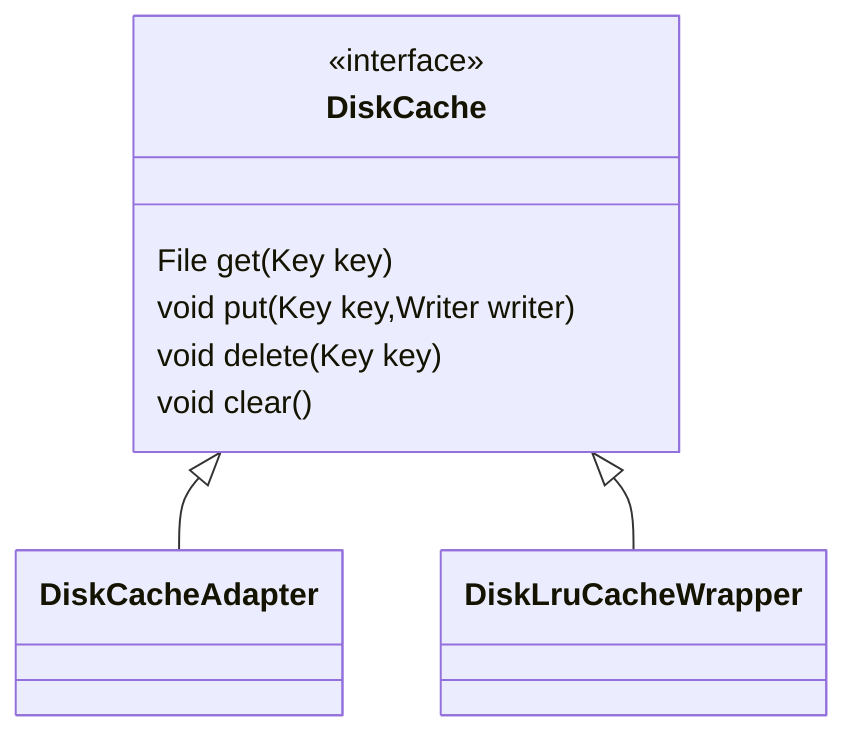
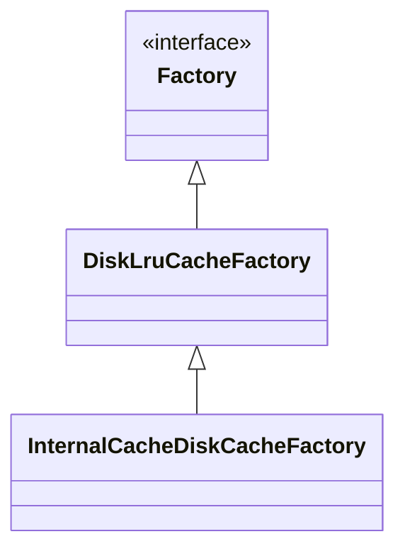
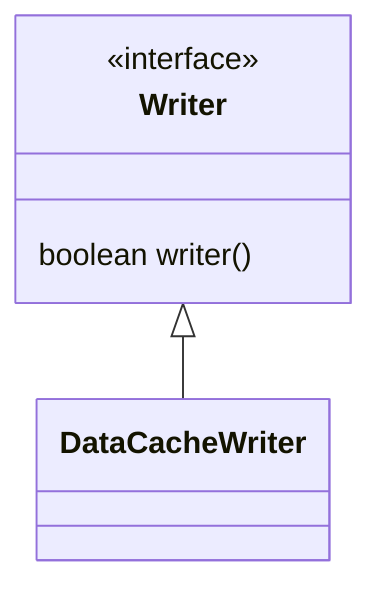

## 内存缓存

内存缓存有两级缓存`ActiveResources`和`MemoryCache`。`ActiveResources` 用于缓存弱引用，当被清理时，会放入`MemoryCache`中。


### ActiveResources

```java
@VisibleForTesting
ActiveResources(
    boolean isActiveResourceRetentionAllowed, Executor monitorClearedResourcesExecutor) {
  this.isActiveResourceRetentionAllowed = isActiveResourceRetentionAllowed;
  this.monitorClearedResourcesExecutor = monitorClearedResourcesExecutor;
  monitorClearedResourcesExecutor.execute(
      new Runnable() {
        @Override
        public void run() {
					//清理引用队列
          cleanReferenceQueue();
        }
      });
}
```


```java
void cleanReferenceQueue() {
  while (!isShutdown) {
    try {
      ResourceWeakReference ref = (ResourceWeakReference) resourceReferenceQueue.remove();
      cleanupActiveReference(ref);
      // This section for testing only.
      DequeuedResourceCallback current = cb;
      if (current != null) {
        current.onResourceDequeued();
      }
      // End for testing only.
    } catch (InterruptedException e) {
      Thread.currentThread().interrupt();
    }
  }
}
```


```java
void cleanupActiveReference(@NonNull ResourceWeakReference ref) {
  synchronized (this) {
    activeEngineResources.remove(ref.key);
    if (!ref.isCacheable || ref.resource == null) {
      return;
    }
  }
  EngineResource<?> newResource =
      new EngineResource<>(
          ref.resource, /*isMemoryCacheable=*/ true, /*isRecyclable=*/ false, ref.key, listener);
  //回调
  listener.onResourceReleased(ref.key, newResource);
}
```


```java
//Engine
public void onResourceReleased(Key cacheKey, EngineResource<?> resource) {
  activeResources.deactivate(cacheKey);
  if (resource.isMemoryCacheable()) {
    //添加到MemoryCache中
    cache.put(cacheKey, resource);
  } else {
    resourceRecycler.recycle(resource, /*forceNextFrame=*/ false);
  }
}
```


### loadFromMemory

```java
@Nullable
private EngineResource<?> loadFromMemory(
    EngineKey key, boolean isMemoryCacheable, long startTime) {
  //内存缓存不可用直接返回null
  if (!isMemoryCacheable) {
    return null;
  }
	//先从ActiveResources中获取
  EngineResource<?> active = loadFromActiveResources(key);
  if (active != null) {
    if (VERBOSE_IS_LOGGABLE) {
      logWithTimeAndKey("Loaded resource from active resources", startTime, key);
    }
    return active;
  }
	//如果ActiveResources中没有，则从MemoryCache中获取
  EngineResource<?> cached = loadFromCache(key);
  if (cached != null) {
    if (VERBOSE_IS_LOGGABLE) {
      logWithTimeAndKey("Loaded resource from cache", startTime, key);
    }
    return cached;
  }
  return null;
}
```


```java
@Nullable
private EngineResource<?> loadFromActiveResources(Key key) {
  EngineResource<?> active = activeResources.get(key);
  if (active != null) {
    //增加引用次数
    active.acquire();
  }
  return active;
}
```


```java
private EngineResource<?> loadFromCache(Key key) {
  EngineResource<?> cached = getEngineResourceFromCache(key);
  if (cached != null) {
    cached.acquire();//增加引用次数
    activeResources.activate(key, cached); //添加到ActiveResources中
  }
  return cached;
}
```


### MemorySizeCalculator

```java
public static final class Builder {
    @VisibleForTesting static final int MEMORY_CACHE_TARGET_SCREENS = 2;

    /**
     * On Android O+, we use {@link android.graphics.Bitmap.Config#HARDWARE} for all reasonably
     * sized images unless we're creating thumbnails for the first time. As a result, the Bitmap
     * pool is much less important on O than it was on previous versions.
     */
    static final int BITMAP_POOL_TARGET_SCREENS =
        Build.VERSION.SDK_INT < Build.VERSION_CODES.O ? 4 : 1;

    static final float MAX_SIZE_MULTIPLIER = 0.4f;
    static final float LOW_MEMORY_MAX_SIZE_MULTIPLIER = 0.33f;
    // 4MB.
    static final int ARRAY_POOL_SIZE_BYTES = 4 * 1024 * 1024;

    @Synthetic final Context context;

    // Modifiable (non-final) for testing.
    @Synthetic ActivityManager activityManager;
    @Synthetic ScreenDimensions screenDimensions;

    @Synthetic float memoryCacheScreens = MEMORY_CACHE_TARGET_SCREENS;
    @Synthetic float bitmapPoolScreens = BITMAP_POOL_TARGET_SCREENS;
    @Synthetic float maxSizeMultiplier = MAX_SIZE_MULTIPLIER;
    @Synthetic float lowMemoryMaxSizeMultiplier = LOW_MEMORY_MAX_SIZE_MULTIPLIER;
    @Synthetic int arrayPoolSizeBytes = ARRAY_POOL_SIZE_BYTES;
}
```

```java
// Package private to avoid PMD warning.
MemorySizeCalculator(MemorySizeCalculator.Builder builder) {
  this.context = builder.context;
  //4M 低内存设备2M
  arrayPoolSize =
      isLowMemoryDevice(builder.activityManager)
          ? builprivate static int getMaxSize(
    ActivityManager activityManager, float maxSizeMultiplier, float lowMemoryMaxSizeMultiplier) {
  final int memoryClassBytes = activityManager.getMemoryClass() * 1024 * 1024;
  final boolean isLowMemoryDevice = isLowMemoryDevice(activityManager);
  return Math.round(
      memoryClassBytes * (isLowMemoryDevice ? lowMemoryMaxSizeMultiplier : maxSizeMultiplier));
}der.arrayPoolSizeBytes / LOW_MEMORY_BYTE_ARRAY_POOL_DIVISOR
          : builder.arrayPoolSizeBytes;
  //计算最大大小
  int maxSize =
      getMaxSize(
          builder.activityManager, builder.maxSizeMultiplier, builder.lowMemoryMaxSizeMultiplier);

  int widthPixels = builder.screenDimensions.getWidthPixels();
  int heightPixels = builder.screenDimensions.getHeightPixels();
  //计算一张格式为 ARGB_8888 ，大小为屏幕大小的图片的占用内存大小
  //BYTES_PER_ARGB_8888_PIXEL 值为 4
  int screenSize = widthPixels * heightPixels * BYTES_PER_ARGB_8888_PIXEL;
  //BitmapPool大小
  //BitmapPool和MemoryCache的大小依赖当前屏幕分辨率
  int targetBitmapPoolSize = Math.round(screenSize * builder.bitmapPoolScreens);
  //MemoryCache大小 
  int targetMemoryCacheSize = Math.round(screenSize * builder.memoryCacheScreens);
  int availableSize = maxSize - arrayPoolSize;
  //小于可用大小 按照计算的值分配
  if (targetMemoryCacheSize + targetBitmapPoolSize <= availableSize) {
    memoryCacheSize = targetMemoryCacheSize;
    bitmapPoolSize = targetBitmapPoolSize;
  } else {
    //将可用的分配
    float part = availableSize / (builder.bitmapPoolScreens + builder.memoryCacheScreens);
    memoryCacheSize = Math.round(part * builder.memoryCacheScreens);
    bitmapPoolSize = Math.round(part * builder.bitmapPoolScreens);
  }
}
```

```java
private static int getMaxSize(
    ActivityManager activityManager, float maxSizeMultiplier, float lowMemoryMaxSizeMultiplier) {
  final int memoryClassBytes = activityManager.getMemoryClass() * 1024 * 1024;
  final boolean isLowMemoryDevice = isLowMemoryDevice(activityManager);
  return Math.round(
      memoryClassBytes * (isLowMemoryDevice ? lowMemoryMaxSizeMultiplier : maxSizeMultiplier));
}
```


## 磁盘缓存


### DiskCache




### Factory




### Writer

Writer负责将数据写入文件。



Writer的write方法会调用Encoder的encode方法

```java
class DataCacheWriter<DataType> implements DiskCache.Writer {
  private final Encoder<DataType> encoder;
  private final DataType data;
  private final Options options;
  DataCacheWriter(Encoder<DataType> encoder, DataType data, Options options) {
    this.encoder = encoder;
    this.data = data;
    this.options = options;
  }
  @Override
  public boolean write(@NonNull File file) {
    return encoder.encode(data, file, options);
  }
}
```


