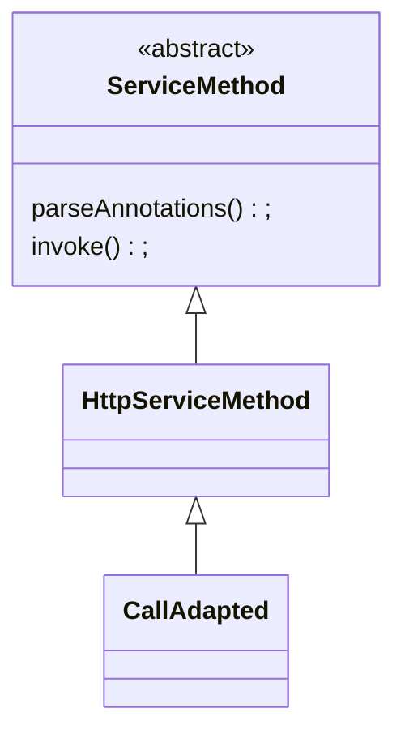

`Retrofit`执行流程可以分为两部分：

* 创建`ServiceMethod`。

* 调用`ServiceMethod`的`invoke()`。

`ServiceMethod`创建过程：

`ServiceMethod`的`invoke()`执行流程：


## Retrofit

`Retrofit`类是`Retrofit`的入口类。使用`Builder`设计模式，允许配置不同的参数。


### **create()**

```java
public <T> T create(final Class<T> service) {
  //校验传入的Class
  validateServiceInterface(service);
  return (T)
      Proxy.newProxyInstance(
          service.getClassLoader(),
          new Class<?>[] {service},
          new InvocationHandler() {
            private final Platform platform = Platform.get(); //获取平台
            private final Object[] emptyArgs = new Object[0];
            @Override
            public @Nullable Object invoke(Object proxy, Method method, @Nullable Object[] args)
                throws Throwable {
              // If the method is a method from Object then defer to normal invocation.
              //如果是Object中声明的方法，就调用当前InvocationHandler对应的方法
              if (method.getDeclaringClass() == Object.class) {
                return method.invoke(this, args);
              }
              args = args != null ? args : emptyArgs;
              return platform.isDefaultMethod(method)
                  ? platform.invokeDefaultMethod(method, service, proxy, args)
                  : loadServiceMethod(method).invoke(args);
            }
          });
}
```

为了避免相同的`Method`多次创建`ServiceMethod`，会将创建的`ServiceMethod`存入缓存中，如果缓存中没有则才重新创建。

```java
ServiceMethod<?> loadServiceMethod(Method method) {
  ServiceMethod<?> result = serviceMethodCache.get(method);
  if (result != null) return result;
  synchronized (serviceMethodCache) {
    result = serviceMethodCache.get(method);
    if (result == null) {
      result = ServiceMethod.parseAnnotations(this, method);
      serviceMethodCache.put(method, result);
    }
  }
  return result;
}
```


### Builder

```java
#public static final class Builder {
  private final Platform platform; //平台
  private @Nullable okhttp3.Call.Factory callFactory; //设置OkHttp的Call.Factory
  private @Nullable HttpUrl baseUrl; 
  private final List<Converter.Factory> converterFactories = new ArrayList<>();//ConverterFactory集合
  private final List<CallAdapter.Factory> callAdapterFactories = new ArrayList<>();//CallAdapterFactory集合
  private @Nullable Executor callbackExecutor;
  private boolean validateEagerly;
}
```


### build()

在`Builder`的`build()`会判断是否配置参数，如果没有配置，会添加一些默认参数。

```java

public Retrofit build() {
    //判断url是否是空
    if (baseUrl == null) {
      throw new IllegalStateException("Base URL required.");
    }
    //判断callFactory是空 直接创建一个OkHttpClient
    okhttp3.Call.Factory callFactory = this.callFactory;
    if (callFactory == null) {
      callFactory = new OkHttpClient();
    }

    Executor callbackExecutor = this.callbackExecutor;
    if (callbackExecutor == null) {
      callbackExecutor = platform.defaultCallbackExecutor();
    }
    List<CallAdapter.Factory> callAdapterFactories = new ArrayList<>(this.callAdapterFactories);
    callAdapterFactories.addAll(platform.defaultCallAdapterFactories(callbackExecutor));
    List<Converter.Factory> converterFactories =
        new ArrayList<>(
            1 + this.converterFactories.size() + platform.defaultConverterFactoriesSize());
    //添加内置的转换器
    converterFactories.add(new BuiltInConverters());
    converterFactories.addAll(this.converterFactories);
    converterFactories.addAll(platform.defaultConverterFactories());

    return new Retrofit(
        callFactory,
        baseUrl,
        unmodifiableList(converterFactories),
        unmodifiableList(callAdapterFactories),
        callbackExecutor,
        validateEagerly);
  }
}
```


## **ServiceMethod**



`ServiceMethod`有两个方法：

* `parseAnnotations()` 负责解析注解。

* `invoke()`会被`InvocationHandler`的`invoke()`方法调用。


### parseAnnotations()

```java
abstract class ServiceMethod<T> {
  static <T> ServiceMethod<T> parseAnnotations(Retrofit retrofit, Method method) {
    //创建RequestFactory
    RequestFactory requestFactory = RequestFactory.parseAnnotations(retrofit, method);
    //获取方法返回类型
    Type returnType = method.getGenericReturnType();
    //校验返回值类型
    if (Utils.hasUnresolvableType(returnType)) {
      throw methodError(
          method,
          "Method return type must not include a type variable or wildcard: %s",
          returnType);
    }
    if (returnType == void.class) {
      throw methodError(method, "Service methods cannot return void.");
    }
  
    return HttpServiceMethod.parseAnnotations(retrofit, method, requestFactory);
  }

  abstract @Nullable T invoke(Object[] args);
}
```


## **RequestFactory**

`RequestFactory`负责获取`Method`上的注解信息，并封装成`Request`。


### **parseAnnotations()**

`parseAnnotations()`方法会创建一个`Builder`，然后调用`build()`方法创建`RequestFactory`实例。

```java
static RequestFactory parseAnnotations(Retrofit retrofit, Method method) {
  return new Builder(retrofit, method).build();
}
```


### **Builder**

```java
static final class Builder{
  //构造函数
  Builder(Retrofit retrofit, Method method) {
  	this.retrofit = retrofit;
  	this.method = method;
  	this.methodAnnotations = method.getAnnotations();//获取方法上的注解 数组
  	this.parameterTypes = method.getGenericParameterTypes(); //获取参数 
    //二维数组 方法有多个参数 每个参数上可能有多个注解所以返回值是一个二维数组
    //获取参数上的注解
  	this.parameterAnnotationsArray = method.getParameterAnnotations();
	}
}
```


### **build()**

```java
RequestFactory build() {
  //遍历方法上的注解调用parseMethodAnnotation解析方法上的注解
  for (Annotation annotation : methodAnnotations) {
    parseMethodAnnotation(annotation);
  }
  //调用完parseMethodAnnotation 会为httpMethod赋值
  //如果httpMethod为空直接抛出异常
  if (httpMethod == null) {
    throw methodError(method, "HTTP method annotation is required (e.g., @GET, @POST, etc.).");
  }
  if (!hasBody) {
    if (isMultipart) {
      throw methodError(
          method,
          "Multipart can only be specified on HTTP methods with request body (e.g., @POST).");
    }
    if (isFormEncoded) {
      throw methodError(
          method,
          "FormUrlEncoded can only be specified on HTTP methods with "
              + "request body (e.g., @POST).");
    }
  }
  //参数个数
  int parameterCount = parameterAnnotationsArray.length;
  //创建一个ParameterHandler数组 
  parameterHandlers = new ParameterHandler<?>[parameterCount];
  for (int p = 0, lastParameter = parameterCount - 1; p < parameterCount; p++) {
    //调用parseParameter方法解析参数 并创建一个ParameterHandler为parameterHandlers赋值
    parameterHandlers[p] =
        parseParameter(p, parameterTypes[p], parameterAnnotationsArray[p], p == lastParameter);
  }
  if (relativeUrl == null && !gotUrl) {
    throw methodError(method, "Missing either @%s URL or @Url parameter.", httpMethod);
  }
  if (!isFormEncoded && !isMultipart && !hasBody && gotBody) {
    throw methodError(method, "Non-body HTTP method cannot contain @Body.");
  }
  if (isFormEncoded && !gotField) {
    throw methodError(method, "Form-encoded method must contain at least one @Field.");
  }
  if (isMultipart && !gotPart) {
    throw methodError(method, "Multipart method must contain at least one @Part.");
  }
  //创建RequestFactory
  return new RequestFactory(this);
}
```


### **parseMethodAnnotation()**

`parseMethodAnnotation()`负责解析方法上的注解。

```java
private void parseMethodAnnotation(Annotation annotation) {
  if (annotation instanceof DELETE) {
    parseHttpMethodAndPath("DELETE", ((DELETE) annotation).value(), false);
  } else if (annotation instanceof GET) {
    parseHttpMethodAndPath("GET", ((GET) annotation).value(), false);
  } else if (annotation instanceof HEAD) {
    parseHttpMethodAndPath("HEAD", ((HEAD) annotation).value(), false);
    if (!Void.class.equals(responseType)) {
      throw methodError("HEAD method must use Void as response type.");
    }
  } else if (annotation instanceof PATCH) {
    parseHttpMethodAndPath("PATCH", ((PATCH) annotation).value(), true);
  } else if (annotation instanceof POST) {
    parseHttpMethodAndPath("POST", ((POST) annotation).value(), true);
  } else if (annotation instanceof PUT) {
    parseHttpMethodAndPath("PUT", ((PUT) annotation).value(), true);
  } else if (annotation instanceof OPTIONS) {
    parseHttpMethodAndPath("OPTIONS", ((OPTIONS) annotation).value(), false);
  } else if (annotation instanceof HTTP) {
    HTTP http = (HTTP) annotation;
    parseHttpMethodAndPath(http.method(), http.path(), http.hasBody());
  } else if (annotation instanceof retrofit2.http.Headers) {
    String[] headersToParse = ((retrofit2.http.Headers) annotation).value();
    if (headersToParse.length == 0) {
      throw methodError("@Headers annotation is empty.");
    }
    //解析请求头
    headers = parseHeaders(headersToParse);
  } else if (annotation instanceof Multipart) {
    if (isFormEncoded) {
      throw methodError("Only one encoding annotation is allowed.");
    }
    isMultipart = true;
  } else if (annotation instanceof FormUrlEncoded) {
    if (isMultipart) {
      throw methodError("Only one encoding annotation is allowed.");
    }
    isFormEncoded = true;
  }
}
```


### **parseHttpMethodAndPath()**

`parseHttpMethodAndPath()`负责获取url。

```java
private void parseHttpMethodAndPath(String httpMethod, String value, boolean hasBody) {
  //如果httpMethod不为null 直接抛出异常
  if (this.httpMethod != null) {
    throw methodError(
        method,
        "Only one HTTP method is allowed. Found: %s and %s.",
        this.httpMethod,
        httpMethod);
  }
  this.httpMethod = httpMethod; //赋值
  this.hasBody = hasBody;
  if (value.isEmpty()) { //注解内值为空直接返回
    return;
  }
  // Get the relative URL path and existing query string, if present.
  int question = value.indexOf('?');
  //url中包含? 并且?不是最后一位
  if (question != -1 && question < value.length() - 1) {
    // Ensure the query string does not have any named parameters.
    String queryParams = value.substring(question + 1);
    Matcher queryParamMatcher = PARAM_URL_REGEX.matcher(queryParams);
    if (queryParamMatcher.find()) {
      throw methodError(
          method,
          "URL query string \"%s\" must not have replace block. "
              + "For dynamic query parameters use @Query.",
          queryParams);
    }
  }
  //获取url
  this.relativeUrl = value;
  //解析url中的参数
  this.relativeUrlParamNames = parsePathParameters(value);
}
```


### **parseParameter()**

`parseParameter()`负责解析参数。

```java
private @Nullable ParameterHandler<?> parseParameter(
    int p, Type parameterType, @Nullable Annotation[] annotations, boolean allowContinuation) {
  ParameterHandler<?> result = null;
  if (annotations != null) {
    for (Annotation annotation : annotations) {
      //解析参数上的注解
      ParameterHandler<?> annotationAction =
          parseParameterAnnotation(p, parameterType, annotations, annotation);
      if (annotationAction == null) {
        continue;
      }
      if (result != null) {
        throw parameterError(
            method, p, "Multiple Retrofit annotations found, only one allowed.");
      }
      result = annotationAction;
    }
  }
  if (result == null) {
    if (allowContinuation) {
      try {
        if (Utils.getRawType(parameterType) == Continuation.class) {
          isKotlinSuspendFunction = true;
          return null;
        }
      } catch (NoClassDefFoundError ignored) {
      }
    }
    throw parameterError(method, p, "No Retrofit annotation found.");
  }
  return result;
}
```


### **parseParameterAnnotation()**

`parseParameterAnnotation()`负责解析参数上的注解，该方法比较长，总体的解析操作都大同小异，我这里只解析`@Query`。

```java
private ParameterHandler<?> parseParameterAnnotation(
        int p, Type type, Annotation[] annotations, Annotation annotation) {
  if (annotation instanceof Query) {
    //校验
    validateResolvableType(p, type);
    //获取注解
    Query query = (Query) annotation;
    //获取注解的值
    String name = query.value();
    //是否编码
    boolean encoded = query.encoded();
    Class<?> rawParameterType = Utils.getRawType(type);
    gotQuery = true;
    if (Iterable.class.isAssignableFrom(rawParameterType)) {
      if (!(type instanceof ParameterizedType)) {
        throw parameterError(
            method,
            p,
            rawParameterType.getSimpleName()
                + " must include generic type (e.g., "
                + rawParameterType.getSimpleName()
                + "<String>)");
      }
      ParameterizedType parameterizedType = (ParameterizedType) type;
      Type iterableType = Utils.getParameterUpperBound(0, parameterizedType);
      //获取Converter
      Converter<?, String> converter = retrofit.stringConverter(iterableType, annotations);
      //创建ParameterHandler 并调用iterable()方法
      return new ParameterHandler.Query<>(name, converter, encoded).iterable();
    } else if (rawParameterType.isArray()) {
      Class<?> arrayComponentType = boxIfPrimitive(rawParameterType.getComponentType());
      Converter<?, String> converter =
          retrofit.stringConverter(arrayComponentType, annotations);
      return new ParameterHandler.Query<>(name, converter, encoded).array();
    } else {
      Converter<?, String> converter = retrofit.stringConverter(type, annotations);
      return new ParameterHandler.Query<>(name, converter, encoded);
    }
 }
}
```


## **ParameterHandler**

`ParameterHandler`是一个抽象类，有多个子类。`ParameterHandler`包含三个方法`iterable()`和`apply()`和`array()`。`apply()`方法是一个抽象方法，具体的实现在其子类中。


### apply()

```java
abstract void apply(RequestBuilder builder, T value) throws IOException;

  final ParameterHandler<Iterable<T>> iterable() {
    return new ParameterHandler<Iterable<T>>() {
      @Override void apply(RequestBuilder builder, Iterable<T> values) throws IOException {
        if (values == null) return; // Skip null values.

        for (T value : values) {
          ParameterHandler.this.apply(builder, value);
        }
      }
    };
  }

  final ParameterHandler<Object> array() {
    return new ParameterHandler<Object>() {
      @Override void apply(RequestBuilder builder, Object values) throws IOException {
        if (values == null) return; // Skip null values.

        for (int i = 0, size = Array.getLength(values); i < size; i++) {
          //noinspection unchecked
          ParameterHandler.this.apply(builder, (T) Array.get(values, i));
        }
      }
    };
  }
```

`apply()`的实现：

```java
static final class Query<T> extends ParameterHandler<T> {
  private final String name;
  private final Converter<T, String> valueConverter;
  private final boolean encoded;
  Query(String name, Converter<T, String> valueConverter, boolean 
    this.name = Objects.requireNonNull(name, "name == null");
    this.valueConverter = valueConverter;
    this.encoded = encoded;
  }
  @Override
  void apply(RequestBuilder builder, @Nullable T value) throws IOE
    if (value == null) return; // Skip null values.
    String queryValue = valueConverter.convert(value);
    if (queryValue == null) return; // Skip converted but null val
    builder.addQueryParam(name, queryValue, encoded);
  }
}
```


## **HttpServiceMethod**


### **parseAnnotations()**

parseAnnotations()负责从Retrofit中获取CallAdapter和Converter，并创建ServiceMethod的子类。

```java
static <ResponseT, ReturnT> HttpServiceMethod<ResponseT, ReturnT> parseAnnotations(
    Retrofit retrofit, Method method, RequestFactory requestFactory) {
  //判断是否是挂起函数
  boolean isKotlinSuspendFunction = requestFactory.isKotlinSuspendFunction;
  boolean continuationWantsResponse = false;
  boolean continuationBodyNullable = false;
  //获取方法上的注解
  Annotation[] annotations = method.getAnnotations();
  Type adapterType;
  if (isKotlinSuspendFunction) { //挂起函数
    Type[] parameterTypes = method.getGenericParameterTypes();
    Type responseType =
        Utils.getParameterLowerBound(
            0, (ParameterizedType) parameterTypes[parameterTypes.length - 1]);
    if (getRawType(responseType) == Response.class && responseType instanceof ParameterizedType) {
      // Unwrap the actual body type from Response<T>.
      responseType = Utils.getParameterUpperBound(0, (ParameterizedType) responseType);
      continuationWantsResponse = true;
    } else {
      // TODO figure out if type is nullable or not
      // Metadata metadata = method.getDeclaringClass().getAnnotation(Metadata.class)
      // Find the entry for method
      // Determine if return type is nullable or not
    }

    adapterType = new Utils.ParameterizedTypeImpl(null, Call.class, responseType);
    annotations = SkipCallbackExecutorImpl.ensurePresent(annotations);
  } else {
    adapterType = method.getGenericReturnType();
  }
  //获取CallAdapter
  CallAdapter<ResponseT, ReturnT> callAdapter =
      createCallAdapter(retrofit, method, adapterType, annotations);
  //获取CallAdapter的返回类型
  Type responseType = callAdapter.responseType();
  //如果返回类型是okhttp3.Response
  if (responseType == okhttp3.Response.class) {
    throw methodError(
        method,
        "'"
            + getRawType(responseType).getName()
            + "' is not a valid response body type. Did you mean ResponseBody?");
  }
  
  if (responseType == Response.class) {
    throw methodError(method, "Response must include generic type (e.g., Response<String>)");
  }
  // TODO support Unit for Kotlin?
  if (requestFactory.httpMethod.equals("HEAD") && !Void.class.equals(responseType)) {
    throw methodError(method, "HEAD method must use Void as response type.");
  }
  //获取Converter
  Converter<ResponseBody, ResponseT> responseConverter =
      createResponseConverter(retrofit, method, responseType);

  okhttp3.Call.Factory callFactory = retrofit.callFactory;
  if (!isKotlinSuspendFunction) {
    //创建CallAdapted
    return new CallAdapted<>(requestFactory, callFactory, responseConverter, callAdapter);
  } else if (continuationWantsResponse) {
    //noinspection unchecked Kotlin compiler guarantees ReturnT to be Object.
    return (HttpServiceMethod<ResponseT, ReturnT>)
        new SuspendForResponse<>(
            requestFactory,
            callFactory,
            responseConverter,
            (CallAdapter<ResponseT, Call<ResponseT>>) callAdapter);
  } else {
    //noinspection unchecked Kotlin compiler guarantees ReturnT to be Object.
    return (HttpServiceMethod<ResponseT, ReturnT>)
        new SuspendForBody<>(
            requestFactory,
            callFactory,
            responseConverter,
            (CallAdapter<ResponseT, Call<ResponseT>>) callAdapter,
            continuationBodyNullable);
  }
}
```


### **createCallAdapter()**

```java
private static <ResponseT, ReturnT> CallAdapter<ResponseT, ReturnT> createCallAdapter(
    Retrofit retrofit, Method method, Type returnType, Annotation[] annotations) {
  try {
    //noinspection unchecked
    //调用Retrofit的callAdapter方法
    return (CallAdapter<ResponseT, ReturnT>) retrofit.callAdapter(returnType, annotations);
  } catch (RuntimeException e) { // Wide exception range because factories are user code.
    throw methodError(method, e, "Unable to create call adapter for %s", returnType);
  }
}
```


### **callAdapter()**

```java
//Retorift
public CallAdapter<?, ?> callAdapter(Type returnType, Annotation[] annotations) {
  return nextCallAdapter(null, returnType, annotations);
}
```


### nextCallAdapter()

`nextCallAdapter()`方法会遍历所有的`CallAdapter`，获取到合适的直接返回。

```java
public CallAdapter<?, ?> nextCallAdapter(
    @Nullable CallAdapter.Factory skipPast, Type returnType, Annotation[] annotations) {
  Objects.requireNonNull(returnType, "returnType == null");
  Objects.requireNonNull(annotations, "annotations == null");
  int start = callAdapterFactories.indexOf(skipPast) + 1;
  for (int i = start, count = callAdapterFactories.size(); i < count; i++) {
    CallAdapter<?, ?> adapter = callAdapterFactories.get(i).get(returnType, annotations, this);
    if (adapter != null) {
      return adapter;
    }
  }
  //构建错误信息
  StringBuilder builder =
      new StringBuilder("Could not locate call adapter for ").append(returnType).append(".\n");
  if (skipPast != null) {
    builder.append("  Skipped:");
    for (int i = 0; i < start; i++) {
      builder.append("\n   * ").append(callAdapterFactories.get(i).getClass().getName());
    }
    builder.append('\n');
  }
  builder.append("  Tried:");
  for (int i = start, count = callAdapterFactories.size(); i < count; i++) {
    builder.append("\n   * ").append(callAdapterFactories.get(i).getClass().getName());
  }
  throw new IllegalArgumentException(builder.toString());
}
```


### **createResponseConverter()**

```java
private static <ResponseT> Converter<ResponseBody, ResponseT> createResponseConverter(
    Retrofit retrofit, Method method, Type responseType) {
  Annotation[] annotations = method.getAnnotations();
  try {
    return retrofit.responseBodyConverter(responseType, annotations);
  } catch (RuntimeException e) { // Wide exception range because factories are user code.
    throw methodError(method, e, "Unable to create converter for %s", responseType);
  }
}
```


### **nextResponseBodyConverter()**

```java
//Retrofit
public <T> Converter<ResponseBody, T> nextResponseBodyConverter(
    @Nullable Converter.Factory skipPast, Type type, Annotation[] annotations) {
  Objects.requireNonNull(type, "type == null");
  Objects.requireNonNull(annotations, "annotations == null");
  int start = converterFactories.indexOf(skipPast) + 1;
  for (int i = start, count = converterFactories.size(); i < count; i++) {
    Converter<ResponseBody, ?> converter =
        converterFactories.get(i).responseBodyConverter(type, annotations, this);
    if (converter != null) {
      //noinspection unchecked
      return (Converter<ResponseBody, T>) converter;
    }
  }
  StringBuilder builder =
      new StringBuilder("Could not locate ResponseBody converter for ")
          .append(type)
          .append(".\n");
  if (skipPast != null) {
    builder.append("  Skipped:");
    for (int i = 0; i < start; i++) {
      builder.append("\n   * ").append(converterFactories.get(i).getClass().getName());
    }
    builder.append('\n');
  }
  builder.append("  Tried:");
  for (int i = start, count = converterFactories.size(); i < count; i++) {
    builder.append("\n   * ").append(converterFactories.get(i).getClass().getName());
  }
  throw new IllegalArgumentException(builder.toString());
}
```


### invoke()

`HttpServiceMethod`的`invoke()`会创建`Call`，然后调用`adapt()`。`adapt()`是抽象的，具体实现在它的子类中。

```java
@Override
final @Nullable ReturnT invoke(Object[] args) {
  //创建OkHttpCall
  Call<ResponseT> call = new OkHttpCall<>(requestFactory, args, callFactory, responseConverter);
  //调用adapt方法 
  return adapt(call, args);
}
```

`CallAdapted`的`adapt()`调用`CallAdapter`的`adapt()`。

```java
@Override
protected ReturnT adapt(Call<ResponseT> call, Object[] args) {
  return callAdapter.adapt(call);
}
```


## RxJavaCallAdapterFactory

```java
public final class RxJavaCallAdapterFactory extends CallAdapter.Factory {
  /**
   * Returns an instance which creates synchronous observables that do not operate on any scheduler
   * by default.
   */
  public static RxJavaCallAdapterFactory create() {
    return new RxJavaCallAdapterFactory(null);
  }

  /**
   * Returns an instance which creates synchronous observables that
   * {@linkplain Observable#subscribeOn(Scheduler) subscribe on} {@code scheduler} by default.
   */
  public static RxJavaCallAdapterFactory createWithScheduler(Scheduler scheduler) {
    if (scheduler == null) throw new NullPointerException("scheduler == null");
    return new RxJavaCallAdapterFactory(scheduler);
  }

  private final Scheduler scheduler;

  private RxJavaCallAdapterFactory(Scheduler scheduler) {
    this.scheduler = scheduler;
  }

  @Override
  public CallAdapter<?, ?> get(Type returnType, Annotation[] annotations, Retrofit retrofit) {
    Class<?> rawType = getRawType(returnType);
    boolean isSingle = rawType == Single.class;//判断返回值是否是Single.class
    boolean isCompletable = "rx.Completable".equals(rawType.getCanonicalName());
    if (rawType != Observable.class && !isSingle && !isCompletable) {
      return null;
    }

    if (isCompletable) {
      return new RxJavaCallAdapter(Void.class, scheduler, false, true, false, true);
    }

    boolean isResult = false;
    boolean isBody = false;
    Type responseType;
    if (!(returnType instanceof ParameterizedType)) {
      String name = isSingle ? "Single" : "Observable";
      throw new IllegalStateException(name + " return type must be parameterized"
          + " as " + name + "<Foo> or " + name + "<? extends Foo>");
    }

    Type observableType = getParameterUpperBound(0, (ParameterizedType) returnType);
    Class<?> rawObservableType = getRawType(observableType);
    if (rawObservableType == Response.class) {
      if (!(observableType instanceof ParameterizedType)) {
        throw new IllegalStateException("Response must be parameterized"
            + " as Response<Foo> or Response<? extends Foo>");
      }
      responseType = getParameterUpperBound(0, (ParameterizedType) observableType);
    } else if (rawObservableType == Result.class) {
      if (!(observableType instanceof ParameterizedType)) {
        throw new IllegalStateException("Result must be parameterized"
            + " as Result<Foo> or Result<? extends Foo>");
      }
      responseType = getParameterUpperBound(0, (ParameterizedType) observableType);
      isResult = true;
    } else {
      responseType = observableType;
      isBody = true;
    }
    //创建RxJavaAdapter
    return new RxJavaCallAdapter(responseType, scheduler, isResult, isBody, isSingle, false);
  }
}
```


## RxJava2CallAdapter


### adapt()

```java
@Override
public Object adapt(Call<R> call) {
  Observable<Response<R>> responseObservable =
      isAsync ? new CallEnqueueObservable<>(call) : new CallExecuteObservable<>(call);
  Observable<?> observable;
  if (isResult) {
    observable = new ResultObservable<>(responseObservable);
  } else if (isBody) {
    observable = new BodyObservable<>(responseObservable);
  } else {
    observable = responseObservable;
  }
  if (scheduler != null) {
    observable = observable.subscribeOn(scheduler);
  }
  if (isFlowable) {
    // We only ever deliver a single value, and the RS spec states that you MUST request at least
    // one element which means we never need to honor backpressure.
    return observable.toFlowable(BackpressureStrategy.MISSING);
  }
  if (isSingle) {
    return observable.singleOrError();
  }
  if (isMaybe) {
    return observable.singleElement();
  }
  if (isCompletable) {
    return observable.ignoreElements();
  }
  return RxJavaPlugins.onAssembly(observable);
}
```


### CallEnqueueObservable

```java
final class CallEnqueueObservable<T> extends Observable<Response<T>> {
  private final Call<T> originalCall;

  CallEnqueueObservable(Call<T> originalCall) {
    this.originalCall = originalCall;
  }

  @Override
  protected void subscribeActual(Observer<? super Response<T>> observer) {
    // Since Call is a one-shot type, clone it for each new observer.
    Call<T> call = originalCall.clone();
    CallCallback<T> callback = new CallCallback<>(call, observer);
    observer.onSubscribe(callback);
    if (!callback.isDisposed()) {
      call.enqueue(callback);//执行请求
    }
  }

  private static final class CallCallback<T> implements Disposable, Callback<T> {
    private final Call<?> call;
    private final Observer<? super Response<T>> observer;
    private volatile boolean disposed;
    boolean terminated = false;

    CallCallback(Call<?> call, Observer<? super Response<T>> observer) {
      this.call = call;
      this.observer = observer;
    }

    @Override
    public void onResponse(Call<T> call, Response<T> response) {
      if (disposed) return;

      try {
        observer.onNext(response);

        if (!disposed) {
          terminated = true;
          observer.onComplete();
        }
      } catch (Throwable t) {
        Exceptions.throwIfFatal(t);
        if (terminated) {
          RxJavaPlugins.onError(t);
        } else if (!disposed) {
          try {
            observer.onError(t);
          } catch (Throwable inner) {
            Exceptions.throwIfFatal(inner);
            RxJavaPlugins.onError(new CompositeException(t, inner));
          }
        }
      }
    }

    @Override
    public void onFailure(Call<T> call, Throwable t) {
      if (call.isCanceled()) return;

      try {
        observer.onError(t);
      } catch (Throwable inner) {
        Exceptions.throwIfFatal(inner);
        RxJavaPlugins.onError(new CompositeException(t, inner));
      }
    }

    @Override
    public void dispose() {
      disposed = true;
      call.cancel();
    }

    @Override
    public boolean isDisposed() {
      return disposed;
    }
  }
}
```


### BodyObservable

```java
final class BodyObservable<T> extends Observable<T> {
  private final Observable<Response<T>> upstream;

  BodyObservable(Observable<Response<T>> upstream) {
    this.upstream = upstream;
  }

  @Override
  protected void subscribeActual(Observer<? super T> observer) {
    upstream.subscribe(new BodyObserver<T>(observer));
  }

  private static class BodyObserver<R> implements Observer<Response<R>> {
    private final Observer<? super R> observer;
    private boolean terminated;

    BodyObserver(Observer<? super R> observer) {
      this.observer = observer;
    }

    @Override
    public void onSubscribe(Disposable disposable) {
      observer.onSubscribe(disposable);
    }

    @Override
    public void onNext(Response<R> response) {
      if (response.isSuccessful()) {
        observer.onNext(response.body());
      } else {
        terminated = true;
        Throwable t = new HttpException(response);
        try {
          observer.onError(t);
        } catch (Throwable inner) {
          Exceptions.throwIfFatal(inner);
          RxJavaPlugins.onError(new CompositeException(t, inner));
        }
      }
    }

    @Override
    public void onComplete() {
      if (!terminated) {
        observer.onComplete();
      }
    }

    @Override
    public void onError(Throwable throwable) {
      if (!terminated) {
        observer.onError(throwable);
      } else {
        // This should never happen! onNext handles and forwards errors automatically.
        Throwable broken =
            new AssertionError(
                "This should never happen! Report as a bug with the full stacktrace.");
        //noinspection UnnecessaryInitCause Two-arg AssertionError constructor is 1.7+ only.
        broken.initCause(throwable);
        RxJavaPlugins.onError(broken);
      }
    }
  }
}
```


## **OkHttpCall**

`OkHttpCall`继承自`Call`，`Call`是一个接口。


### 构造函数

```java
OkHttpCall(
    RequestFactory requestFactory,
    Object[] args,//接口中定义的参数
    okhttp3.Call.Factory callFactory,
    Converter<ResponseBody, T> responseConverter) {
  this.requestFactory = requestFactory;
  this.args = args;
  this.callFactory = callFactory;
  this.responseConverter = responseConverter;//转换器
}
```


### e**xecute()**

```java
@Override
public Response<T> execute() throws IOException {
  okhttp3.Call call;
  synchronized (this) {
    if (executed) throw new IllegalStateException("Already executed.");
    executed = true;
    call = getRawCall();//获取okhttp3.Call
  }
  if (canceled) {
    call.cancel();
  }
  //解析返回值
  return parseResponse(call.execute());
}
```


### **getRawCall()**

```java
private okhttp3.Call getRawCall() throws IOException {
  okhttp3.Call call = rawCall;
  if (call != null) return call;
  // Re-throw previous failures if this isn't the first attempt.
  if (creationFailure != null) {
    if (creationFailure instanceof IOException) {
      throw (IOException) creationFailure;
    } else if (creationFailure instanceof RuntimeException) {
      throw (RuntimeException) creationFailure;
    } else {
      throw (Error) creationFailure;
    }
  }
  // Create and remember either the success or the failure.
  try {
    return rawCall = createRawCall();
  } catch (RuntimeException | Error | IOException e) {
    throwIfFatal(e); // Do not assign a fatal error to creationFailure.
    creationFailure = e;
    throw e;
  }
}
```


### **createRawCall()**

```java
private okhttp3.Call createRawCall() throws IOException {
  //调用RequestFactory的create方法创建Request
  //调用CallFactory的newCall方法创建okhttp3.Call
  okhttp3.Call call = callFactory.newCall(requestFactory.create(args));
  if (call == null) {
    throw new NullPointerException("Call.Factory returned null.");
  }
  return call;
}
```

