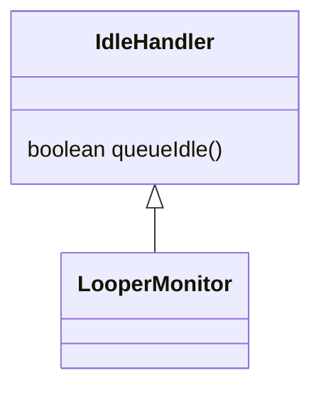
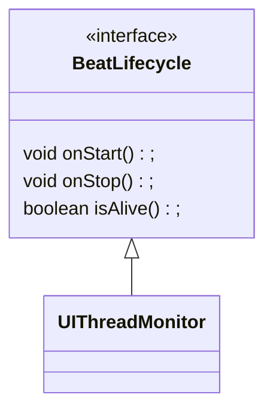
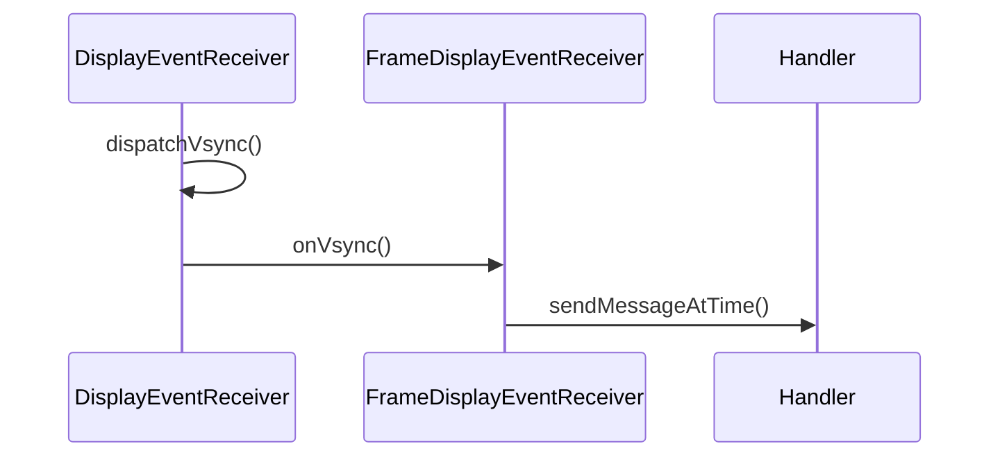
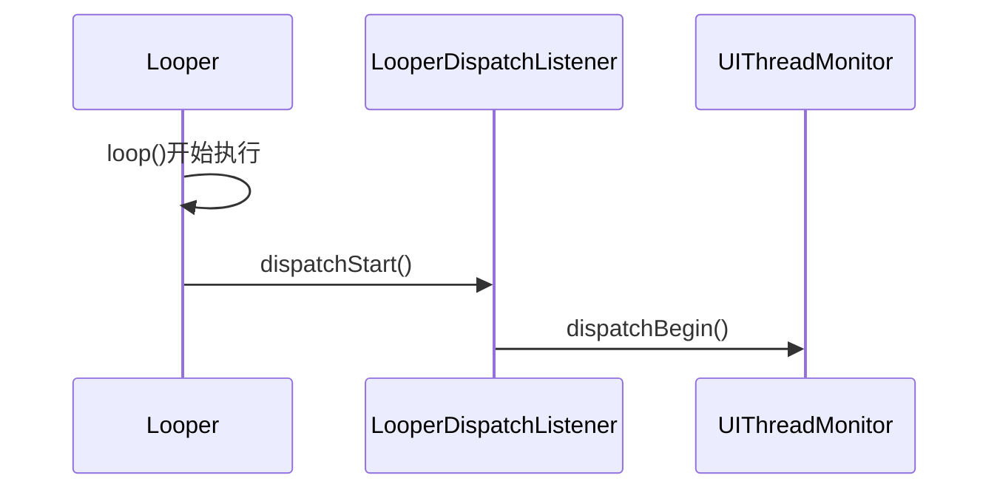
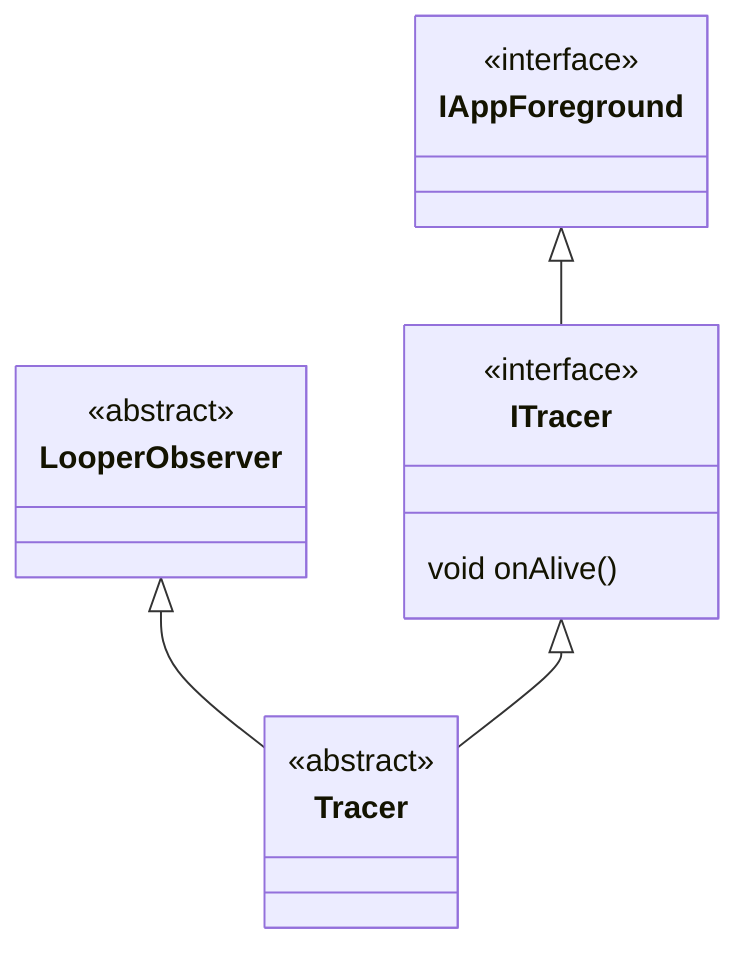

## **LooperMonitor**




### 构造函数

```java
private LooperMonitor(Looper looper) {
    Objects.requireNonNull(looper);
    this.looper = looper;
    resetPrinter();
    addIdleHandler(looper);
}
```


### register()

```java
private static final LooperMonitor sMainMonitor = LooperMonitor.of(Looper.getMainLooper());

static void register(LooperDispatchListener listener) {
    sMainMonitor.addListener(listener);
}
```


### of()

```java
//保证一个线程只有一个LooperMonitor对象
private static final Map<Looper, LooperMonitor> sLooperMonitorMap = new ConcurrentHashMap<>();

public static LooperMonitor of(@NonNull Looper looper) {
    LooperMonitor looperMonitor = sLooperMonitorMap.get(looper);
    if (looperMonitor == null) {
        //调用构造函数创建LooperMonitor
        looperMonitor = new LooperMonitor(looper);
        sLooperMonitorMap.put(looper, looperMonitor);
    }
    return looperMonitor;
}
```


### **resetPrinter()**

```java
private synchronized void resetPrinter() {
    Printer originPrinter = null;
    try {
        if (!isReflectLoggingError) {
            //反射获取原始的Printer
            originPrinter = ReflectUtils.get(looper.getClass(), "mLogging", looper);
            if (originPrinter == printer && null != printer) {
                return;
            }
            // Fix issues that printer loaded by different classloader
            if (originPrinter != null && printer != null) {
                if (originPrinter.getClass().getName().equals(printer.getClass().getName())) {
                    MatrixLog.w(TAG, "LooperPrinter might be loaded by different classloader"
                            + ", my = " + printer.getClass().getClassLoader()
                            + ", other = " + originPrinter.getClass().getClassLoader());
                    return;
                }
            }
        }
    } catch (Exception e) {
        isReflectLoggingError = true;
        Log.e(TAG, "[resetPrinter] %s", e);
    }
    if (null != printer) {
        MatrixLog.w(TAG, "maybe thread:%s printer[%s] was replace other[%s]!",
                looper.getThread().getName(), printer, originPrinter);
    }
  //为looper设置Logger
    looper.setMessageLogging(printer = new LooperPrinter(originPrinter));
    if (null != originPrinter) {
        MatrixLog.i(TAG, "reset printer, originPrinter[%s] in %s", originPrinter, looper.getThread().getName());
    }
}
```


### **LooperPrinter**

```java
class LooperPrinter implements Printer {
    public Printer origin; //被代理的对象
    boolean isHasChecked = false;
    boolean isValid = false;
    LooperPrinter(Printer printer) {
        this.origin = printer;
    }
    @Override
    public void println(String x) {
        if (null != origin) {
            origin.println(x);
            if (origin == this) {
                throw new RuntimeException(TAG + " origin == this");
            }
        }
        if (!isHasChecked) {
					  //以>或者<开头
            isValid = x.charAt(0) == '>' || x.charAt(0) == '<';
            isHasChecked = true;
            if (!isValid) {
                MatrixLog.e(TAG, "[println] Printer is inValid! x:%s", x);
            }
        }
        if (isValid) {
            dispatch(x.charAt(0) == '>', x);
        }
    }
}
```


### dispatch()

```java
private void dispatch(boolean isBegin, String log) {
    synchronized (listeners) {
        //遍历所有的listeners
        for (LooperDispatchListener listener : listeners) {
            if (listener.isValid()) {
                if (isBegin) {
                    //开始
                    if (!listener.isHasDispatchStart) {
                        if (listener.historyMsgRecorder) {
                            messageStartTime = System.currentTimeMillis();
                            latestMsgLog = log;
                            recentMCount++;
                        }
                        listener.onDispatchStart(log);
                    }
                } else {
                    //结束
                    if (listener.isHasDispatchStart) {
                        if (listener.historyMsgRecorder) {
                            recordMsg(log, System.currentTimeMillis() - messageStartTime, listener.denseMsgTracer);
                        }
                        listener.onDispatchEnd(log);
                    }
                }
            } else if (!isBegin && listener.isHasDispatchStart) {
                listener.dispatchEnd();
            }
        }
    }
}
```


### **addListener()**

```java
private final HashSet<LooperDispatchListener> listeners = new HashSet<>();

public void addListener(LooperDispatchListener listener) {
    synchronized (listeners) {
        listeners.add(listener);
    }
}
```


### **queueIdle()**

当消息队列空闲时，会调用`IdleHandler`的`queueIdle`方法。

```java
@Override
public boolean queueIdle() {
    if (SystemClock.uptimeMillis() - lastCheckPrinterTime >= CHECK_TIME) {
        resetPrinter();
        lastCheckPrinterTime = SystemClock.uptimeMillis();
    }
		//返回true，执行完成不会被移除
    return true;
}
```


## LooperDispatchListener

```java
public abstract static class LooperDispatchListener {

  boolean isHasDispatchStart = false;
  boolean historyMsgRecorder = false;
  boolean denseMsgTracer = false;

  public LooperDispatchListener(boolean historyMsgRecorder, boolean denseMsgTracer) {
    this.historyMsgRecorder = historyMsgRecorder;
    this.denseMsgTracer = denseMsgTracer;
  }

  public LooperDispatchListener() {

  }

  public boolean isValid() {
    return false;
  }


  public void dispatchStart() {

  }

  @CallSuper
  public void onDispatchStart(String x) {
    this.isHasDispatchStart = true;
    dispatchStart();
  }

  @CallSuper
  public void onDispatchEnd(String x) {
    this.isHasDispatchStart = false;
    dispatchEnd();
  }


  public void dispatchEnd() {
  }
}
```


## **UIThreadMonitor**




### init()

```java
private static final String ADD_CALLBACK = "addCallbackLocked";

public void init(TraceConfig config) {
  if (Thread.currentThread() != Looper.getMainLooper().getThread()) {
    throw new AssertionError("must be init in main thread!");
  }
  this.config = config;
  choreographer = Choreographer.getInstance();//获取Choreographer对象
  //获取mLock
  callbackQueueLock = ReflectUtils.reflectObject(choreographer, "mLock", new Object());
  //获取mCallbackQueues
  callbackQueues = ReflectUtils.reflectObject(choreographer, "mCallbackQueues", null);
  if (null != callbackQueues) {
    //获取不同类型的addCallbackLocked方法
    addInputQueue = ReflectUtils.reflectMethod(callbackQueues[CALLBACK_INPUT], ADD_CALLBACK, long.class, Object.class, Object.class);
    addAnimationQueue = ReflectUtils.reflectMethod(callbackQueues[CALLBACK_ANIMATION], ADD_CALLBACK, long.class, Object.class, Object.class);
    addTraversalQueue = ReflectUtils.reflectMethod(callbackQueues[CALLBACK_TRAVERSAL], ADD_CALLBACK, long.class, Object.class, Object.class);
  }
  //获取mDisplayEventReceiver
  vsyncReceiver = ReflectUtils.reflectObject(choreographer, "mDisplayEventReceiver", null);
  //获取mFrameIntervalNanos
  frameIntervalNanos = ReflectUtils.reflectObject(choreographer, "mFrameIntervalNanos", Constants.DEFAULT_FRAME_DURATION);
  boolean historyMsgRecorder = config.historyMsgRecorder;
  boolean denseMsgTracer = config.denseMsgTracer;
  //注册LooperDispatchListener
  LooperMonitor.register(new LooperMonitor.LooperDispatchListener(historyMsgRecorder, denseMsgTracer) {
    @Override
    public boolean isValid() {
      return isAlive;
    }

    @Override
    public void dispatchStart() {
      super.dispatchStart();
      //开始处理消息的时候执行dispatchBegin()
      UIThreadMonitor.this.dispatchBegin();
    }

    @Override
    public void dispatchEnd() {
      super.dispatchEnd();
      //结束执行消息的时候执行dispatchEnd()
      UIThreadMonitor.this.dispatchEnd();
    }

  });
  this.isInit = true;
  MatrixLog.i(TAG, "[UIThreadMonitor] %s %s %s %s %s %s frameIntervalNanos:%s", callbackQueueLock == null, callbackQueues == null,
              addInputQueue == null, addTraversalQueue == null, addAnimationQueue == null, vsyncReceiver == null, frameIntervalNanos);


  if (config.isDevEnv()) {
    addObserver(new LooperObserver() {
      @Override
      public void doFrame(String focusedActivity, long startNs, long endNs, boolean isVsyncFrame, long intendedFrameTimeNs, long inputCostNs, long animationCostNs, long traversalCostNs) {
        MatrixLog.i(TAG, "focusedActivity[%s] frame cost:%sms isVsyncFrame=%s intendedFrameTimeNs=%s [%s|%s|%s]ns",
                    focusedActivity, (endNs - startNs) / Constants.TIME_MILLIS_TO_NANO, isVsyncFrame, intendedFrameTimeNs, inputCostNs, animationCostNs, traversalCostNs);
      }
    });
  }
}
```


### onStart()

```java
@Override
public synchronized void onStart() {
    if (!isInit) {
        MatrixLog.e(TAG, "[onStart] is never init.");
        return;
    }
    if (!isAlive) {
        this.isAlive = true;
        synchronized (this) {
            MatrixLog.i(TAG, "[onStart] callbackExist:%s %s", Arrays.toString(callbackExist), Utils.getStack());
            callbackExist = new boolean[CALLBACK_LAST + 1];
        }
        queueStatus = new int[CALLBACK_LAST + 1];
        queueCost = new long[CALLBACK_LAST + 1];
        //传入当前对象 当收到信号时调用run方法
        addFrameCallback(CALLBACK_INPUT, this, true);
    }
}
```


### **addFrameCallback()**

```java
private synchronized void addFrameCallback(int type, Runnable callback, boolean isAddHeader) {
  if (callbackExist[type]) {
    MatrixLog.w(TAG, "[addFrameCallback] this type %s callback has exist! isAddHeader:%s", type, isAddHeader);
    return;
  }

  if (!isAlive && type == CALLBACK_INPUT) {
    MatrixLog.w(TAG, "[addFrameCallback] UIThreadMonitor is not alive!");
    return;
  }
  try {
    synchronized (callbackQueueLock) {
      Method method = null;
      switch (type) {
        case CALLBACK_INPUT:
          method = addInputQueue;
          break;
        case CALLBACK_ANIMATION:
          method = addAnimationQueue;
          break;
        case CALLBACK_TRAVERSAL:
          method = addTraversalQueue;
          break;
      }
      if (null != method) {
        //调用CallbackQueue的addCallbackLocked方法
       //如果isAddHeader为true，会添加到队列的的开头
        method.invoke(callbackQueues[type], !isAddHeader ? SystemClock.uptimeMillis() : -1, callback, null);
        callbackExist[type] = true;
      }
    }
  } catch (Exception e) {
    MatrixLog.e(TAG, e.toString());
  }
}
```


### run()

```java
@Override
public void run() {
  final long start = System.nanoTime();
  try {
    doFrameBegin(token);
    //CALLBACK_INPUT队列开始执行
    doQueueBegin(CALLBACK_INPUT);
    //开始执行CALLBACK_INPUT队列时调用addFrameCallback添加到CALLBACK_ANIMATION和CALLBACK_TRAVERSAL队列中
    addFrameCallback(CALLBACK_ANIMATION, new Runnable() {

      @Override
      public void run() {
				//CALLBACK_INPUT队列执行结束
        doQueueEnd(CALLBACK_INPUT);
        //CALLBACK_ANIMATION队列开始执行
        doQueueBegin(CALLBACK_ANIMATION);
      }
    }, true);
    
    addFrameCallback(CALLBACK_TRAVERSAL, new Runnable() {

      @Override
      public void run() {
        doQueueEnd(CALLBACK_ANIMATION);
        doQueueBegin(CALLBACK_TRAVERSAL);
      }
    }, true);

  } finally {
    if (config.isDevEnv()) {
      MatrixLog.d(TAG, "[UIThreadMonitor#run] inner cost:%sns", System.nanoTime() - start);
    }
  }
}
```


### doFrameBegin()

```java
//传递的token没啥用
private void doFrameBegin(long token) {
    this.isVsyncFrame = true;
}
```


### **doQueueBegin()**

`doQueueBegin()`和`doQueueEnd()`负责记录每一个队列执行的时间。

```java
private void doQueueBegin(int type) {
    queueStatus[type] = DO_QUEUE_BEGIN;
    queueCost[type] = System.nanoTime();
}
```


### **doQueueEnd()**

```java
private void doQueueEnd(int type) {
    queueStatus[type] = DO_QUEUE_END;
    queueCost[type] = System.nanoTime() - queueCost[type];
    synchronized (this) {
        callbackExist[type] = false;
    }
}
```






### dispatchBegin()

```java
private void dispatchBegin() {
    token = dispatchTimeMs[0] = System.nanoTime();
    dispatchTimeMs[2] = SystemClock.currentThreadTimeMillis();
    AppMethodBeat.i(AppMethodBeat.METHOD_ID_DISPATCH);

    synchronized (observers) {
        for (LooperObserver observer : observers) {
            if (!observer.isDispatchBegin()) {
                observer.dispatchBegin(dispatchTimeMs[0], dispatchTimeMs[2], token);
            }
        }
    }
    if (config.isDevEnv()) {
        MatrixLog.d(TAG, "[dispatchBegin#run] inner cost:%sns", System.nanoTime() - token);
    }
}
```


### **dispatchEnd()**

```java
private void dispatchEnd() {
    long traceBegin = 0;
    if (config.isDevEnv()) {
        traceBegin = System.nanoTime();
    }

    if (config.isFPSEnable()) {
        long startNs = token;
        long intendedFrameTimeNs = startNs;
        if (isVsyncFrame) {
            doFrameEnd(token);
            //获取接收到的信号时间
            intendedFrameTimeNs = getIntendedFrameTimeNs(startNs);
        }
        //当前时间
        long endNs = System.nanoTime();

        synchronized (observers) {
            for (LooperObserver observer : observers) {
                if (observer.isDispatchBegin()) {
                    // intendedFrameTimeNs接收到信号的时间
                    //startNs 开始执行message的时间
                    //endNs 执行message结束的时间
                    observer.doFrame(AppMethodBeat.getVisibleScene(), startNs, endNs, isVsyncFrame, intendedFrameTimeNs, queueCost[CALLBACK_INPUT], queueCost[CALLBACK_ANIMATION], queueCost[CALLBACK_TRAVERSAL]);
                }
            }
        }
    }

    if (config.isEvilMethodTraceEnable() || config.isDevEnv()) {
        dispatchTimeMs[3] = SystemClock.currentThreadTimeMillis();
        dispatchTimeMs[1] = System.nanoTime();
    }

    AppMethodBeat.o(AppMethodBeat.METHOD_ID_DISPATCH);

    synchronized (observers) {
        for (LooperObserver observer : observers) {
            if (observer.isDispatchBegin()) {
                observer.dispatchEnd(dispatchTimeMs[0], dispatchTimeMs[2], dispatchTimeMs[1], dispatchTimeMs[3], token, isVsyncFrame);
            }
        }
    }

    this.isVsyncFrame = false;

    if (config.isDevEnv()) {
        MatrixLog.d(TAG, "[dispatchEnd#run] inner cost:%sns", System.nanoTime() - traceBegin);
    }
}
```


## **FrameTracer**




### **doFrame()**

```java
@Override
public void doFrame(String focusedActivity, long startNs, long endNs, boolean isVsyncFrame, long intendedFrameTimeNs, long inputCostNs, long animationCostNs, long traversalCostNs) {
    if (isForeground()) {
        notifyListener(focusedActivity, startNs, endNs, isVsyncFrame, intendedFrameTimeNs, inputCostNs, animationCostNs, traversalCostNs);
    }
}
```


### notifyListener

```java
private void notifyListener(final String focusedActivity, final long startNs, final long endNs, final boolean isVsyncFrame,
                            final long intendedFrameTimeNs, final long inputCostNs, final long animationCostNs, final long traversalCostNs) {
    long traceBegin = System.currentTimeMillis();
    try { 
        final long jiter = endNs - intendedFrameTimeNs;
        final int dropFrame = (int) (jiter / frameIntervalNs); //计算掉的帧数
        if (dropFrameListener != null) {
            //当掉帧数目大于设置的阈值
            if (dropFrame > dropFrameListenerThreshold) {
                try {
                    if (AppActiveMatrixDelegate.getTopActivityName() != null) {
                        long lastResumeTime = lastResumeTimeMap.get(AppActiveMatrixDelegate.getTopActivityName());
                        dropFrameListener.dropFrame(dropFrame, AppActiveMatrixDelegate.getTopActivityName(), lastResumeTime);
                    }
                } catch (Exception e) {
                    MatrixLog.e(TAG, "dropFrameListener error e:" + e.getMessage());
                }
            }
        }
        droppedSum += dropFrame;
        durationSum += Math.max(jiter, frameIntervalNs);
        synchronized (listeners) {
            //遍历所有listener
            for (final IDoFrameListener listener : listeners) {
                if (config.isDevEnv()) {
                    listener.time = SystemClock.uptimeMillis();
                }
                if (null != listener.getExecutor()) {
                    if (listener.getIntervalFrameReplay() > 0) {
                        listener.collect(focusedActivity, startNs, endNs, dropFrame, isVsyncFrame,
                                intendedFrameTimeNs, inputCostNs, animationCostNs, traversalCostNs);
                    } else {
                        listener.getExecutor().execute(new Runnable() {
                            @Override
                            public void run() {
                                listener.doFrameAsync(focusedActivity, startNs, endNs, dropFrame, isVsyncFrame,
                                        intendedFrameTimeNs, inputCostNs, animationCostNs, traversalCostNs);
                            }
                        });
                    }
                } else {
                    listener.doFrameSync(focusedActivity, startNs, endNs, dropFrame, isVsyncFrame,
                            intendedFrameTimeNs, inputCostNs, animationCostNs, traversalCostNs);
                }
                if (config.isDevEnv()) {
                    listener.time = SystemClock.uptimeMillis() - listener.time;
                    MatrixLog.d(TAG, "[notifyListener] cost:%sms listener:%s", listener.time, listener);
                }
            }
        }
    } finally {
        long cost = System.currentTimeMillis() - traceBegin;
        if (config.isDebug() && cost > frameIntervalNs) {
            MatrixLog.w(TAG, "[notifyListener] warm! maybe do heavy work in doFrameSync! size:%s cost:%sms", listeners.size(), cost);
        }
    }
}
```

